## Dokumentace statistických metod vektorů

Vektorové funkce jsou statistické metody, které jsou prováděny nad instancemi vektorů. Jednoduchým příkladem je funkce 'sum', která sečte všechny neprázdné hodnoty v (numerickém vektoru). Vektorových metod je k dispozici celkem kolem 30, přičemž některé jsou prosté (jako např. 'sum')., jiné jsou buďto výpočetně komplexnější (testy normality), mají komplexní výstup (např. histogram) nebo vyžadují ke svému výpočtu upřesnit parametry (argumenty). Metody lze vyvolávat dvěma způsoby, buďto přímo voláním metody z instance vektoru - např vector.sum() - nebo voláním přes obecnou metodu **analyze**, např. *vector.analyze('sum').run()*. Více přístupů lze zvolit i v zadávání argumentů. Ty lze buď zadávat dle pořadí uvedeném v dokumentaci jako členy argumentů - např. parties.pci('ODS', 0.95) - nebo pomocí jediného objektu, který pomocí svých vlastnosti přesně definuje hodnoty argumenty - např. parties.pci({value: 'ODS', alpha: 0.95}). Volání metod přes obecnou funkci **analyze** je efektivní v několika ohledech, mj. proto, že umožňuje sekvenční provádění analýzy (např. před výpočtem validovat argumenty pomocí metody *with*) a také kvůli zápisu metadat do instance třídy VectorAnalysis, konkrétně vstupní a výstupní velikost vzorku (objekt *sample* a vlastnosti *raw* a *net*) a časové parametry (object *time* a vlastnosti *from* a *to*, ze kterých metoda *duration* přístupná z instance analytické třídy počítá celkovou dobu zpracování výsledků.

| funkce | metoda |
| :--- | :--- |
| sum | [Součet](#sum) |
| count | [Počet](#count) |
| mode | [Modus](#mode) |
| avg | [Aritmetický průměr](#avg) |
| min | [Minimum](#min) |
| max | [Maximum](#max) |
| range | [Variační rozpětí](#range) |
| geomean | [Geometrický průměr](#geomean) |
| harmean | [Harmonický průměr](#harmean) |
| median | [Medián](#median) |
| percentile | [Kvantil](#percentile) |
| stdev | [Směrodatná odchylka](#stdev) |
| variance | [Rozptyl](#variance) |
| varc | [Variační koeficient](#varc) |
| histogram | [Histogram](#histogram) |
| frequency | [Tabulka četností](#frequency) |
| sem | [Střední chyba průměru](#sem) |
| skewness | [Šikmost](#skewness) |
| kurtosis | [Špičatost](#kurtosis) |
| mci | [Interval spolehlivosti pro střední hodnotu](#mci) |
| pci | [Interval spolehlivosti podílu](#pci) |
| ttest | [Jednovýběrový t-test](#ttest) |
| swtest ⚠️ | [Shapirův-Wilkův W test](#swtest) |
| kstest ⚠️ | [Kolmogorov-Smirnovův test](#kstest) |

### [Součet](#sum)

Stanoví součet všech neprázdných číselných hodnot vektoru.


### Před-výpočetní úprava dat

Odstraní z vektoru všechny prázdné hodnoty (buňky).

#### Příklady syntaxe

```js
var cashflow = new NumericVector(200,250,150,320,240,-250,10,-320).sum();  /* = 600 */
```

#### Schéma výsledku

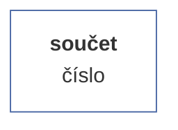

### [Počet](#count)

Stanoví počet všech členů vektorů, včetně prázdných hodnot.

#### Příklady syntaxe

```js
var total_numeric = new NumericVector(200,250,null,150,320,240,-250,null,10,-320).count();  /* = 10 */
var total_string = new StringVector("A","B","C","D").count();  /* = 4 */
var total_boolean = new BooleanVector(true, true, false, null, false, true).count();  /* = 6 */
```

#### Schéma výsledku

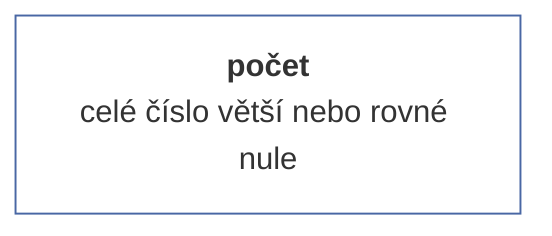

### [Modus](#mode)

Stanoví nejčastější hodnotu ve vektoru (pokud je nejčastější prázdná hodnota, stanoví prázdnou hodnotu). Pokud je nejčastějších hodnot více (např. četnost hodnot X  a Y je shodná), určí tu hodnotu, kterou ve vektoru nalezne jako první.

#### Příklady syntaxe

```js
var x = new NumericVector(1,2,3,4,3,4,5,3).mode(); /* = 3 */
var y = new StringVector("a",null,null,"b","c","d",null,"b").mode(); /* = null */
var z = new BooleanVector(true, false, true).mode(); /* = true */
```

#### Schéma výsledku

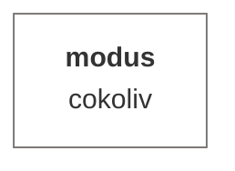

### [Aritmetický průměr](#avg)

Stanoví aritmetický průměr (tedy podíl součtu a počtu hodnot vektoru) ze všech neprázdných hodnot (tedy včetně nul).


### Před-výpočetní úprava dat

Odstraní z vektoru všechny prázdné hodnoty (buňky).

#### Příklady syntaxe

```js
var avgCashFlow = new NumericVector(200,250,150,320,240,-250,10,-320).avg();  /* = 75 */
```

#### Schéma výsledku

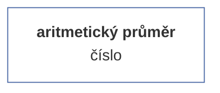

### [Minimum](#min)

Stanoví nejnižší hodnotu z neprázdných hodnot.


### Před-výpočetní úprava dat

Odstraní z vektoru všechny prázdné hodnoty (buňky).

#### Příklady syntaxe

```js
var numeric_min = new NumericVector(4.5, 3.9, 5, 6, 7, 5.7, 9.1, 5.3, 7.2, 6.9, 6, 7.5, 5.3, 7.1, 8.2, 1).min(); /* = 1 */;
var string_min = new StringVector("Norwood", "Pearson", "Fisher", "Nightingale", "Gauss", "Poisson").min(); /* = Fisher */
```

#### Schéma výsledku

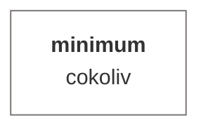

### [Maximum](#max)

Stanoví nejvyšší hodnotu z neprázdných hodnot.


### Před-výpočetní úprava dat

Odstraní z vektoru všechny prázdné hodnoty (buňky).

#### Příklady syntaxe

```js
var numeric_max = new NumericVector(4.5, 3.9, 5, 6, 7, 5.7, 9.1, 5.3, 7.2, 6.9, 6, 7.5, 5.3, 7.1, 8.2, 1).max(); /* = 9.1 */;
var string_max = new StringVector("Norwood", "Pearson", "Fisher", "Nightingale", "Gauss", "Poisson").max(); /* = Poisson */
```

#### Schéma výsledku

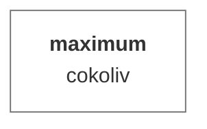

### [Variační rozpětí](#range)

Stanoví hodnotu variačního rozpětí.


### Před-výpočetní úprava dat

Odstraní z vektoru všechny prázdné hodnoty (buňky).

#### Příklady syntaxe

```js
var range = new NumericVector(5,2,-15,-16.3,12,null, null, 12,13,7).range(); /* = 22 */
```

#### Schéma výsledku

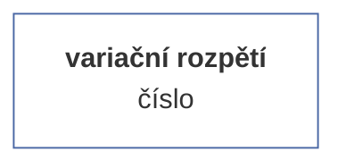

### [Geometrický průměr](#geomean)

Geometrický průměr je charakteristika, která se počítá jako n-tá odmocnina součinu n čísel v sadě. Používá se pro výpočet tempa růstu, protože zohledňuje změny v procentuálním růstu hodnot v průběhu času. Dále se používá v geometrii pro výpočet průměrné délky strany n-úhelníku a v biologii pro výpočet průměrné velikosti buněk nebo organismů v populaci.


### Před-výpočetní úprava dat

Odstraní z vektoru všechny prázdné hodnoty (buňky).

#### Příklady syntaxe

```js
var x = new framework.NumericVector(20,19,21,22,21,18,23,22,27,16,17,19,19,21,29,24,23,25,24,21,22,19).geomean(); /* = 21.24*/
```

#### Schéma výsledku

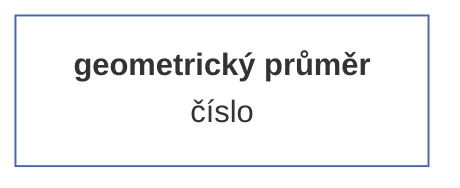

### [Harmonický průměr](#harmean)

Harmonický průměr je charakteristika, která se počítá jako podíl počtu čísel v sadě a součtu jejich převrácených hodnot. Harmonický průměr se používá v situacích, kdy je důležité zohlednit, jak se rychlost nebo výkon mění v průběhu času nebo v různých situacích. Například se používá k výpočtu průměrné rychlosti, průměrného výkonu nebo průměrného odporu v elektronických obvodech. Také se používá v oblasti finance pro výpočet průměrného výnosu z investic v různých časových obdobích.


### Před-výpočetní úprava dat

Odstraní z vektoru všechny prázdné hodnoty (buňky).

#### Příklady syntaxe

```js
var x = new NumericVector(20,19,21,22,21,18,23,22,27,16,17,19,19,21,29,24,23,25,24,21,22,19).harmean(); /* = 21.03*/
```

#### Schéma výsledku

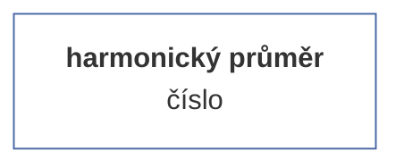

### [Medián](#median)

Stanoví medián neboli prostřední hodnotu z neprázdných hodnot vektoru. Jedná se o 50% kvantil.


### Před-výpočetní úprava dat

Odstraní z vektoru všechny prázdné hodnoty (buňky).

#### Příklady syntaxe

```js
var median = new NumericVector(20,19,21,22,21,18,23,22,27,16,17,19,19,21,29,24,23,25,24,21,22,19).median(); /* = 21*/
```

#### Schéma výsledku

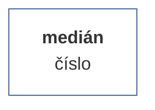

### [Kvantil](#percentile)

Pomocí kvantilu můžeme zkoumat rozdělení numerické řady, a to tak, že řadu nejprve seřadíme od nejmenšího po největšího člena (číslo), a následně vybereme první N % členů (toto N je parametrem), kdy poslední člen ve výběru představuje daný percentil, konkrétní číslo. Pokud je počet členů ve výběru sudý, počítá se percentil jako průměr z dvou sousedících hodnot, pokud je lichý, percentilem je právě poslední hodnota.

#### Argumenty

| id |popis |typ hodnoty |validátor |povinný |defaultní hodnota |
| :--- |:--- |:--- |:--- |:--- |:--- |
| <b></b> | hodnota kvantilu | desetinné číslo mezi 1 a 0 (včetně) | <sub>Ověří, zdali se jedná o celé kladné číslo větší než nula. V opačném případě vyvolá chybu.<sub> | ✔️ |  |

### Před-výpočetní úprava dat

Odstraní z vektoru všechny prázdné hodnoty (buňky).

#### Příklady syntaxe

```js
var score = new NumericVector(10,20,15,25,23,19,18,17,24,23);
var median = score.percentile(0.5); /* = 19.5 */
var q25 = score.percentile(0.25); /* = 17.25 */
var max = score.percentile(1); /* = 25 */
```

#### Schéma výsledku

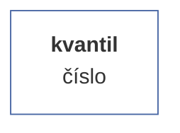

### [Směrodatná odchylka](#stdev)

Stanoví směrodatnou odchylku neprázdných hodnot. Směrodatná odchylka je statistický ukazatel, který udává, jak moc se hodnoty v daném souboru dat od sebe liší. Směrodatná odchylka je vyjádřena jako číslo, které udává, o kolik se průměrná hodnota odchýlí od skutečné hodnoty v daném souboru dat. Směrodatná odchylka je užitečná při porovnávání velikosti rozptýlení dat v různých souborech nebo v různých skupinách v rámci jednoho souboru dat. Čím je směrodatná odchylka větší, tím více se hodnoty v daném souboru dat od sebe liší.

#### Argumenty

| id |popis |typ hodnoty |validátor |povinný |defaultní hodnota |
| :--- |:--- |:--- |:--- |:--- |:--- |
| <b></b> | výběrový soubor | binární hodnota | <sub>Ověří, zdali je hodnota binární povahy. V opačném případě hodnotu automaticky převede na typ boolean a nevrací tudíž nikdy chybu.<sub> |  | false |

### Před-výpočetní úprava dat

Odstraní z vektoru všechny prázdné hodnoty (buňky).

#### Příklady syntaxe

```js
var population = new NumericVector(10,20,15,25,23,19,18,17,24,23).stdev();  /* = 4.41 */
var sample = new NumericVector(10,20,15,25,23,19,18,17,24,23).stdev(true); /* = 4.65 */
```

#### Schéma výsledku

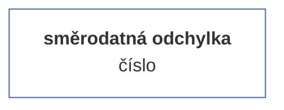

### [Rozptyl](#variance)

Stanoví hodnotu rozptylu tohoto vektoru.

#### Argumenty

| id |popis |typ hodnoty |validátor |povinný |defaultní hodnota |
| :--- |:--- |:--- |:--- |:--- |:--- |
| <b>isSample</b> | výběrový soubor | binární hodnota | <sub>Ověří, zdali je hodnota binární povahy. V opačném případě hodnotu automaticky převede na typ boolean a nevrací tudíž nikdy chybu.<sub> |  | false |

### Před-výpočetní úprava dat

Odstraní z vektoru všechny prázdné hodnoty (buňky).

#### Příklady syntaxe

```js
var population = new NumericVector(10,20,15,25,23,19,18,17,24,23).variance();  /* = 19.44 */
var sample = new NumericVector(10,20,15,25,23,19,18,17,24,23).variance(true); /* = 21.6 */
```

#### Schéma výsledku

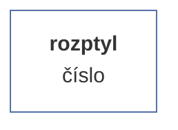

### [Variační koeficient](#varc)

Variační koeficient (také nazývaný relativní rozptyl) je statistický ukazatel, který měří míru variability nebo rozptýlení dat vzhledem k jejich střední hodnotě. Je to bezrozměrná míra variability, která umožňuje porovnávat rozptyl různých souborů dat bez ohledu na jednotky, ve kterých jsou data vyjádřena. Variační koeficient se počítá jako poměr směrodatné odchylky (sigma) a střední hodnoty (x) v sadě dat, násobený 100 pro vyjádření v procentech. okud je variační koeficient nízký, znamená to, že data jsou poměrně homogenní nebo málo rozptýlená vzhledem k průměru. Pokud je naopak vysoký, znamená to, že data jsou velmi různorodá nebo se výrazně liší od průměru.Variační koeficient se používá především k porovnávání variability mezi různými soubory dat. Například se často používá v biologii, medicíně, ekonomii, psychologii a sociologii pro měření variability různých populací nebo skupin.

#### Argumenty

| id |popis |typ hodnoty |validátor |povinný |defaultní hodnota |
| :--- |:--- |:--- |:--- |:--- |:--- |
| <b>isSample</b> | výběrový soubor | binární hodnota | <sub>Ověří, zdali je hodnota binární povahy. V opačném případě hodnotu automaticky převede na typ boolean a nevrací tudíž nikdy chybu.<sub> |  | false |
#### Příklady syntaxe

```js
var population = new NumericVector(10,20,15,25,23,19,18,17,24,23).varc();  /* = 0.227 */
var sample = new NumericVector(10,20,15,25,23,19,18,17,24,23).varc(true); /* = 0.24 */
```

#### Schéma výsledku

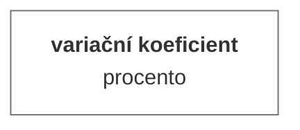

### [Histogram](#histogram)

Stanoví matici histogramu daného vektoru. Metodu lze volit s upřesněním parametrů nebo i bez nich. Pokud není upřesněn parametr 'maximální počet intervalů' (maxIntervals), je jeho hodnota automaticky vypočítána jako variační rozpětí/odmocnina z počtu prvků. Pokud je uveden parametr 'pevná velikost intervalu' (fixedInterval), je brána tato hodnota jako rozhodující pro počet intervalu. Obě dvě hodnoty nejsou slučitelné (ačkoliv nevrací chybu), při zadání obou dvou je jako prioritní brán parametr maxIntervals.

#### Argumenty

| id |popis |typ hodnoty |validátor |povinný |defaultní hodnota |
| :--- |:--- |:--- |:--- |:--- |:--- |
| <b></b> | maximální počet intervalů | číslo | <sub>Ověří, zdali se jedná o celé kladné číslo větší než nula. V opačném případě vyvolá chybu.<sub> |  |  |
| <b></b> | pevná velikost intervalu | kladné číslo | <sub>Ověří, zdali se jedná o celé kladné číslo větší než nula. V opačném případě vyvolá chybu.<sub> |  |  |

### Před-výpočetní úprava dat

Odstraní z vektoru všechny prázdné hodnoty (buňky).

#### Příklady syntaxe

##### Bez upřesnění intervalu

<sub>Metoda je volána bez parametrů, tzn. že velikost intervalu je automaticky spočítána jako (maximum-minimum)/odmocnina(počet prvků).</sub>

```js
var score = new NumericVector(4.5,3.9,5,6,7,5.7,9.1,5.3,null, 7.2,6.9,6,7.5,5.3,7.1,8.2,1, null);
var h1 = score.histogram();
var h2 = score.analyze("histogram").run();
// h1 = h2.result
```

##### Se specifikací počtu intervalů

<sub>Argument 'max' upřesní, na kolik kategorií (intervalů) má být histogram rozdělen. Argument 'max' je možné upřesnit buďto jako první parametr, nebo - pokud je argumentem objekt - jako vlatnost 'max'.</sub>

```js
var score = new NumericVector(4.5,3.9,5,6,7,5.7,9.1,5.3,7.2,6.9,6,7.5,5.3,7.1,8.2,1);
var h1 = score.histogram(4);
var h2 = score.analyze("histogram").run(4);
var h3 = score.histogram({max: 4});
var h4 = score.analyze("histogram").run({max: 4});
// h1 = h3 = h2.result = h4.result
```

##### Se specifikací velikosti intervalu

<sub>Argument 'fix' nastaví pevnou velikost intervalu. Argument je možné upřesnit buďto jako druhý parametr (v tom případě musí být první argument null), nebo - pokud je argumentem objekt - jako vlatnost 'fix'. Argument 'max' má před argumentem 'fix' prioritu.</sub>

```js
var score = new NumericVector(4.5,3.9,5,6,7,5.7,9.1,5.3,7.2,6.9,6,7.5,5.3,7.1,8.2,1);
var h1 = score.histogram(null, 3);
var h2 = score.analyze("histogram").run(null, 3);
var h3 = score.histogram({fix: 3});
var h4 = score.analyze("histogram").run({fix: 3});
// h1 = h3 = h2.result = h4.result
```

#### Schéma výsledku

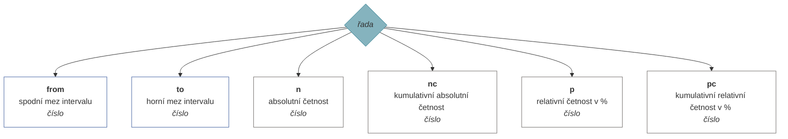

### [Tabulka četností](#frequency)

Stanoví tabulku četností jednotlivých variant a jejich výskyt.

#### Argumenty

| id |popis |typ hodnoty |validátor |povinný |defaultní hodnota |
| :--- |:--- |:--- |:--- |:--- |:--- |
| <b></b> | způsob řazení dat tabulky | enumerace | <sub>Ověří, zdali je zadaná hodnota klíčem enumerace (seznamu možných hodnot). Pokud ne, vyhodí chybu.<br><br><b>1</b> = dle četnosti sestupně (max-min)<br><b>2</b> = dle četnosti vzestupně (min-max)<br><b>3</b> = dle hodnoty vzestupně (A-Z)<br><b>4</b> = dle hodnoty sestupně (Z-A)<br><sub> |  | 1 |
#### Příklady syntaxe

```js
var numeric_vector_no_order = new NumericVector(5,2,3,2,3,3,1,6,3).frequency();
```

```js
var string_vector_desc_value = new StringVector("E","B","C","B","C","C","A","F","C").frequency({order: 3});
```

```js
var boolean_vector_desc_frequency = new BooleanVector(true, false, null, true, null, null).frequency(4);
```

#### Schéma výsledku

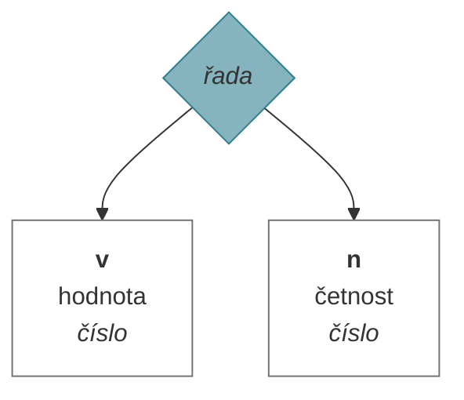

### [Střední chyba průměru](#sem)

Stanoví hodnotu směrodatné chyby odhadu průměru. Směrodatná chyba průměru (anglicky 'standard error of the mean', odtud zkratka SEM) je statistická míra variability výběrového průměru odhadovaného parametru v celé populaci. Jedná se o odhad standardní odchylky průměru výběrového souboru. Střední chyba průměru se vypočítá jako poměr odhadované standardní odchylky výběrového průměru k odmocnině z velikosti výběru. Čím větší je velikost výběru, tím menší je střední chyba průměru, což znamená, že odhad výběrového průměru je přesnější a blíže se shoduje s průměrem celé populace. Střední chyba průměru je užitečná pro odhadování intervalů spolehlivosti výběrového průměru, což umožňuje určit, jak přesně odhaduje průměr populace.


### Před-výpočetní úprava dat

Odstraní z vektoru všechny prázdné hodnoty (buňky).

#### Příklady syntaxe

```js
var sem = new NumericVector(20,19,21,22,21,18,23,22,27,16,17,19,19,21,29,24,23,25,24,21,22,19).SEM(); /* = 0.67*/
```

#### Schéma výsledku

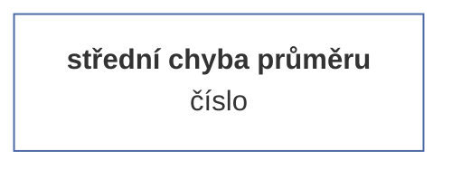

### [Šikmost](#skewness)

Stanoví koeficient šikmosti, tedy asymetrii rozdělení kolem střední hodnoty vektoru.

#### Argumenty

| id |popis |typ hodnoty |validátor |povinný |defaultní hodnota |
| :--- |:--- |:--- |:--- |:--- |:--- |
| <b>isSample</b> | výběrový soubor | binární hodnota | <sub>Ověří, zdali je hodnota binární povahy. V opačném případě hodnotu automaticky převede na typ boolean a nevrací tudíž nikdy chybu.<sub> |  | false |

### Před-výpočetní úprava dat

Odstraní z vektoru všechny prázdné hodnoty (buňky).

#### Příklady syntaxe

```js
var skewness_population = new NumericVector(20,19,21,22,21,18,23,22,27,16,17,19,19,21,29,24,23,25,24,21,22,19).skewness(); /* = 0.52*/
var skewness_sample = new NumericVector(20,19,21,22,21,18,23,22,27,16,17,19,19,21,29,24,23,25,24,21,22,19).skewness(true); /* = 0.027*/
```

#### Schéma výsledku

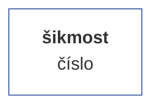

### [Špičatost](#kurtosis)

Stanoví hodnotu excesu množiny dat. Ve statistice špičatost (kurtosis) označuje míru, jak moc se hodnoty liší od průměrné hodnoty. Špičatost se obvykle počítá pro křivku rozdělení dat, která je grafickým zobrazením rozložení hodnot v dané sbírce dat.
Existují dva základní typy špičatosti: platykurtóza a leptokurtóza. Platykurtóza se vyskytuje, když hodnoty vektoru jsou rozloženy víceméně rovnoměrně kolem průměrné hodnoty. Toto rozložení se projevuje jako křivka rozdělení tvaru písmene U, která má plochý vrchol. Naopak leptokurtóza se vyskytuje, když hodnoty v sbírce dat jsou rozloženy s výraznou odchylkou od průměrné hodnoty. Toto rozložení se projevuje jako křivka rozdělení tvaru 'písmene špičatého kopce' nebo 'písmene špičatého údolí'.
Špičatost se používá k určení, zda je rozložení hodnot v sbírce dat víceméně rovnoměrné, nebo zda existují nějaké výrazné odchylky od průměrné hodnoty. Špičatost se často používá spolu s dalšími metrikami, jako je medián, šikmost a kvantily, které vám pomohou lépe porozumět rozložení dat a určit, zda existují nějaké výrazné odchylky od průměrné hodnoty.


### Před-výpočetní úprava dat

Odstraní z vektoru všechny prázdné hodnoty (buňky).

#### Příklady syntaxe

```js
var kurtosis = new NumericVector(20,19,21,22,21,18,23,22,27,16,17,19,19,21,29,24,23,25,24,21,22,19).kurtosis(); /* = 0.425*/
```

#### Schéma výsledku

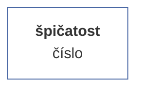

### [Interval spolehlivosti pro střední hodnotu](#mci)

Stanoví statistický protokol odhadu intervalu spolehlivosti pro střední hodnotu při dané úrovni spolehlivosti. Pokud je počet případů menší než 30 (a výběr pochází z normálního rozdělení), je použito Studentovo T-rozdělení. V dalších případech je použito standardizované normální rozdělení.

#### Argumenty

| id |popis |typ hodnoty |validátor |povinný |defaultní hodnota |
| :--- |:--- |:--- |:--- |:--- |:--- |
| <b>k</b> | hladina významnosti | desetinné číslo mezi 1 a 0 (včetně) | <sub>Ověří, zdali se jedná o celé kladné číslo větší než nula. V opačném případě vyvolá chybu.<sub> |  | 0.95 |

### Před-výpočetní úprava dat

Odstraní z vektoru všechny prázdné hodnoty (buňky).

#### Příklady syntaxe

```js
var v = new NumericVector([2,2,3,3,4,4,5,5,6,7,8,9,10,11,10,9,8,7,7,6,6,5,5]).mci(0.95);
```

#### Schéma výsledku

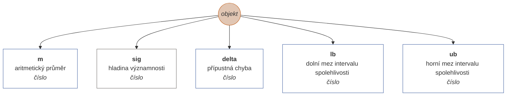

### [Interval spolehlivosti podílu](#pci)

Stanoví statistický protokol odhadu intervalu spolehlivosti podílu výběrového souboru při určité úrovni spolehlivosti.

#### Argumenty

| id |popis |typ hodnoty |validátor |povinný |defaultní hodnota |
| :--- |:--- |:--- |:--- |:--- |:--- |
| <b></b> | hledaná hodnota | cokoliv | <sub>-<sub> | ✔️ |  |
| <b>alpha</b> | hladina významnosti | desetinné číslo mezi 1 a 0 (včetně) | <sub>Ověří, zdali se jedná o celé kladné číslo větší než nula. V opačném případě vyvolá chybu.<sub> |  | 0.95 |

### Před-výpočetní úprava dat

Odstraní z vektoru všechny prázdné hodnoty (buňky).

#### Příklady syntaxe

```js
var v = new NumericVector([2,2,3,3,4,4,5,5,6,7,8,9,10,11,10,9,8,7,7,6,6,5,5]).pci(5, 0.95);
```

#### Schéma výsledku

```mermaid
graph TD
pci((<i>objekt</i>))
style pci fill:#E1C6B3;
style pci stroke:#C36422;
pci --> p[<b>p</b><br>podíl hodnoty v % <br><i>číslo</i>]
style p fill:#FFFFFF;
style p stroke:#75716F;
pci --> sig[<b>sig</b><br>hladina významnosti <br><i>číslo</i>]
style sig fill:#FFFFFF;
style sig stroke:#75716F;
pci --> delta[<b>delta</b><br>přípustná chyba <br><i>číslo</i>]
style delta fill:#FFFFFF;
style delta stroke:#75716F;
pci --> lb[<b>lb</b><br>dolní mez intervalu spolehlivosti <br><i>číslo</i>]
style lb fill:#FFFFFF;
style lb stroke:#75716F;
pci --> ub[<b>ub</b><br>horní mez intervalu spolehlivosti <br><i>číslo</i>]
style ub fill:#FFFFFF;
style ub stroke:#75716F;

```

### [Jednovýběrový t-test](#ttest)

Stanoví statistický protokol pro jednovýběrový t-test při zadání populačního průměru.

#### Argumenty

| id |popis |typ hodnoty |validátor |povinný |defaultní hodnota |
| :--- |:--- |:--- |:--- |:--- |:--- |
| <b></b> | populační průměr | číslo | <sub>Ověří, zdali je hodnota číslo. V opačném případě vyvolá chybu.<sub> | ✔️ |  |

### Před-výpočetní úprava dat

Odstraní z vektoru všechny prázdné hodnoty (buňky).

#### Příklady syntaxe

```js
var T = new NumericVector(4.5,3.9,5,6,7,5.7,9.1,5.3,7.2,6.9,6,7.5,5.3,7.1,8.2,1).ttest(10);
```

#### Schéma výsledku

```mermaid
graph TD
ttest((<i>objekt</i>))
style ttest fill:#E1C6B3;
style ttest stroke:#C36422;
ttest --> t[<b>t</b><br>hodnota testového kritéria daného t-testu <br><i>číslo</i>]
style t fill:#FFFFFF;
style t stroke:#4967A4;
ttest --> p[<b>p</b><br>významnost <br><i>číslo</i>]
style p fill:#FFFFFF;
style p stroke:#75716F;
ttest --> n[<b>n</b><br>počet případů <br><i>číslo</i>]
style n fill:#FFFFFF;
style n stroke:#75716F;

```

### [Shapirův-Wilkův W test](#swtest)

Stanoví statistický protokol Shapiro-Wilkova W testu normality rozdělení hodnot vektoru. Shapiro-Wilk test je statistický test, který se používá k testování hypotézy, že data pocházejí z normálního rozdělení. Tento test je často používán k ověření normality dat v rámci statistické analýzy. Test Shapiro-Wilk se zakládá na porovnání hodnoty kvartilů dat s hodnotami kvartilů normálního rozdělení. Když jsou hodnoty kvartilů dat podobné hodnotám kvartilů normálního rozdělení, je pravděpodobné, že data pocházejí z normálního rozdělení. V opačném případě je pravděpodobné, že data nejsou normální. Při použití testu Shapiro-Wilk je třeba si uvědomit, že tento test má nízkou citlivost pro velké vzorky, tj. pro velké vzorky může být test méně spolehlivý při detekci ne-normality. Proto se pro velké vzorky často používají jiné testy normality, jako například test Anderson-Darling nebo test Kolmogorov-Smirnov.

⚠️ Tato metoda je ve vývojové fázi a může vracet neplatné výsledky či vyvolávat chybu.


### Před-výpočetní úprava dat

Odstraní z vektoru všechny prázdné hodnoty (buňky).

#### Příklady syntaxe

```js
var sw = new NumericVector(2,2,3,3,4,4,5,5,6,7,8,9,10,11,10,9,8,7,7,6,6,5,5).swtest();
```

#### Schéma výsledku

```mermaid
graph TD
shapirowilk((<i>objekt</i>))
style shapirowilk fill:#E1C6B3;
style shapirowilk stroke:#C36422;
shapirowilk --> W[<b>W</b><br>hodnota testového kritéria W <br><i>číslo</i>]
style W fill:#FFFFFF;
style W stroke:#4967A4;
shapirowilk --> df[<b>df</b><br>stupně volnosti <br><i>číslo</i>]
style df fill:#FFFFFF;
style df stroke:#75716F;
shapirowilk --> p[<b>p</b><br>významnost <br><i>číslo</i>]
style p fill:#FFFFFF;
style p stroke:#75716F;

```

### [Kolmogorov-Smirnovův test](#kstest)

Stanoví statistický protokol Komogorov-Smirnovova testu normality rozdělení hodnot vektoru. Aktuálně nepočítá hladinu významnosti testu. Kolmogorov-Smirnov test (často také zkracovaný jako K-S test) je statistický test, který se používá k testování hypotézy, že data pocházejí z určitého rozdělení. Tento test porovnává rozdělení dat s teoretickým rozdělením, které se předpokládá, že data vycházejí, a vyhodnocuje, zda jsou datové hodnoty s teoretickým rozdělením dostatečně blízko, aby se mohla hypotéza o tom, že data pocházejí z daného rozdělení, považovat za pravdivou.Test Kolmogorov-Smirnov se často používá k ověření normality dat, ale může být také použit k ověření, zda data pocházejí z jiného teoretického rozdělení, jako je například exponenciální nebo binomické rozdělení. Test Kolmogorov-Smirnov je obecně považován za jeden z nejpřesnějších testů normality, ale má omezenou citlivost pro malé vzorky, tj. pro malé vzorky může být méně spolehlivý při detekci ne-normality. Pro malé vzorky se proto často používají jiné testy normality, jako například test Shapiro-Wilk nebo test Anderson-Darling.

⚠️ Tato metoda je ve vývojové fázi a může vracet neplatné výsledky či vyvolávat chybu.


### Před-výpočetní úprava dat

Odstraní z vektoru všechny prázdné hodnoty (buňky).

#### Příklady syntaxe

```js
var sw = new NumericVector(2,2,3,3,4,4,5,5,6,7,8,9,10,11,10,9,8,7,7,6,6,5,5).kstest();
```

#### Schéma výsledku

```mermaid
graph TD
kstest((<i>objekt</i>))
style kstest fill:#E1C6B3;
style kstest stroke:#C36422;
kstest --> T[<b>T</b><br>hodnota testového kritéria K <br><i>číslo</i>]
style T fill:#FFFFFF;
style T stroke:#4967A4;
kstest --> df[<b>df</b><br>stupně volnosti <br><i>číslo</i>]
style df fill:#FFFFFF;
style df stroke:#75716F;
kstest --> p[<b>p</b><br>významnost <br><i>číslo</i>]
style p fill:#FFFFFF;
style p stroke:#75716F;

```

## Dokumentace statistických metod matic

Maticové metody představují statistické metody, které je možné provádět nad danou maticí. Obecně je lze volat dvě způsoby: buďto přímo (např. {Matrix}.correlPearson(0,1), nebo pomocí obecné metody 'analyze', např. {Matrix}.analyze('correlPearson').run(0,1). Rozdíl mezi první a druhým způsobem spočívá v tom, že u první metody dotneme čistý výsledek (u daného příkladu objekt s vlastnostmi r a p), v druhém případě dostaneme zpět celou třídy MatrixAnalysis, obsahující kromě výsledku i metadata (jako jsou informacee o vzorku, trvání výpočtu ad.) a také vstupní model, specifikaci argumentů atd. Pokud tedy potřebujete v průběhu výpočtu uchovávat metadata, je vhodné volat metody přes funkci 'analyze', kde parametr tvoří název metody.

Každá metoda má specifikované argumenty a jejich validátory. Validátory metod ověřují, zdali jsou uživatelem poskytnuté parametry v souladu s očekávanými vstupy výpočetních funkcí a v řadě případů jsou i schopné kompatibilní typy (třeba Array x Vector) překonvertovat. Validátory často fungují v několika krocích, tzn. pokud se jim nezdaří validovat vstupní hodnotu jením způsobem, mají v zásobě třeba ještě dvě další strategie konverze. Hodnota validátorů spočívá v tom, že výpočetní metoda dostane skutečně takové parametry, na základě kterých výslednou statistiku spočítá správně. 

Řada metod má specifikovaný tzv. preprocessor, což je funkce, která vstupní data výpočetních funkcí upraví na potřebný formát. Nejčastěji se jedná o to, že ze vstupních vektorů vyřadí řádky s prázdnámi hodnotami. V některých metodách ale provádí hlubší změny, např. transformaci matice dle určitého klíče (např. ANOVA). Preprocessory mají ještě jednu funkci, a to že do dat ukládají statistiky vstupního (raw) a počítaného (net) souboru.

| funkce | metoda |
| :--- | :--- |
| linreg | [Lineární regrese](#linreg) |
| correlPearson | [Pearsonův korelační koeficient](#correlPearson) |
| correlSpearman | [Spearmanův korelační koeficient](#correlSpearman) |
| correlGamma | [Koeficient gamma](#correlGamma) |
| correlKendall ⚠️ | [Kendallova korelace](#correlKendall) |
| correlPartial | [Parciální korelace](#correlPartial) |
| correlBiserial | [Bodově biseriální korelace](#correlBiserial) |
| anovaow | [Jednofaktorová analýza rozptylu (ANOVA)](#anovaow) |
| ttestind | [Dvouvýběrový t-test](#ttestind) |
| ttestpair | [T-test (párový)](#ttestpair) |
| mwu ⚠️ | [Mann-Whitneyho test](#mwu) |
| wcxpaired | [Wilcoxonův znaménkový test pro dva závislé výběry](#wcxpaired) |
| friedman ⚠️ | [Friedmanova ANOVA](#friedman) |
| contingency | [Kontingence](#contingency) |

## [Lineární regrese](#linreg)

Lineární regrese je statistická metoda používaná k nalezení vztahu mezi dvěma proměnnými. Tyto proměnné jsou obvykle označeny jako závislá proměnná a nezávislá proměnná. Cílem lineární regrese je najít nejlepší lineární aproximaci závislé proměnné v závislosti na nezávislé proměnné. Lineární regrese se používá k predikci hodnoty závislé proměnné pro danou hodnotu nezávislé proměnné, když mezi nimi existuje lineární vztah. Tento vztah je reprezentován pomocí rovnice lineární regrese, která popisuje, jak se hodnoty závislé proměnné mění v závislosti na hodnotách nezávislé proměnné. Lineární regrese je často používána v různých oblastech, jako je ekonomie, sociologie, biologie, psychologie, inženýrství a dalších.

Metoda umožňuje upřesnit, pro jakou transformaci modelu (např. lineární, logaritmovanou) hledáme koeficient determinace.

#### Argumenty

| id |popis |typ hodnoty |validátor |povinný |defaultní hodnota |
| :--- |:--- |:--- |:--- |:--- |:--- |
| <b></b> | nezávislá (vysvětlující) proměnná (X) | numerický vektor | <sub>Ověří, zdali je argument typově numerický vektor, nebo zdali se jedná o validní identifkátor numerického vektoru v matici, nebo - pokud je argument typu array - se pokusí řadu pomocí funkce 'numerify' převést na numerický vektor. Pokud se ani jedna z variant nezdaří, vyhodí chybu.<sub> | ✔️ |  |
| <b>x</b> | závislá (vysvětlovaná) proměnná (Y) | numerický vektor | <sub>Ověří, zdali je argument typově numerický vektor, nebo zdali se jedná o validní identifkátor numerického vektoru v matici, nebo - pokud je argument typu array - se pokusí řadu pomocí funkce 'numerify' převést na numerický vektor. Pokud se ani jedna z variant nezdaří, vyhodí chybu.<sub> | ✔️ |  |
| <b></b> | regresní model | enumerace | <sub>Ověří, zdali je zadaná hodnota klíčem enumerace (seznamu možných hodnot). Pokud ne, vyhodí chybu.<br><br><b>1</b> = lineární<br><b>2</b> = logaritmický<br><b>3</b> = hyperbolický<br><b>4</b> = exponenciální<br><b>5</b> = kvadratický<br><sub> |  | 1 |

#### Před-výpočetní úprava dat

Odstraní ze vstupních vektorů (matice) všechny řádky, ve kterých je alespoň jedna prázdná hodnota.

#### Příklady syntaxe

```js
var M = new Matrix(
new NumericVector(180,197,240,210,180,160,179,185,183,150,110,190,170).name("independent x"),
new NumericVector(75,82,100,80,75,60,75,71,77,63,46,81,70).name("dependent y")
);
var lr_a = M.linreg(0,1); // with model argument missing (set to 1 by default)
var lr_b = M.linreg(0,1,4); // regression model set to 4 (exponential transformation)
var lr_c = M.analyze("linreg").run({x: 0, y: "dependent y", model: undefined}); // same as lr_a
var lr_b = M.analyze("linreg").run({x: "independent x", y: 1, model: 4}); // same as lr_b
// lr_a = lr_c.result
// lb_b = lr_d.result
```

#### Schéma výsledku

```mermaid
graph TD
linreg((<i>objekt</i>))
style linreg fill:#E1C6B3;
style linreg stroke:#C36422;
linreg --> r2[<b>r2</b><br>koeficient determinace <br><i>číslo</i>]
style r2 fill:#FFFFFF;
style r2 stroke:#4967A4;
linreg --> r[<b>r</b><br>Pearsonův korelační koeficient <br><i>číslo</i>]
style r fill:#FFFFFF;
style r stroke:#4967A4;
linreg --> F[<b>F</b><br>F test <br><i>číslo</i>]
style F fill:#FFFFFF;
style F stroke:#4967A4;
linreg --> p[<b>p</b><br>významnost <br><i>číslo</i>]
style p fill:#FFFFFF;
style p stroke:#75716F;
linreg --> beta0[<b>beta0</b><br>konstanta funkce <br><i>číslo</i>]
style beta0 fill:#FFFFFF;
style beta0 stroke:#4967A4;
linreg --> beta1[<b>beta1</b><br>koeficient funkce <br><i>číslo</i>]
style beta1 fill:#FFFFFF;
style beta1 stroke:#4967A4;

```

## [Pearsonův korelační koeficient](#correlPearson)

Stanoví statistický protokol Pearsonova korelačního koeficientu. Pearsonova korelace je statistická metoda, která se používá k měření vztahu mezi dvěma veličinami. Jejím cílem je zjistit, zda existuje lineární vztah mezi těmito veličinami a jaký je jeho intenzita.
Pearsonova korelace se vypočítá pomocí vzorce, který se nazývá Pearsonův koeficient korelace. Tento koeficient se pohybuje v rozmezí od -1 do 1 a udává, jak silně je mezi veličinami vztah. Pokud je koeficient blízký -1, znamená to, že mezi veličinami je silný negativní vztah, což znamená, že když se hodnota jedné veličiny zvyšuje, hodnota druhé veličiny klesá. Naopak pokud je koeficient blízký 1, znamená to, že mezi veličinami je silný pozitivní vztah, což znamená, že když se hodnota jedné veličiny zvyšuje, hodnota druhé veličiny také roste. Pokud je koeficient blízký 0, znamená to, že mezi veličinami není žádný vztah nebo je vztah velmi slabý.
Pearsonova korelace se používá především k porovnávání dvou kvantitativních veličin, tj. veličin, které jsou měřitelné na škále s přesnými hodnotami (například věk, výška nebo hmotnost). Může se použít k určení, zda existuje vztah mezi těmito veličinami a jaký je jeho charakter. Například může být Pearsonova korelace použita k porovnání věku a hmotnosti a zjistit, zda existuje vztah mezi těmito veličinami a jaký je jeho charakter. Může se také použít k porovnání výsledků dvou různých testů a zjistit, zda existuje vztah mezi výsledky těchto testů. Zdroj: https://chat.openai.com/chat

#### Argumenty

| id |popis |typ hodnoty |validátor |povinný |defaultní hodnota |
| :--- |:--- |:--- |:--- |:--- |:--- |
| <b>y</b> | první proměnná | numerický vektor | <sub>Ověří, zdali je argument typově numerický vektor, nebo zdali se jedná o validní identifkátor numerického vektoru v matici, nebo - pokud je argument typu array - se pokusí řadu pomocí funkce 'numerify' převést na numerický vektor. Pokud se ani jedna z variant nezdaří, vyhodí chybu.<sub> | ✔️ |  |
| <b>x</b> | druhá proměnná | numerický vektor | <sub>Ověří, zdali je argument typově numerický vektor, nebo zdali se jedná o validní identifkátor numerického vektoru v matici, nebo - pokud je argument typu array - se pokusí řadu pomocí funkce 'numerify' převést na numerický vektor. Pokud se ani jedna z variant nezdaří, vyhodí chybu.<sub> | ✔️ |  |

#### Před-výpočetní úprava dat

Odstraní ze vstupních vektorů (matice) všechny řádky, ve kterých je alespoň jedna prázdná hodnota.

#### Příklady syntaxe

```js
var M = new Matrix(
new NumericVector(180,197,240,210,180,160,179,185,183,150,110,190,170).name("height"),
new NumericVector(75,82,100,80,75,60,75,71,77,63,46,81,70).name("weight")
);
var rxy_a = M.analyze("correlPearson").run(0,1);
var rxy_b = M.correlPearson("height","weight");
// rxy_a.result = rxy_b
```

#### Schéma výsledku

```mermaid
graph TD
correlPearson((<i>objekt</i>))
style correlPearson fill:#E1C6B3;
style correlPearson stroke:#C36422;
correlPearson --> r[<b>r</b><br>Pearsonův korelační koeficient <br><i>číslo</i>]
style r fill:#FFFFFF;
style r stroke:#4967A4;
correlPearson --> p[<b>p</b><br>významnost <br><i>číslo</i>]
style p fill:#FFFFFF;
style p stroke:#75716F;

```

## [Spearmanův korelační koeficient](#correlSpearman)

Stanoví statistický protokol Spearmanova koeficientu pořadové korelace. Narozdíl od hodnoty Pearsonovy korelačního koeficientu, hodnota tohoto koeficientu vychází z porovnání pořadí velikosti hodnot vstupních proměnných.

#### Argumenty

| id |popis |typ hodnoty |validátor |povinný |defaultní hodnota |
| :--- |:--- |:--- |:--- |:--- |:--- |
| <b>y</b> | první proměnná | numerický vektor | <sub>Ověří, zdali je argument typově numerický vektor, nebo zdali se jedná o validní identifkátor numerického vektoru v matici, nebo - pokud je argument typu array - se pokusí řadu pomocí funkce 'numerify' převést na numerický vektor. Pokud se ani jedna z variant nezdaří, vyhodí chybu.<sub> | ✔️ |  |
| <b>x</b> | druhá proměnná | numerický vektor | <sub>Ověří, zdali je argument typově numerický vektor, nebo zdali se jedná o validní identifkátor numerického vektoru v matici, nebo - pokud je argument typu array - se pokusí řadu pomocí funkce 'numerify' převést na numerický vektor. Pokud se ani jedna z variant nezdaří, vyhodí chybu.<sub> | ✔️ |  |

#### Před-výpočetní úprava dat

Odstraní ze vstupních vektorů (matice) všechny řádky, ve kterých je alespoň jedna prázdná hodnota.

#### Příklady syntaxe

```js
var M = new Matrix(
new NumericVector(3,7,5,10,9,8,4,1,6,2).name("design rating"),
new NumericVector(4,9,2,10,8,7,6,3,5,1).name("utility rating")
);
var rs_a = M.analyze("correlSpearman").run(0,1);
var rs_b = M.correlSpearman("design rating","utility rating");
// rs_a.result = rs_b
```

#### Schéma výsledku

```mermaid
graph TD
correlSpearman((<i>objekt</i>))
style correlSpearman fill:#E1C6B3;
style correlSpearman stroke:#C36422;
correlSpearman --> r[<b>r</b><br>Spearmanův korelační koeficient <br><i>číslo</i>]
style r fill:#FFFFFF;
style r stroke:#4967A4;
correlSpearman --> df[<b>df</b><br>stupně volnosti <br><i>číslo</i>]
style df fill:#FFFFFF;
style df stroke:#75716F;
correlSpearman --> p[<b>p</b><br>významnost <br><i>číslo</i>]
style p fill:#FFFFFF;
style p stroke:#75716F;

```

## [Koeficient gamma](#correlGamma)

Goodman-Kruskalova gama je obdobou ordinálního korelačního koeficientu, tedy testu, který měří závislost mezi dvěma pořadovými proměnnými. I z toho důvodu může nabývat stejných hodnot jako ostatní korelační koeficienty (např. Pearsonův či Spearmanův) a stejně se i interpretuje. Tento test se před ostatními pořadově orientovanými korelačními metodami doporučuje tehdy, pokud mají data mnoho shodných pořadí (tzv. ties).

#### Argumenty

| id |popis |typ hodnoty |validátor |povinný |defaultní hodnota |
| :--- |:--- |:--- |:--- |:--- |:--- |
| <b>y</b> | první proměnná | numerický vektor | <sub>Ověří, zdali je argument typově numerický vektor, nebo zdali se jedná o validní identifkátor numerického vektoru v matici, nebo - pokud je argument typu array - se pokusí řadu pomocí funkce 'numerify' převést na numerický vektor. Pokud se ani jedna z variant nezdaří, vyhodí chybu.<sub> | ✔️ |  |
| <b>x</b> | druhá proměnná | numerický vektor | <sub>Ověří, zdali je argument typově numerický vektor, nebo zdali se jedná o validní identifkátor numerického vektoru v matici, nebo - pokud je argument typu array - se pokusí řadu pomocí funkce 'numerify' převést na numerický vektor. Pokud se ani jedna z variant nezdaří, vyhodí chybu.<sub> | ✔️ |  |

#### Před-výpočetní úprava dat

Odstraní ze vstupních vektorů (matice) všechny řádky, ve kterých je alespoň jedna prázdná hodnota.

#### Příklady syntaxe

```js
var M = new Matrix(
new NumericVector(180,197,240,210,180,160,179,185,183,150,110,190,170).name("score A"),
new NumericVector(75,82,100,80,75,60,75,71,77,63,46,81,70).name("score B")
);
var rg_a = M.analyze("correlGamma").run(0,1);
var rg_b = M.correlGamma("score A","score B");
// rg_a.result = rg_b
```

#### Schéma výsledku

```mermaid
graph TD
correlGamma((<i>objekt</i>))
style correlGamma fill:#E1C6B3;
style correlGamma stroke:#C36422;
correlGamma --> r[<b>r</b><br>Goodman-Kruskalova gama <br><i>číslo</i>]
style r fill:#FFFFFF;
style r stroke:#4967A4;
correlGamma --> p[<b>p</b><br>významnost <br><i>číslo</i>]
style p fill:#FFFFFF;
style p stroke:#75716F;

```

## [Kendallova korelace](#correlKendall)

Stanoví statistický protokol Kendallova korelačního koeficientu Tau-B. Pokud byste tutéž operaci počítali v SPSS, patrně dostanete mírně odlišný výsledek. Podle všeho je to vlivem odlišné citlivosti na desetinná místa u obou systémů. Na interpretaci výsledku by to nicméně zásadní vliv mít nemělo.

⚠️ Tato metoda je ve vývojové fázi a může vracet neplatné výsledky či vyvolávat chybu.

#### Argumenty

| id |popis |typ hodnoty |validátor |povinný |defaultní hodnota |
| :--- |:--- |:--- |:--- |:--- |:--- |
| <b>y</b> | první proměnná | numerický vektor | <sub>Ověří, zdali je argument typově numerický vektor, nebo zdali se jedná o validní identifkátor numerického vektoru v matici, nebo - pokud je argument typu array - se pokusí řadu pomocí funkce 'numerify' převést na numerický vektor. Pokud se ani jedna z variant nezdaří, vyhodí chybu.<sub> | ✔️ |  |
| <b>x</b> | druhá proměnná | numerický vektor | <sub>Ověří, zdali je argument typově numerický vektor, nebo zdali se jedná o validní identifkátor numerického vektoru v matici, nebo - pokud je argument typu array - se pokusí řadu pomocí funkce 'numerify' převést na numerický vektor. Pokud se ani jedna z variant nezdaří, vyhodí chybu.<sub> | ✔️ |  |

#### Před-výpočetní úprava dat

Odstraní ze vstupních vektorů (matice) všechny řádky, ve kterých je alespoň jedna prázdná hodnota.

#### Příklady syntaxe

```js
var M = new Matrix(
new NumericVector(3,7,5,10,9,8,4,1,6,2).name("design rating"),
new NumericVector(4,9,2,10,8,7,6,3,5,1).name("utility rating")
);
var rk_a = M.analyze("correlKendall").run(0,1);
var rk_b = M.correlKendall("design rating","utility rating");
// rk_a.result = rk_b
```

#### Schéma výsledku

```mermaid
graph TD
correlKendall((<i>objekt</i>))
style correlKendall fill:#E1C6B3;
style correlKendall stroke:#C36422;
correlKendall --> taub[<b>taub</b><br>Tau-b <br><i>číslo</i>]
style taub fill:#FFFFFF;
style taub stroke:#4967A4;
correlKendall --> taua[<b>taua</b><br>Tau-a <br><i>číslo</i>]
style taua fill:#FFFFFF;
style taua stroke:#4967A4;
correlKendall --> df[<b>df</b><br>stupně volnosti <br><i>číslo</i>]
style df fill:#FFFFFF;
style df stroke:#75716F;
correlKendall --> p[<b>p</b><br>významnost <br><i>číslo</i>]
style p fill:#FFFFFF;
style p stroke:#75716F;

```

## [Parciální korelace](#correlPartial)

Parciální korelační koeficient umožňuje zjistit, jaký je vztah mezi dvěma proměnnými, přičemž se zohlední vliv třetí proměnné. To je užitečné, pokud chcete zjistit, zda existuje přímý vztah mezi dvěma proměnnými, aniž byste byli ovlivněni vlivem jiných proměnných. Například, pokud chcete zjistit, zda existuje vztah mezi úrovní školení a úspěšností v práci, může být užitečné zohlednit také vliv věku nebo pohlaví. V takovém případě byste mohli použít parciální korelaci k zjištění vztahu mezi úrovní školení a úspěšností v práci při zohlednění vlivu věku a pohlaví. Parciální korelace se počítá pomocí vzorce, který se odvíjí od korelačního koeficientu Pearsona. Je důležité si uvědomit, že parciální korelace neznamená causaci, tj. že jedna proměnná nezpůsobuje druhou, ale pouze ukazuje, že existuje mezi nimi určitá souvislost. Zdroj: https://chat.openai.com/chat.

#### Argumenty

| id |popis |typ hodnoty |validátor |povinný |defaultní hodnota |
| :--- |:--- |:--- |:--- |:--- |:--- |
| <b>y</b> | první proměnná | numerický vektor | <sub>Ověří, zdali je argument typově numerický vektor, nebo zdali se jedná o validní identifkátor numerického vektoru v matici, nebo - pokud je argument typu array - se pokusí řadu pomocí funkce 'numerify' převést na numerický vektor. Pokud se ani jedna z variant nezdaří, vyhodí chybu.<sub> | ✔️ |  |
| <b>x</b> | druhá proměnná | numerický vektor | <sub>Ověří, zdali je argument typově numerický vektor, nebo zdali se jedná o validní identifkátor numerického vektoru v matici, nebo - pokud je argument typu array - se pokusí řadu pomocí funkce 'numerify' převést na numerický vektor. Pokud se ani jedna z variant nezdaří, vyhodí chybu.<sub> | ✔️ |  |
| <b>y</b> | třetí (kontrolní) proměnná | numerický vektor | <sub>Ověří, zdali je argument typově numerický vektor, nebo zdali se jedná o validní identifkátor numerického vektoru v matici, nebo - pokud je argument typu array - se pokusí řadu pomocí funkce 'numerify' převést na numerický vektor. Pokud se ani jedna z variant nezdaří, vyhodí chybu.<sub> | ✔️ |  |

#### Před-výpočetní úprava dat

Odstraní ze vstupních vektorů (matice) všechny řádky, ve kterých je alespoň jedna prázdná hodnota.

#### Příklady syntaxe

```js
var M = new Matrix(
new NumericVector(180,197,240,210,180,160,179,185,183,150,110,190,170).name("x"),
new NumericVector(75,82,100,80,75,60,75,71,77,63,46,81,70).name("y"),
new NumericVector(79,81,103,84,72,55,78,76,82,65,49,83,74).name("z")
);
var rp_a = M.analyze("correlPartial").run(0,1,2);
var rp_b = M.correlPartial("x","y","z");
// rp_a.result = rp_b
```

#### Schéma výsledku

```mermaid
graph TD
correlPartial((<i>objekt</i>))
style correlPartial fill:#E1C6B3;
style correlPartial stroke:#C36422;
correlPartial --> r[<b>r</b><br>Pearsonův korelační koeficient <br><i>číslo</i>]
style r fill:#FFFFFF;
style r stroke:#4967A4;
correlPartial --> p[<b>p</b><br>významnost <br><i>číslo</i>]
style p fill:#FFFFFF;
style p stroke:#75716F;

```

## [Bodově biseriální korelace](#correlBiserial)

Bodově biseriální korelační koeficient se používá k vyhodnocení vztahu mezi dvěma ...

#### Argumenty

| id |popis |typ hodnoty |validátor |povinný |defaultní hodnota |
| :--- |:--- |:--- |:--- |:--- |:--- |
| <b></b> | první proměnná | binární vektor | <sub>Ověří, zdali je argument buďto binární (boolean) vektor, jeho identifikátor nebo řada převoditelná na binární vektor. V opačném případě vyhodí chybu,<sub> | ✔️ |  |
| <b>z</b> | druhá proměnná | numerický vektor | <sub>Ověří, zdali je argument typově numerický vektor, nebo zdali se jedná o validní identifkátor numerického vektoru v matici, nebo - pokud je argument typu array - se pokusí řadu pomocí funkce 'numerify' převést na numerický vektor. Pokud se ani jedna z variant nezdaří, vyhodí chybu.<sub> | ✔️ |  |

#### Před-výpočetní úprava dat

Odstraní ze vstupních vektorů (matice) všechny řádky, ve kterých je alespoň jedna prázdná hodnota.

#### Schéma výsledku

```mermaid
graph TD
correlPearson((<i>objekt</i>))
style correlPearson fill:#E1C6B3;
style correlPearson stroke:#C36422;
correlPearson --> r[<b>r</b><br>Pearsonův korelační koeficient <br><i>číslo</i>]
style r fill:#FFFFFF;
style r stroke:#4967A4;
correlPearson --> p[<b>p</b><br>významnost <br><i>číslo</i>]
style p fill:#FFFFFF;
style p stroke:#75716F;

```

## [Jednofaktorová analýza rozptylu (ANOVA)](#anovaow)

Stanoví statistický protokol analýzy rozptylu jednoduchého třídění (One-way ANOVA). Metoda má dva argumenty. První tvoří řada numerických vektorů, kde minimálně jeden vektor je povinný. Druhý argument je nepovinný a představuje shlukovací faktor, tedy textovou proměnnou, která v řádcích určuje příslučnost numerického faktoru ke skupině. Pokud je zadán druhý parametr, z první skupiny vektorů je zohledňován pouze první.

#### Argumenty

| id |popis |typ hodnoty |validátor |povinný |defaultní hodnota |
| :--- |:--- |:--- |:--- |:--- |:--- |
| <b></b> | vstupní vektor/y | numerický vektor nebo matice numerických vektorů | <sub>Ověří, zdali je argument buďto numerický vektor, jeho identifikátor nebo řada převoditelná na numerický vektor, anebo zdali se jedná o řadu numerických vektorů (resp. hodnot, které jsou buďto vektory, identifikátry nebo hodnoty převoditelné na numerické vektory - v libovolné kombinace). Pokud se ani jedna z variant nezdaří, vyhodí chybu.<sub> | ✔️ |  |
| <b></b> | shlukovací proměnná | jakýkoliv vektor | <sub>Ověří, zdali je argument typu vektor, nebo zdali se jedná o validní identifkátor vektoru v matice, nebo - pokud je argument typu array - se pokusí řadu pomocí funkce 'vectorify' převést na vektor. Pokud se ani jedna z variant nezdaří, vyhodí chybu.<sub> |  |  |

#### Před-výpočetní úprava dat

Pokud argumenty specifikují faktorovou proměnnou (druhý argument), rozloží se první argument (buďto numerický vektor nebo první vektor v matici, pokud je prvním argumentem matice) dle hodnot faktoru do nové matice. Pokud jsou argumenty bez faktoru (tedy druhý argument je prázdný), vezme všechny numerické vektory z prvního argumentu 'vectors' (matice) a následně odstraní řádky s prázdnými hodnotami. V případě, že není zadán argument 'factor' a argument 'vectors' zároveň obsahuje pouze jediný vektor nebo je sám numerickým vektorem, vyhodí chybu (bez faktoru jsou třeba alespoň dva numerické vektory v prvním argumentu).

#### Příklady syntaxe

```js
var M = new Matrix(
new NumericVector(180,197,240,210,180,160,179,185,183,150,110,190,170).name("x"),
new NumericVector(75,82,100,80,75,60,75,71,77,63,46,81,70).name("y"),
new NumericVector(275,282,300,280,275,260,275,271,277,263,246,281,270).name("z")
);
var anova = M.analyze("anovaow").run({vectors: [0,1,2]});
```

#### Schéma výsledku

```mermaid
graph TD
anovaow((<i>objekt</i>))
style anovaow fill:#E1C6B3;
style anovaow stroke:#C36422;
anovaow --> F[<b>F</b><br>F test <br><i>číslo</i>]
style F fill:#FFFFFF;
style F stroke:#4967A4;
anovaow --> P2[<b>P2</b><br>Poměr determinace P2 ANOVA <br><i>číslo</i>]
style P2 fill:#FFFFFF;
style P2 stroke:#4967A4;
anovaow --> p[<b>p</b><br>významnost <br><i>číslo</i>]
style p fill:#FFFFFF;
style p stroke:#75716F;
anovaow --> n[<b>n</b><br>počet případů <br><i>číslo</i>]
style n fill:#FFFFFF;
style n stroke:#75716F;
anovaow --> ANOVA((<b>ANOVA</b><br><u>statistiky ANOVA</u>))
ANOVA((<b>ANOVA</b><br><u>statistiky ANOVA</u><br><i>objekt</i>))
style ANOVA fill:#E1C6B3;
style ANOVA stroke:#C36422;
ANOVA --> totalOfGroups[<b>totalOfGroups</b><br>celkem skupin <br><i>číslo</i>]
style totalOfGroups fill:#FFFFFF;
style totalOfGroups stroke:#75716F;
ANOVA --> betweenGroups((<b>betweenGroups</b><br><u>meziskupinové efekty</u>))
betweenGroups((<b>betweenGroups</b><br><u>meziskupinové efekty</u><br><i>objekt</i>))
style betweenGroups fill:#E1C6B3;
style betweenGroups stroke:#C36422;
betweenGroups --> sumOfSquares[<b>sumOfSquares</b><br>suma čtverců <br><i>číslo</i>]
style sumOfSquares fill:#FFFFFF;
style sumOfSquares stroke:#4967A4;
betweenGroups --> df[<b>df</b><br>stupně volnosti <br><i>číslo</i>]
style df fill:#FFFFFF;
style df stroke:#75716F;
ANOVA --> withinGroups((<b>withinGroups</b><br><u>vnitroskupinové efekty</u>))
withinGroups((<b>withinGroups</b><br><u>vnitroskupinové efekty</u><br><i>objekt</i>))
style withinGroups fill:#E1C6B3;
style withinGroups stroke:#C36422;
withinGroups --> sumOfSquares[<b>sumOfSquares</b><br>suma čtverců <br><i>číslo</i>]
style sumOfSquares fill:#FFFFFF;
style sumOfSquares stroke:#4967A4;
withinGroups --> df[<b>df</b><br>stupně volnosti <br><i>číslo</i>]
style df fill:#FFFFFF;
style df stroke:#75716F;
ANOVA --> total((<b>total</b><br><u>celkem</u>))
total((<b>total</b><br><u>celkem</u><br><i>objekt</i>))
style total fill:#E1C6B3;
style total stroke:#C36422;
total --> sumOfSquares[<b>sumOfSquares</b><br>suma čtverců <br><i>číslo</i>]
style sumOfSquares fill:#FFFFFF;
style sumOfSquares stroke:#4967A4;
total --> df[<b>df</b><br>stupně volnosti <br><i>číslo</i>]
style df fill:#FFFFFF;
style df stroke:#75716F;

```

## [Dvouvýběrový t-test](#ttestind)

Stanoví statistický protokol Studentova t-testu pro dva nezávislé výběry, které jsou definovány vlastní proměnnou (tedy dvěma numerickými vektory). Argumenty tvoří buď dva numerické vektory, nebo jeden numerický a jen faktorový vektor (obvykle text, ale může být i numerický či binární). Pokud je použit jako faktor vektor, který má více než dvě unikátní hodnoty, jsou pro test uvažovány pouze první dvě unikátní nalezené hodnoty (ostatní se ignorují) - v takovém případě je informace o velikosti čistého vzorku nepodstatná, nicméně hladina významnosti, do které velikost vzorku vstupuje, je již založena na čistých případech.

#### Argumenty

| id |popis |typ hodnoty |validátor |povinný |defaultní hodnota |
| :--- |:--- |:--- |:--- |:--- |:--- |
| <b>vectors</b> | vstupní vektor/y | numerický vektor nebo matice numerických vektorů | <sub>Ověří, zdali je argument buďto numerický vektor, jeho identifikátor nebo řada převoditelná na numerický vektor, anebo zdali se jedná o řadu numerických vektorů (resp. hodnot, které jsou buďto vektory, identifikátry nebo hodnoty převoditelné na numerické vektory - v libovolné kombinace). Pokud se ani jedna z variant nezdaří, vyhodí chybu.<sub> | ✔️ |  |
| <b>factor</b> | shlukovací proměnná | jakýkoliv vektor | <sub>Ověří, zdali je argument typu vektor, nebo zdali se jedná o validní identifkátor vektoru v matice, nebo - pokud je argument typu array - se pokusí řadu pomocí funkce 'vectorify' převést na vektor. Pokud se ani jedna z variant nezdaří, vyhodí chybu.<sub> |  |  |
#### Příklady syntaxe

##### Argumenty jako vlastnosti objektu

<sub>Metoda má dva parametry: vectors (první a povinný) a factor (druhý, nepovinný). V uvedeném příkladu je jako argument specifikován jediný objekt, který specifikuje hodnoty jednotlivých parametrů funkce. V této metodě je možné uvést parametr vectors i jako jediný vektor.</sub>

```js
var M = new Matrix(
new NumericVector(4,5,6,7,8,9,10,7,7,6).name("x"),
new NumericVector(10,11,9,8,7,8,9,4,5,10).name("y")
);
var ttestind_a = M.analyze("ttestind").run({vectors: [0,1]});
var ttestind_b = M.ttestind({vectors: [0,1]});
// ttestind_a.result === mqu_b
```

##### Argumenty jako řada

<sub>Argumenty jsou standardndím způsobem řazeny za sebe. Je zde zásadní dodržovat pořadí argumentů a krom toho, první argument by měl být ideálně ve formátu array, např. [vector1, vector2].</sub>

```js
var M = new Matrix(
new NumericVector(4,5,6,7,8,9,10,7,7,6).name("x"),
new NumericVector(10,11,9,8,7,8,9,4,5,10).name("y")
);
var ttestind_a = M.analyze("ttestind").run([0,1]);
var ttestind_b = M.ttestind(["x","y"]);
// ttestind_a.result === mqu_b
```

##### Implementace argumentu 'factor'

<sub>Jako druhý parametr je specifikován faktor, tedy proměnná, dle které se přetransformuje argument vector (případně první vektor, pakliže je zadáno více numerických vektorů).</sub>

```js
var M = new Matrix(
new NumericVector(4,5,6,7,8,9,10,7,7,6,10,11,9,8,7,8,9,4,5,10).name("score"),
new StringVector("A","A","A","A","A","A","A","A","A","A","B","B","B","B","B","B","B","B","B","B",).name("group")
);
var ttestind_a = M.analyze("ttestind").run({vectors: 0, factor: 1});
var ttestind_b = M.ttestind({vectors: 0, factor: 1});
var ttestind_c = M.analyze("ttestind").run(0, 1);
var ttestind_d = M.ttestind(0, 1);
var ttestind_e = M.analyze("ttestind").run([0], 1);
```

#### Schéma výsledku

```mermaid
graph TD
ttestind((<i>objekt</i>))
style ttestind fill:#E1C6B3;
style ttestind stroke:#C36422;
ttestind --> t[<b>t</b><br>hodnota testového kritéria daného t-testu <br><i>číslo</i>]
style t fill:#FFFFFF;
style t stroke:#4967A4;
ttestind --> p[<b>p</b><br>významnost <br><i>číslo</i>]
style p fill:#FFFFFF;
style p stroke:#75716F;
ttestind --> df[<b>df</b><br>stupně volnosti <br><i>číslo</i>]
style df fill:#FFFFFF;
style df stroke:#75716F;

```

## [T-test (párový)](#ttestpair)

Stanoví statistický protokol párového t-testu pro dva závislé výběry. Prázdné hodnoty jsou vyřezeny v průřezu řádků, tzn. že pokud v jednom řádku chybí alespoň jedna hodnota, je z analýzy vyřezen celý řádek.

#### Argumenty

| id |popis |typ hodnoty |validátor |povinný |defaultní hodnota |
| :--- |:--- |:--- |:--- |:--- |:--- |
| <b>y</b> | první proměnná | numerický vektor | <sub>Ověří, zdali je argument typově numerický vektor, nebo zdali se jedná o validní identifkátor numerického vektoru v matici, nebo - pokud je argument typu array - se pokusí řadu pomocí funkce 'numerify' převést na numerický vektor. Pokud se ani jedna z variant nezdaří, vyhodí chybu.<sub> | ✔️ |  |
| <b>x</b> | druhá proměnná | numerický vektor | <sub>Ověří, zdali je argument typově numerický vektor, nebo zdali se jedná o validní identifkátor numerického vektoru v matici, nebo - pokud je argument typu array - se pokusí řadu pomocí funkce 'numerify' převést na numerický vektor. Pokud se ani jedna z variant nezdaří, vyhodí chybu.<sub> | ✔️ |  |

#### Před-výpočetní úprava dat

Odstraní ze vstupních vektorů (matice) všechny řádky, ve kterých je alespoň jedna prázdná hodnota.

#### Příklady syntaxe

```js
var M = new Matrix(
new NumericVector(4,5,6,7,8,9,10,7,7,6).name("pre-score"),
new NumericVector(10,11,12,13,14,8,9,10,11,10).name("post-score")
);
var ttest_a = M.analyze("ttestpair").run(0,1);
var ttest_b = M.ttestpair("pre-score","post-score");
// ttest_a.result = ttest_b
```

#### Schéma výsledku

```mermaid
graph TD
ttestpair((<i>objekt</i>))
style ttestpair fill:#E1C6B3;
style ttestpair stroke:#C36422;
ttestpair --> t[<b>t</b><br>hodnota testového kritéria daného t-testu <br><i>číslo</i>]
style t fill:#FFFFFF;
style t stroke:#4967A4;
ttestpair --> p[<b>p</b><br>významnost <br><i>číslo</i>]
style p fill:#FFFFFF;
style p stroke:#75716F;
ttestpair --> df[<b>df</b><br>stupně volnosti <br><i>číslo</i>]
style df fill:#FFFFFF;
style df stroke:#75716F;

```

## [Mann-Whitneyho test](#mwu)

Stanoví statistický protokol Mann-Whitneyho U testu. Jedná se o neparametrický test nulové hypotézy, která srsovnává náhodně vybrané hodnoty X a Y ze dvou populací, přičemž pravděpodobnost, že X bude větší než Y, se rovná pravděpodobnosti, že Y bude větší než X.

⚠️ Tato metoda je ve vývojové fázi a může vracet neplatné výsledky či vyvolávat chybu.

#### Argumenty

| id |popis |typ hodnoty |validátor |povinný |defaultní hodnota |
| :--- |:--- |:--- |:--- |:--- |:--- |
| <b>vectors</b> | vstupní vektor/y | numerický vektor nebo matice numerických vektorů | <sub>Ověří, zdali je argument buďto numerický vektor, jeho identifikátor nebo řada převoditelná na numerický vektor, anebo zdali se jedná o řadu numerických vektorů (resp. hodnot, které jsou buďto vektory, identifikátry nebo hodnoty převoditelné na numerické vektory - v libovolné kombinace). Pokud se ani jedna z variant nezdaří, vyhodí chybu.<sub> | ✔️ |  |
| <b>factor</b> | shlukovací proměnná | jakýkoliv vektor | <sub>Ověří, zdali je argument typu vektor, nebo zdali se jedná o validní identifkátor vektoru v matice, nebo - pokud je argument typu array - se pokusí řadu pomocí funkce 'vectorify' převést na vektor. Pokud se ani jedna z variant nezdaří, vyhodí chybu.<sub> |  |  |

#### Před-výpočetní úprava dat

Pokud argumenty specifikují faktorovou proměnnou (druhý argument), rozloží se první argument (buďto numerický vektor nebo první vektor v matici, pokud je prvním argumentem matice) dle hodnot faktoru do nové matice. Pokud jsou argumenty bez faktoru (tedy druhý argument je prázdný), vezme první dva vektory z prvního argumentu 'vectors' (matice) a následně odstraní řádky s prázdnými hodnotami.V případě, že není zadán argument 'factor' a argument 'vectors' zároveň obsahuje pouze jediný vektor nebo je sám numerickým vektorem, vyhodí chybu (bez faktoru jsou třeba alespoň dva numerické vektory v prvním argumentu).

#### Příklady syntaxe

##### Argumenty jako vlastnosti objektu

<sub>Metoda má dva parametry: vectors (první a povinný) a factor (druhý, nepovinný). V uvedeném příkladu je jako argument specifikován jediný objekt, který specifikuje hodnoty jednotlivých parametrů funkce. V této metodě je možné uvést parametr vectors i jako jediný vektor.</sub>

```js
var M = new Matrix(
new NumericVector(4,5,6,7,8,9,10,7,7,6).name("x"),
new NumericVector(10,11,9,8,7,8,9,4,5,10).name("y")
);
var mwu_a = M.analyze("mwu").run({vectors: [0,1]});
var mwu_b = M.mwu({vectors: [0,1]});
// mwu_a.result === mqu_b
```

##### Argumenty jako řada

<sub>Argumenty jsou standardndím způsobem řazeny za sebe. Je zde zásadní dodržovat pořadí argumentů a krom toho, první argument by měl být ideálně ve formátu array, např. [vector1, vector2].</sub>

```js
var M = new Matrix(
new NumericVector(4,5,6,7,8,9,10,7,7,6).name("x"),
new NumericVector(10,11,9,8,7,8,9,4,5,10).name("y")
);
var mwu_a = M.analyze("mwu").run([0,1]);
var mwu_b = M.mwu(["x","y"]);
// mwu_a.result === mqu_b
```

##### Implementace argumentu 'factor'

<sub>Jako druhý parametr je specifikován faktor, tedy proměnná, dle které se přetransformuje argument vector (případně první vektor, pakliže je zadáno více numerických vektorů).</sub>

```js
var M = new Matrix(
new NumericVector(4,5,6,7,8,9,10,7,7,6,10,11,9,8,7,8,9,4,5,10).name("score"),
new StringVector("A","A","A","A","A","A","A","A","A","A","B","B","B","B","B","B","B","B","B","B",).name("group")
);
var mwu_a = M.analyze("mwu").run({vectors: 0, factor: 1});
var mwu_b = M.mwu({vectors: 0, factor: 1});
var mwu_c = M.analyze("mwu").run(0, 1);
var mwu_d = M.mwu(0, 1);
var mwu_e = M.analyze("mwu").run([0], 1);
```

#### Schéma výsledku

```mermaid
graph TD
mwu((<i>objekt</i>))
style mwu fill:#E1C6B3;
style mwu stroke:#C36422;
mwu --> U[<b>U</b><br>U test <br><i>číslo</i>]
style U fill:#FFFFFF;
style U stroke:#4967A4;
mwu --> Z[<b>Z</b><br>Z test <br><i>číslo</i>]
style Z fill:#FFFFFF;
style Z stroke:#4967A4;
mwu --> p[<b>p</b><br>významnost <br><i>číslo</i>]
style p fill:#FFFFFF;
style p stroke:#75716F;

```

## [Wilcoxonův znaménkový test pro dva závislé výběry](#wcxpaired)

Wilcoxonův znaménkový test je neparametrický statistický test používaný k určení, zda dva příbuzné nebo spárované vzorky mají stejný medián nebo ne. Používá se, když data nejsou normálně rozdělena nebo je porušen předpoklad stejných rozptylů. Tento test je vhodný pro malé velikosti vzorků.

#### Argumenty

| id |popis |typ hodnoty |validátor |povinný |defaultní hodnota |
| :--- |:--- |:--- |:--- |:--- |:--- |
| <b>y</b> | první proměnná | numerický vektor | <sub>Ověří, zdali je argument typově numerický vektor, nebo zdali se jedná o validní identifkátor numerického vektoru v matici, nebo - pokud je argument typu array - se pokusí řadu pomocí funkce 'numerify' převést na numerický vektor. Pokud se ani jedna z variant nezdaří, vyhodí chybu.<sub> | ✔️ |  |
| <b>x</b> | druhá proměnná | numerický vektor | <sub>Ověří, zdali je argument typově numerický vektor, nebo zdali se jedná o validní identifkátor numerického vektoru v matici, nebo - pokud je argument typu array - se pokusí řadu pomocí funkce 'numerify' převést na numerický vektor. Pokud se ani jedna z variant nezdaří, vyhodí chybu.<sub> | ✔️ |  |

#### Před-výpočetní úprava dat

Odstraní ze vstupních vektorů (matice) všechny řádky, ve kterých je alespoň jedna prázdná hodnota.

#### Příklady syntaxe

```js
var M = new Matrix(
new NumericVector(15,8,11,19,13,4,16,5,9,15,12,11,14,4,11,17,14,5,9,8,9,11,11,12,17,12,5,5,15,0).name("wife"),
new NumericVector(17,19,18,19,17,5,13,0,16,21,12,9,10,17,12,24,12,12,8,16,12,7,17,13,20,9,13,11,11,12).name("husband")
);
var wcx_a = M.analyze("wcxpaired").run("wife", "husband");
var wcx_b = M.wcxpaired(0,1);
// wcx_a.result = wcx_b
```

#### Schéma výsledku

```mermaid
graph TD
wcxpaired((<i>objekt</i>))
style wcxpaired fill:#E1C6B3;
style wcxpaired stroke:#C36422;
wcxpaired --> Z[<b>Z</b><br>Z test <br><i>číslo</i>]
style Z fill:#FFFFFF;
style Z stroke:#4967A4;
wcxpaired --> p[<b>p</b><br>významnost <br><i>číslo</i>]
style p fill:#FFFFFF;
style p stroke:#75716F;

```

## [Friedmanova ANOVA](#friedman)

Friedmanova analýza rozptylu je neparametrický statistický test vyvinutý Miltonem Friedmanem. Podobně jako u parametrických opakovaných opatření ANOVA se používá k detekci rozdílů v léčbě během více pokusů o testování. Postup zahrnuje hodnocení každého řádu (nebo bloku) dohromady, poté zváží hodnoty řad podle sloupců. Použitelné pro kompletní návrhy bloků je tedy zvláštním případem testu Durbin.

⚠️ Tato metoda je ve vývojové fázi a může vracet neplatné výsledky či vyvolávat chybu.

#### Argumenty

| id |popis |typ hodnoty |validátor |povinný |defaultní hodnota |
| :--- |:--- |:--- |:--- |:--- |:--- |
| <b>vectors</b> | vstupní vektor/y | numerický vektor nebo matice numerických vektorů | <sub>Ověří, zdali je argument buďto numerický vektor, jeho identifikátor nebo řada převoditelná na numerický vektor, anebo zdali se jedná o řadu numerických vektorů (resp. hodnot, které jsou buďto vektory, identifikátry nebo hodnoty převoditelné na numerické vektory - v libovolné kombinace). Pokud se ani jedna z variant nezdaří, vyhodí chybu.<sub> | ✔️ |  |

#### Před-výpočetní úprava dat

Odstraní ze vstupních vektorů (matice) všechny řádky, ve kterých je alespoň jedna prázdná hodnota.

#### Příklady syntaxe

```js
var M = new Matrix(
new NumericVector(10,8,7,9,7,4,5,6,5,10,4,7).name("white"),
new NumericVector(7,5,8,6,5,7,9,6,4,6,7,3).name("red"),
new NumericVector(8,5,6,4,7,5,3,7,6,4,4,3).name("rose")
);
var friedman_a = M.analyze("friedman").run([0,1,2]);
var friedman_b = M.friedman(["white","red","rose"]);
// friedman_a.result = friedman_b
```

#### Schéma výsledku

```mermaid
graph TD
friedman((<i>objekt</i>))
style friedman fill:#E1C6B3;
style friedman stroke:#C36422;
friedman --> Q[<b>Q</b><br>Friedmanův Q test <br><i>číslo</i>]
style Q fill:#FFFFFF;
style Q stroke:#4967A4;
friedman --> df[<b>df</b><br>stupně volnosti <br><i>číslo</i>]
style df fill:#FFFFFF;
style df stroke:#75716F;
friedman --> p[<b>p</b><br>významnost <br><i>číslo</i>]
style p fill:#FFFFFF;
style p stroke:#75716F;

```

## [Kontingence](#contingency)

Stanoví statistický protokol kontingence. Parametry metody jsou a) řádková proměnná, b) sloupcová proměnná a volitelně c) četnost skupiny a/b (pokud je prázdná, bere se, že četnost průniku je 1). Výstupem metody jsou jak statistiky kontingence (chí^2), Cramérovo V, Pearsonovo C, ad).

#### Argumenty

| id |popis |typ hodnoty |validátor |povinný |defaultní hodnota |
| :--- |:--- |:--- |:--- |:--- |:--- |
| <b>factor</b> | řádková proměnná | jakýkoliv vektor | <sub>Ověří, zdali je argument typu vektor, nebo zdali se jedná o validní identifkátor vektoru v matice, nebo - pokud je argument typu array - se pokusí řadu pomocí funkce 'vectorify' převést na vektor. Pokud se ani jedna z variant nezdaří, vyhodí chybu.<sub> | ✔️ |  |
| <b>rows</b> | sloupcová proměnná | jakýkoliv vektor | <sub>Ověří, zdali je argument typu vektor, nebo zdali se jedná o validní identifkátor vektoru v matice, nebo - pokud je argument typu array - se pokusí řadu pomocí funkce 'vectorify' převést na vektor. Pokud se ani jedna z variant nezdaří, vyhodí chybu.<sub> | ✔️ |  |
| <b>y</b> | proměnná četnosti | numerický vektor | <sub>Ověří, zdali je argument typově numerický vektor, nebo zdali se jedná o validní identifkátor numerického vektoru v matici, nebo - pokud je argument typu array - se pokusí řadu pomocí funkce 'numerify' převést na numerický vektor. Pokud se ani jedna z variant nezdaří, vyhodí chybu.<sub> |  |  |

#### Před-výpočetní úprava dat

Odstraní ze vstupních vektorů (matice) všechny řádky, ve kterých je alespoň jedna prázdná hodnota.

#### Příklady syntaxe

##### Bez specifikace četností

<sub>Metoda nahrazuje chybějící argument n (četnosti) automaticky vygenerovaných vektorem, jehož každá hodnota je rovna 1. Stručně řešeno, vstupní tabulka má podobu hrubých, neagregovaných dat.</sub>

```js
var M = new Matrix(
new StringVector("A","A","A","A","A","A","B","B","B","B","B","B").name("R"),
new StringVector("A","A","A","B","B","B","C","C","C","C","C","C").name("C")
);
var c_a = M.contingency(0,1);
var c_b = M.analyze("contingency").run(0,1);
var c_c = M.analyze("contingency").run({rows: 0, columns: 1});
// c_a = c_b.result = c_c.result
```

##### Se specifikací četností

<sub>Poslední argument tvoří agregované četnosti, tzn. že vstupní tabulka je již agregovaná.</sub>

```js
var M = new Matrix(
new StringVector("elementary","elementary","elementary","elementary","high school","high school","high school","high school","college","college","college","college").name("grade"),
new StringVector("A","B","C","D","A","B","C","D","A","B","C","D").name("group"),
new NumericVector(39,25,25,27,17,30,40,29,12,41,62,53).name("frequencies")
);
var c_a = M.contingency(0,1,2);
var c_b = M.analyze("contingency").run(0,1,2);
var c_c = M.analyze("contingency").run("grade","group","frequencies");
var c_d = M.analyze("contingency").run({rows: 0, columns: 1, n: 2});
// c_a = c_b.result = c_c.result = c_d.result
```

#### Schéma výsledku

```mermaid
graph TD
contingency((<i>objekt</i>))
style contingency fill:#E1C6B3;
style contingency stroke:#C36422;
contingency --> phi[<b>phi</b><br>chí^2 test <br><i>číslo</i>]
style phi fill:#FFFFFF;
style phi stroke:#4967A4;
contingency --> p[<b>p</b><br>významnost <br><i>číslo</i>]
style p fill:#FFFFFF;
style p stroke:#75716F;
contingency --> df[<b>df</b><br>stupně volnosti <br><i>číslo</i>]
style df fill:#FFFFFF;
style df stroke:#75716F;
contingency --> C[<b>C</b><br>Pearsonovo C <br><i>číslo</i>]
style C fill:#FFFFFF;
style C stroke:#4967A4;
contingency --> V[<b>V</b><br>Cramérovo V <br><i>číslo</i>]
style V fill:#FFFFFF;
style V stroke:#4967A4;

```