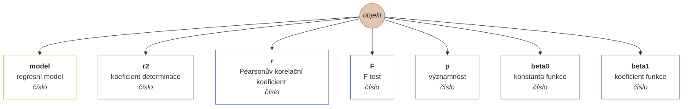
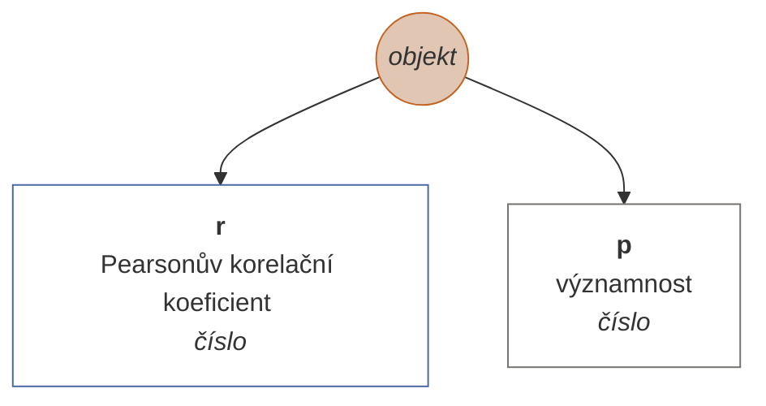
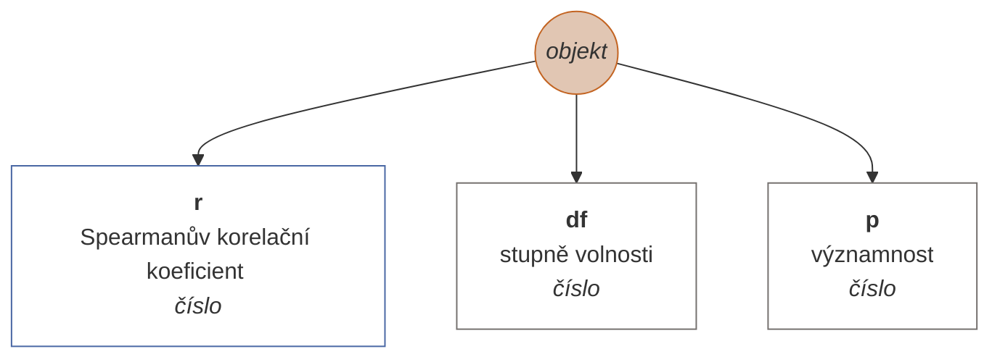
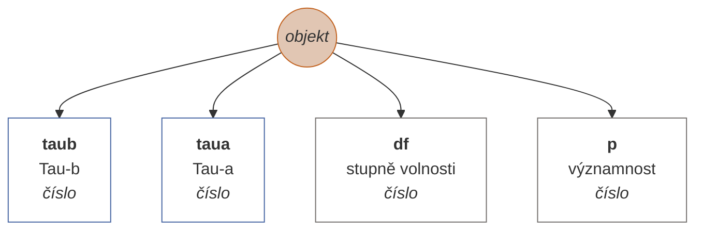
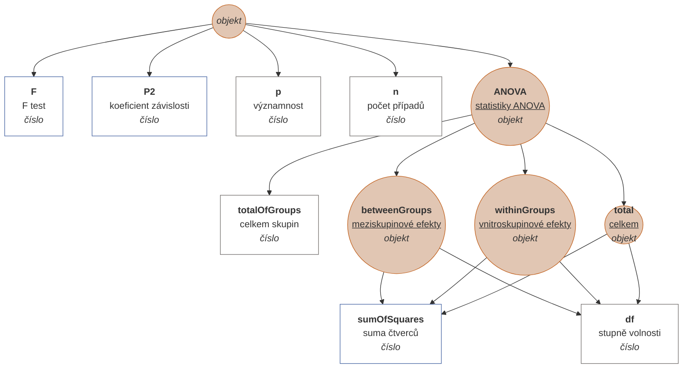
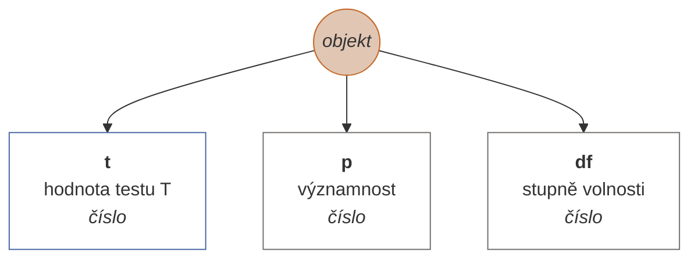
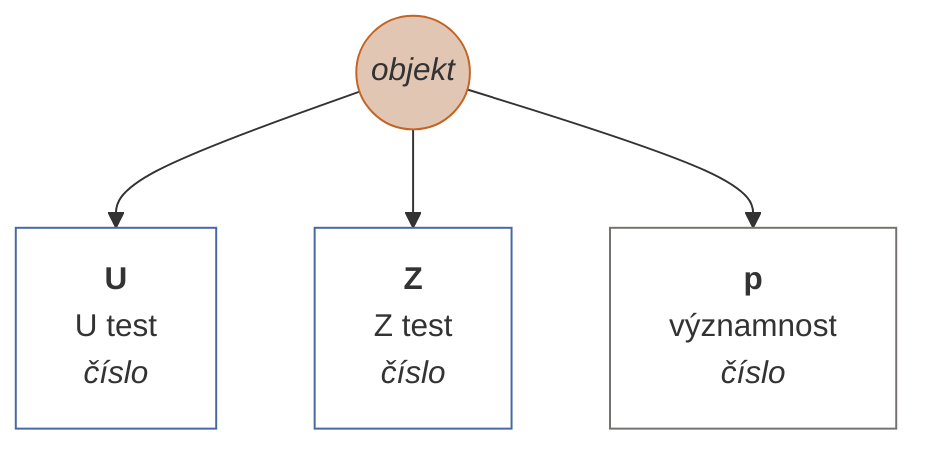
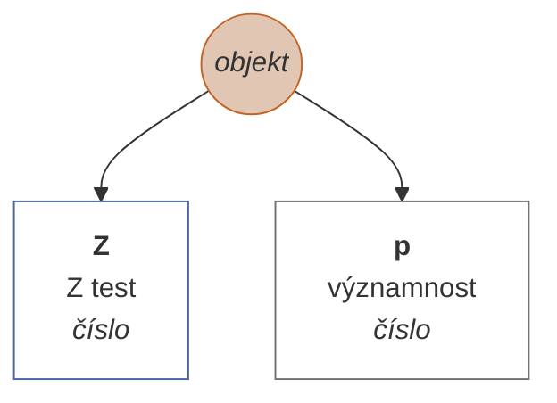
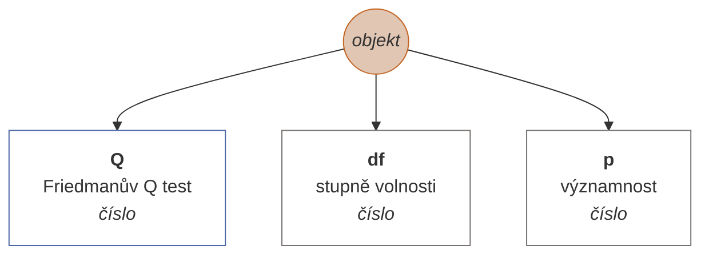
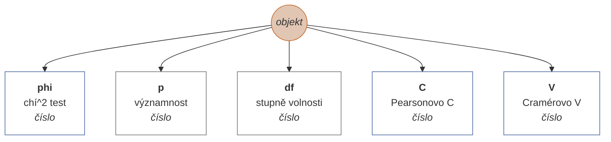

# Dokumentace statistických metod matic

Maticové metody představují statistické metody, které je možné provádět nad danou maticí. Obecně je lze volat dvě způsoby: buďto přímo (např. {Matrix}.correlPearson(0,1), nebo pomocí obecné metody 'analyze', např. {Matrix}.analyze('correlPearson').run(0,1). Rozdíl mezi první a druhým způsobem spočívá v tom, že u první metody dotneme čistý výsledek (u daného příkladu objekt s vlastnostmi r a p), v druhém případě dostaneme zpět celou třídy MatrixAnalysis, obsahující kromě výsledku i metadata (jako jsou informacee o vzorku, trvání výpočtu ad.) a také vstupní model, specifikaci argumentů atd. Pokud tedy potřebujete v průběhu výpočtu uchovávat metadata, je vhodné volat metody přes funkci 'analyze', kde parametr tvoří název metody.

Každá metoda má specifikované argumenty a jejich validátory. Validátory metod ověřují, zdali jsou uživatelem poskytnuté parametry v souladu s očekávanými vstupy výpočetních funkcí a v řadě případů jsou i schopné kompatibilní typy (třeba Array x Vector) překonvertovat. Validátory často fungují v několika krocích, tzn. pokud se jim nezdaří validovat vstupní hodnotu jením způsobem, mají v zásobě třeba ještě dvě další strategie konverze. Hodnota validátorů spočívá v tom, že výpočetní metoda dostane skutečně takové parametry, na základě kterých výslednou statistiku spočítá správně. 

Řada metod má specifikovaný tzv. preprocessor, což je funkce, která vstupní data výpočetních funkcí upraví na potřebný formát. Nejčastěji se jedná o to, že ze vstupních vektorů vyřadí řádky s prázdnámi hodnotami. V některých metodách ale provádí hlubší změny, např. transformaci matice dle určitého klíče (např. ANOVA). Preprocessory mají ještě jednu funkci, a to že do dat ukládají statistiky vstupního (raw) a počítaného (net) souboru.

| funkce | metoda |
| :--- | :--- |
| linreg | [Lineární regrese](#linreg) |
| correlPearson | [Pearsonův korelační koeficient](#correlPearson) |
| correlSpearman | [Spearmanův korelační koeficient](#correlSpearman) |
| correlKendall | [Kendallova korelace](#correlKendall) |
| correlPartial | [Parciální korelace](#correlPartial) |
| correlBiserial | [Biseriální korelace](#correlBiserial) |
| anovaow | [ANOVA (jednofaktorová)](#anovaow) |
| ttestind | [T-test (nezávislý)](#ttestind) |
| ttestpair | [T-test (párový)](#ttestpair) |
| mwu | [Mann-Whitneyho test](#mwu) |
| wcxpaired | [Wilcoxonův znaménkový test pro dva závislé výběry](#wcxpaired) |
| friedman | [Friedmanova ANOVA](#friedman) |
| contingency | [Kontingence](#contingency) |

## [Lineární regrese](#linreg)

Lineární regrese je statistická metoda používaná k nalezení vztahu mezi dvěma spojitými proměnnými. Tyto proměnné jsou obvykle označeny jako závislá proměnná a nezávislá proměnná. Cílem lineární regrese je najít nejlepší lineární aproximaci závislé proměnné v závislosti na nezávislé proměnné. Lineární regrese se používá k predikci hodnoty závislé proměnné pro danou hodnotu nezávislé proměnné, když mezi nimi existuje lineární vztah. Tento vztah je reprezentován pomocí rovnice lineární regrese, která popisuje, jak se hodnoty závislé proměnné mění v závislosti na hodnotách nezávislé proměnné. Lineární regrese je často používána v různých oblastech, jako je ekonomie, sociologie, biologie, psychologie, inženýrství a dalších.

Metoda umožňuje upřesnit, pro jakou transformaci modelu (např. lineární, logaritmovanou) hledáme koeficient determinace.

### Argumenty

| id |popis |typ hodnoty |validátor |povinný |defaultní hodnota |
| :--- |:--- |:--- |:--- |:--- |:--- |
| <b>x</b> | nezávislá proměnná (x) | numerický vektor | <sub>Ověří, zdali je argument typově numerický vektor, nebo zdali se jedná o validní identifkátor numerického vektoru v matici, nebo - pokud je argument typu array - se pokusí řadu pomocí funkce 'numerify' převést na numerický vektor. Pokud se ani jedna z variant nezdaří, vyhodí chybu.<sub> | ✔️ |  |
| <b>y</b> | závislá proměnná (y) | numerický vektor | <sub>Ověří, zdali je argument typově numerický vektor, nebo zdali se jedná o validní identifkátor numerického vektoru v matici, nebo - pokud je argument typu array - se pokusí řadu pomocí funkce 'numerify' převést na numerický vektor. Pokud se ani jedna z variant nezdaří, vyhodí chybu.<sub> | ✔️ |  |
| <b>model</b> | regresní model | enumerace | <sub>Ověří, zdali je zadaná hodnota klíčem enumerace (seznamu možných hodnot). Pokud ne, vyhodí chybu.<br><br><b>1</b> = lineární<br><b>2</b> = logaritmovaný<br><b>3</b> = hyperbolický<br><b>4</b> = exponenciální<br><b>5</b> = kvadratický<br><sub> |  | 1 |
### Příklady syntaxe

```js
var M = new Matrix(
new NumericVector(180,197,240,210,180,160,179,185,183,150,110,190,170).name("independent x"),
new NumericVector(75,82,100,80,75,60,75,71,77,63,46,81,70).name("dependent y")
);
var lr_a = M.linreg(0,1); // with model argument missing (set to 1 by default)
var lr_b = M.linreg(0,1,4); // regression model set to 4 (exponential transformation)
var lr_c = M.analyze("linreg").run({x: 0, y: "dependent y", model: undefined}); // same as lr_a
var lr_b = M.analyze("linreg").run({x: "independent x", y: 1, model: 4}); // same as lr_b
// lr_a = lr_c.result
// lb_b = lr_d.result
```

### Schéma výsledku



## [Pearsonův korelační koeficient](#correlPearson)

Vrátí statistický protokol Pearsonova korelačního koeficientu.
Pearsonova korelace je statistická metoda, která se používá k měření vztahu mezi dvěma veličinami. Jejím cílem je zjistit, zda existuje lineární vztah mezi těmito veličinami a jaký je jeho intenzita.
Pearsonova korelace se vypočítá pomocí vzorce, který se nazývá Pearsonův koeficient korelace. Tento koeficient se pohybuje v rozmezí od -1 do 1 a udává, jak silně je mezi veličinami vztah. Pokud je koeficient blízký -1, znamená to, že mezi veličinami je silný negativní vztah, což znamená, že když se hodnota jedné veličiny zvyšuje, hodnota druhé veličiny klesá. Naopak pokud je koeficient blízký 1, znamená to, že mezi veličinami je silný pozitivní vztah, což znamená, že když se hodnota jedné veličiny zvyšuje, hodnota druhé veličiny také roste. Pokud je koeficient blízký 0, znamená to, že mezi veličinami není žádný vztah nebo je vztah velmi slabý.
Pearsonova korelace se používá především k porovnávání dvou kvantitativních veličin, tj. veličin, které jsou měřitelné na škále s přesnými hodnotami (například věk, výška nebo hmotnost). Může se použít k určení, zda existuje vztah mezi těmito veličinami a jaký je jeho charakter. Například může být Pearsonova korelace použita k porovnání věku a hmotnosti a zjistit, zda existuje vztah mezi těmito veličinami a jaký je jeho charakter. Může se také použít k porovnání výsledků dvou různých testů a zjistit, zda existuje vztah mezi výsledky těchto testů. Zdroj: https://chat.openai.com/chat

### Argumenty

| id |popis |typ hodnoty |validátor |povinný |defaultní hodnota |
| :--- |:--- |:--- |:--- |:--- |:--- |
| <b>x</b> | první proměnná | numerický vektor | <sub>Ověří, zdali je argument typově numerický vektor, nebo zdali se jedná o validní identifkátor numerického vektoru v matici, nebo - pokud je argument typu array - se pokusí řadu pomocí funkce 'numerify' převést na numerický vektor. Pokud se ani jedna z variant nezdaří, vyhodí chybu.<sub> | ✔️ |  |
| <b>y</b> | druhá proměnná | numerický vektor | <sub>Ověří, zdali je argument typově numerický vektor, nebo zdali se jedná o validní identifkátor numerického vektoru v matici, nebo - pokud je argument typu array - se pokusí řadu pomocí funkce 'numerify' převést na numerický vektor. Pokud se ani jedna z variant nezdaří, vyhodí chybu.<sub> | ✔️ |  |

### Před-výpočetní úprava dat

Odstraní ze vstupních vektorů (matice) všechny řádky, ve kterých je alespoň jedna prázdná hodnota.

### Příklady syntaxe

```js
var M = new Matrix(
new NumericVector(180,197,240,210,180,160,179,185,183,150,110,190,170).name("height"),
new NumericVector(75,82,100,80,75,60,75,71,77,63,46,81,70).name("weight")
);
var rxy_a = M.analyze("correlPearson").run(0,1);
var rxy_b = M.correlPearson("height","weight");
// rxy_a.result = rxy_b
```

### Schéma výsledku



## [Spearmanův korelační koeficient](#correlSpearman)

Vrátí statistický protokol Spearmanova koeficientu pořadové korelace. Narozdíl od Pearsonovy korelace, Spearmanova metoda vychází z porovnání pořadí velikosti hodnot vstupních proměnných.

### Argumenty

| id |popis |typ hodnoty |validátor |povinný |defaultní hodnota |
| :--- |:--- |:--- |:--- |:--- |:--- |
| <b>x</b> | první proměnná | numerický vektor | <sub>Ověří, zdali je argument typově numerický vektor, nebo zdali se jedná o validní identifkátor numerického vektoru v matici, nebo - pokud je argument typu array - se pokusí řadu pomocí funkce 'numerify' převést na numerický vektor. Pokud se ani jedna z variant nezdaří, vyhodí chybu.<sub> | ✔️ |  |
| <b>y</b> | druhá proměnná | numerický vektor | <sub>Ověří, zdali je argument typově numerický vektor, nebo zdali se jedná o validní identifkátor numerického vektoru v matici, nebo - pokud je argument typu array - se pokusí řadu pomocí funkce 'numerify' převést na numerický vektor. Pokud se ani jedna z variant nezdaří, vyhodí chybu.<sub> | ✔️ |  |

### Před-výpočetní úprava dat

Odstraní ze vstupních vektorů (matice) všechny řádky, ve kterých je alespoň jedna prázdná hodnota.

### Příklady syntaxe

```js
var M = new Matrix(
new NumericVector(3,7,5,10,9,8,4,1,6,2).name("design rating"),
new NumericVector(4,9,2,10,8,7,6,3,5,1).name("utility rating")
);
var rs_a = M.analyze("correlSpearman").run(0,1);
var rs_b = M.correlSpearman("design rating","utility rating");
// rs_a.result = rs_b
```

### Schéma výsledku



## [Kendallova korelace](#correlKendall)

Vrátí statistický protokol Kendallova korelačního koeficientu Tau-B. Pokud byste tutéž operaci počítali v SPSS, patrně dostanete mírně odlišný výsledek. Podle všeho je to vlivem odlišné citlivosti na desetinná místa u obou systémů. Na interpretaci výsledku by to nicméně zásadní vliv mít nemělo.

### Argumenty

| id |popis |typ hodnoty |validátor |povinný |defaultní hodnota |
| :--- |:--- |:--- |:--- |:--- |:--- |
| <b>x</b> | první proměnná | numerický vektor | <sub>Ověří, zdali je argument typově numerický vektor, nebo zdali se jedná o validní identifkátor numerického vektoru v matici, nebo - pokud je argument typu array - se pokusí řadu pomocí funkce 'numerify' převést na numerický vektor. Pokud se ani jedna z variant nezdaří, vyhodí chybu.<sub> | ✔️ |  |
| <b>y</b> | druhá proměnná | numerický vektor | <sub>Ověří, zdali je argument typově numerický vektor, nebo zdali se jedná o validní identifkátor numerického vektoru v matici, nebo - pokud je argument typu array - se pokusí řadu pomocí funkce 'numerify' převést na numerický vektor. Pokud se ani jedna z variant nezdaří, vyhodí chybu.<sub> | ✔️ |  |

### Před-výpočetní úprava dat

Odstraní ze vstupních vektorů (matice) všechny řádky, ve kterých je alespoň jedna prázdná hodnota.

### Příklady syntaxe

```js
var M = new Matrix(
new NumericVector(3,7,5,10,9,8,4,1,6,2).name("design rating"),
new NumericVector(4,9,2,10,8,7,6,3,5,1).name("utility rating")
);
var rk_a = M.analyze("correlKendall").run(0,1);
var rk_b = M.correlKendall("design rating","utility rating");
// rk_a.result = rk_b
```

### Schéma výsledku



## [Parciální korelace](#correlPartial)

Parciální korelace je statistická metoda, která vám umožňuje zjistit, jaký je vztah mezi dvěma proměnnými, přičemž se zohlední vliv třetí proměnné. To je užitečné, pokud chcete zjistit, zda existuje přímý vztah mezi dvěma proměnnými, aniž byste byli ovlivněni vlivem jiných proměnných. Například, pokud chcete zjistit, zda existuje vztah mezi úrovní školení a úspěšností v práci, může být užitečné zohlednit také vliv věku nebo pohlaví. V takovém případě byste mohli použít parciální korelaci k zjištění vztahu mezi úrovní školení a úspěšností v práci při zohlednění vlivu věku a pohlaví. Parciální korelace se počítá pomocí vzorce, který se odvíjí od korelačního koeficientu Pearsona. Je důležité si uvědomit, že parciální korelace neznamená causaci, tj. že jedna proměnná nezpůsobuje druhou, ale pouze ukazuje, že existuje mezi nimi určitá souvislost. Zdroj: https://chat.openai.com/chat.

### Argumenty

| id |popis |typ hodnoty |validátor |povinný |defaultní hodnota |
| :--- |:--- |:--- |:--- |:--- |:--- |
| <b>x</b> | první proměnná | numerický vektor | <sub>Ověří, zdali je argument typově numerický vektor, nebo zdali se jedná o validní identifkátor numerického vektoru v matici, nebo - pokud je argument typu array - se pokusí řadu pomocí funkce 'numerify' převést na numerický vektor. Pokud se ani jedna z variant nezdaří, vyhodí chybu.<sub> | ✔️ |  |
| <b>y</b> | druhá proměnná | numerický vektor | <sub>Ověří, zdali je argument typově numerický vektor, nebo zdali se jedná o validní identifkátor numerického vektoru v matici, nebo - pokud je argument typu array - se pokusí řadu pomocí funkce 'numerify' převést na numerický vektor. Pokud se ani jedna z variant nezdaří, vyhodí chybu.<sub> | ✔️ |  |
| <b>z</b> | třetí (kontrolní) proměnná | numerický vektor | <sub>Ověří, zdali je argument typově numerický vektor, nebo zdali se jedná o validní identifkátor numerického vektoru v matici, nebo - pokud je argument typu array - se pokusí řadu pomocí funkce 'numerify' převést na numerický vektor. Pokud se ani jedna z variant nezdaří, vyhodí chybu.<sub> | ✔️ |  |

### Před-výpočetní úprava dat

Odstraní ze vstupních vektorů (matice) všechny řádky, ve kterých je alespoň jedna prázdná hodnota.

### Příklady syntaxe

```js
var M = new Matrix(
new NumericVector(180,197,240,210,180,160,179,185,183,150,110,190,170).name("x"),
new NumericVector(75,82,100,80,75,60,75,71,77,63,46,81,70).name("y"),
new NumericVector(79,81,103,84,72,55,78,76,82,65,49,83,74).name("z")
);
var rp_a = M.analyze("correlPartial").run(0,1,2);
var rp_b = M.correlPartial("x","y","z");
// rp_a.result = rp_b
```

### Schéma výsledku


## [Biseriální korelace](#correlBiserial)

Biseriální korelace je statistická metoda, která se používá k vyhodnocení vztahu mezi dvěma binárními proměnnými (tj. proměnnými, které mohou mít pouze dvě možné hodnoty, například 'ano' nebo 'ne'). Binární proměnné se často používají v sociálních vědách, například při zkoumání vztahu mezi vzděláním a zaměstnáním nebo mezi kouřením a zdravím. Biseriální korelace se počítá pomocí vzorce, který se odvíjí od korelačního koeficientu Pearsona. Je důležité si uvědomit, že biseriální korelace neznamená causaci, tj. že jedna proměnná nezpůsobuje druhou, ale pouze ukazuje, že existuje mezi nimi určitá souvislost.

### Argumenty

| id |popis |typ hodnoty |validátor |povinný |defaultní hodnota |
| :--- |:--- |:--- |:--- |:--- |:--- |
| <b>x</b> | první proměnná | binární vektor | <sub>Ověří, zdali je argument buďto binární (boolean) vektor, jeho identifikátor nebo řada převoditelná na binární vektor. V opačném případě vyhodí chybu,<sub> | ✔️ |  |
| <b>y</b> | druhá proměnná | numerický vektor | <sub>Ověří, zdali je argument typově numerický vektor, nebo zdali se jedná o validní identifkátor numerického vektoru v matici, nebo - pokud je argument typu array - se pokusí řadu pomocí funkce 'numerify' převést na numerický vektor. Pokud se ani jedna z variant nezdaří, vyhodí chybu.<sub> | ✔️ |  |

### Před-výpočetní úprava dat

Odstraní ze vstupních vektorů (matice) všechny řádky, ve kterých je alespoň jedna prázdná hodnota.

### Schéma výsledku


## [ANOVA (jednofaktorová)](#anovaow)

Vrátí statistický protokol analýzy rozptylu jednoduchého třídění (One-way ANOVA). Metoda má dva argumenty. První tvoří řada numerických vektorů, kde minimálně jeden vektor je povinný. Druhý argument je nepovinný a představuje shlukovací faktor, tedy textovou proměnnou, která v řádcích určuje příslučnost numerického faktoru ke skupině. Pokud je zadán druhý parametr, z první skupiny vektorů je zohledňován pouze první.

### Argumenty

| id |popis |typ hodnoty |validátor |povinný |defaultní hodnota |
| :--- |:--- |:--- |:--- |:--- |:--- |
| <b>vectors</b> | vstupní vektor/y | numerický vektor nebo matice numerických vektorů | <sub>Ověří, zdali je argument buďto numerický vektor, jeho identifikátor nebo řada převoditelná na numerický vektor, anebo zdali se jedná o řadu numerických vektorů (resp. hodnot, které jsou buďto vektory, identifikátry nebo hodnoty převoditelné na numerické vektory - v libovolné kombinace). Pokud se ani jedna z variant nezdaří, vyhodí chybu.<sub> | ✔️ |  |
| <b>factor</b> | shlukovací proměnná | jakýkoliv vektor | <sub>Ověří, zdali je argument typu vektor, nebo zdali se jedná o validní identifkátor vektoru v matice, nebo - pokud je argument typu array - se pokusí řadu pomocí funkce 'vectorify' převést na vektor. Pokud se ani jedna z variant nezdaří, vyhodí chybu.<sub> | ✔️ |  |

### Před-výpočetní úprava dat

Pokud argumenty specifikují faktorovou proměnnou (druhý argument), rozloží se první argument (buďto numerický vektor nebo první vektor v matici, pokud je prvním argumentem matice) dle hodnot faktoru do nové matice. Pokud jsou argumenty bez faktoru (tedy druhý argument je prázdný), vezme všechny numerické vektory z prvního argumentu 'vectors' (matice) a následně odstraní řádky s prázdnými hodnotami. V případě, že není zadán argument 'factor' a argument 'vectors' zároveň obsahuje pouze jediný vektor nebo je sám numerickým vektorem, vyhodí chybu (bez faktoru jsou třeba alespoň dva numerické vektory v prvním argumentu).

### Příklady syntaxe

```js
var M = new Matrix(
new NumericVector(180,197,240,210,180,160,179,185,183,150,110,190,170).name("x"),
new NumericVector(75,82,100,80,75,60,75,71,77,63,46,81,70).name("y"),
new NumericVector(275,282,300,280,275,260,275,271,277,263,246,281,270).name("z")
);
var anova = M.analyze("anovaow").run({vectors: [0,1,2]});
```

### Schéma výsledku



## [T-test (nezávislý)](#ttestind)

Vrátí statistický protokol Studentova t-testu pro dva nezávislé výběry, které jsou definovány vlastní proměnnou (tedy dvěma numerickými vektory). Argumenty tvoří buď dva numerické vektory, nebo jeden numerický a jen faktorový vektor (obvykle text, ale může být i numerický či binární). Pokud je použit jako faktor vektor, který má více než dvě unikátní hodnoty, jsou pro test uvažovány pouze první dvě unikátní nalezené hodnoty (ostatní se ignorují) - v takovém případě je informace o velikosti čistého vzorku nepodstatná, nicméně hladina významnosti, do které velikost vzorku vstupuje, je již založena na čistých případech.

### Argumenty

| id |popis |typ hodnoty |validátor |povinný |defaultní hodnota |
| :--- |:--- |:--- |:--- |:--- |:--- |
| <b>vectors</b> | vstupní vektor/y | numerický vektor nebo matice numerických vektorů | <sub>Ověří, zdali je argument buďto numerický vektor, jeho identifikátor nebo řada převoditelná na numerický vektor, anebo zdali se jedná o řadu numerických vektorů (resp. hodnot, které jsou buďto vektory, identifikátry nebo hodnoty převoditelné na numerické vektory - v libovolné kombinace). Pokud se ani jedna z variant nezdaří, vyhodí chybu.<sub> | ✔️ |  |
| <b>factor</b> | shlukovací proměnná | jakýkoliv vektor | <sub>Ověří, zdali je argument typu vektor, nebo zdali se jedná o validní identifkátor vektoru v matice, nebo - pokud je argument typu array - se pokusí řadu pomocí funkce 'vectorify' převést na vektor. Pokud se ani jedna z variant nezdaří, vyhodí chybu.<sub> | ✔️ |  |
### Příklady syntaxe

#### Argumenty jako vlastnosti objektu

<sub>Metoda má dva parametry: vectors (první a povinný) a factor (druhý, nepovinný). V uvedeném příkladu je jako argument specifikován jediný objekt, který specifikuje hodnoty jednotlivých parametrů funkce. V této metodě je možné uvést parametr vectors i jako jediný vektor.</sub>

```js
var M = new Matrix(
new NumericVector(4,5,6,7,8,9,10,7,7,6).name("x"),
new NumericVector(10,11,9,8,7,8,9,4,5,10).name("y")
);
var ttestind_a = M.analyze("ttestind").run({vectors: [0,1]});
var ttestind_b = M.ttestind({vectors: [0,1]});
// ttestind_a.result === mqu_b
```

#### Argumenty jako řada

<sub>Argumenty jsou standardndím způsobem řazeny za sebe. Je zde zásadní dodržovat pořadí argumentů a krom toho, první argument by měl být ideálně ve formátu array, např. [vector1, vector2].</sub>

```js
var M = new Matrix(
new NumericVector(4,5,6,7,8,9,10,7,7,6).name("x"),
new NumericVector(10,11,9,8,7,8,9,4,5,10).name("y")
);
var ttestind_a = M.analyze("ttestind").run([0,1]);
var ttestind_b = M.ttestind(["x","y"]);
// ttestind_a.result === mqu_b
```

#### Implementace argumentu 'factor'

<sub>Jako druhý parametr je specifikován faktor, tedy proměnná, dle které se přetransformuje argument vector (případně první vektor, pakliže je zadáno více numerických vektorů).</sub>

```js
var M = new Matrix(
new NumericVector(4,5,6,7,8,9,10,7,7,6,10,11,9,8,7,8,9,4,5,10).name("score"),
new StringVector("A","A","A","A","A","A","A","A","A","A","B","B","B","B","B","B","B","B","B","B",).name("group")
);
var ttestind_a = M.analyze("ttestind").run({vectors: 0, factor: 1});
var ttestind_b = M.ttestind({vectors: 0, factor: 1});
var ttestind_c = M.analyze("ttestind").run(0, 1);
var ttestind_d = M.ttestind(0, 1);
var ttestind_e = M.analyze("ttestind").run([0], 1);
```

### Schéma výsledku



## [T-test (párový)](#ttestpair)

Vrátí statistický protokol párového t-testu pro dva závislé výběry. Prázdné hodnoty jsou vyřezeny v průřezu řádků, tzn. že pokud v jednom řádku chybí alespoň jedna hodnota, je z analýzy vyřezen celý řádek.

### Argumenty

| id |popis |typ hodnoty |validátor |povinný |defaultní hodnota |
| :--- |:--- |:--- |:--- |:--- |:--- |
| <b>x</b> | první proměnná | numerický vektor | <sub>Ověří, zdali je argument typově numerický vektor, nebo zdali se jedná o validní identifkátor numerického vektoru v matici, nebo - pokud je argument typu array - se pokusí řadu pomocí funkce 'numerify' převést na numerický vektor. Pokud se ani jedna z variant nezdaří, vyhodí chybu.<sub> | ✔️ |  |
| <b>y</b> | druhá proměnná | numerický vektor | <sub>Ověří, zdali je argument typově numerický vektor, nebo zdali se jedná o validní identifkátor numerického vektoru v matici, nebo - pokud je argument typu array - se pokusí řadu pomocí funkce 'numerify' převést na numerický vektor. Pokud se ani jedna z variant nezdaří, vyhodí chybu.<sub> | ✔️ |  |

### Před-výpočetní úprava dat

Odstraní ze vstupních vektorů (matice) všechny řádky, ve kterých je alespoň jedna prázdná hodnota.

### Příklady syntaxe

```js
var M = new Matrix(
new NumericVector(4,5,6,7,8,9,10,7,7,6).name("pre-score"),
new NumericVector(10,11,12,13,14,8,9,10,11,10).name("post-score")
);
var ttest_a = M.analyze("ttestpair").run(0,1);
var ttest_b = M.ttestpair("pre-score","post-score");
// ttest_a.result = ttest_b
```

### Schéma výsledku


## [Mann-Whitneyho test](#mwu)

Vrátí statistický protokol Mann-Whitneyho U testu. Jedná se o neparametrický test nulové hypotézy, která srsovnává náhodně vybrané hodnoty X a Y ze dvou populací, přičemž pravděpodobnost, že X bude větší než Y, se rovná pravděpodobnosti, že Y bude větší než X.

### Argumenty

| id |popis |typ hodnoty |validátor |povinný |defaultní hodnota |
| :--- |:--- |:--- |:--- |:--- |:--- |
| <b>vectors</b> | vstupní vektor/y | numerický vektor nebo matice numerických vektorů | <sub>Ověří, zdali je argument buďto numerický vektor, jeho identifikátor nebo řada převoditelná na numerický vektor, anebo zdali se jedná o řadu numerických vektorů (resp. hodnot, které jsou buďto vektory, identifikátry nebo hodnoty převoditelné na numerické vektory - v libovolné kombinace). Pokud se ani jedna z variant nezdaří, vyhodí chybu.<sub> | ✔️ |  |
| <b>factor</b> | shlukovací proměnná | jakýkoliv vektor | <sub>Ověří, zdali je argument typu vektor, nebo zdali se jedná o validní identifkátor vektoru v matice, nebo - pokud je argument typu array - se pokusí řadu pomocí funkce 'vectorify' převést na vektor. Pokud se ani jedna z variant nezdaří, vyhodí chybu.<sub> | ✔️ |  |

### Před-výpočetní úprava dat

Pokud argumenty specifikují faktorovou proměnnou (druhý argument), rozloží se první argument (buďto numerický vektor nebo první vektor v matici, pokud je prvním argumentem matice) dle hodnot faktoru do nové matice. Pokud jsou argumenty bez faktoru (tedy druhý argument je prázdný), vezme první dva vektory z prvního argumentu 'vectors' (matice) a následně odstraní řádky s prázdnými hodnotami.V případě, že není zadán argument 'factor' a argument 'vectors' zároveň obsahuje pouze jediný vektor nebo je sám numerickým vektorem, vyhodí chybu (bez faktoru jsou třeba alespoň dva numerické vektory v prvním argumentu).

### Příklady syntaxe

#### Argumenty jako vlastnosti objektu

<sub>Metoda má dva parametry: vectors (první a povinný) a factor (druhý, nepovinný). V uvedeném příkladu je jako argument specifikován jediný objekt, který specifikuje hodnoty jednotlivých parametrů funkce. V této metodě je možné uvést parametr vectors i jako jediný vektor.</sub>

```js
var M = new Matrix(
new NumericVector(4,5,6,7,8,9,10,7,7,6).name("x"),
new NumericVector(10,11,9,8,7,8,9,4,5,10).name("y")
);
var mwu_a = M.analyze("mwu").run({vectors: [0,1]});
var mwu_b = M.mwu({vectors: [0,1]});
// mwu_a.result === mqu_b
```

#### Argumenty jako řada

<sub>Argumenty jsou standardndím způsobem řazeny za sebe. Je zde zásadní dodržovat pořadí argumentů a krom toho, první argument by měl být ideálně ve formátu array, např. [vector1, vector2].</sub>

```js
var M = new Matrix(
new NumericVector(4,5,6,7,8,9,10,7,7,6).name("x"),
new NumericVector(10,11,9,8,7,8,9,4,5,10).name("y")
);
var mwu_a = M.analyze("mwu").run([0,1]);
var mwu_b = M.mwu(["x","y"]);
// mwu_a.result === mqu_b
```

#### Implementace argumentu 'factor'

<sub>Jako druhý parametr je specifikován faktor, tedy proměnná, dle které se přetransformuje argument vector (případně první vektor, pakliže je zadáno více numerických vektorů).</sub>

```js
var M = new Matrix(
new NumericVector(4,5,6,7,8,9,10,7,7,6,10,11,9,8,7,8,9,4,5,10).name("score"),
new StringVector("A","A","A","A","A","A","A","A","A","A","B","B","B","B","B","B","B","B","B","B",).name("group")
);
var mwu_a = M.analyze("mwu").run({vectors: 0, factor: 1});
var mwu_b = M.mwu({vectors: 0, factor: 1});
var mwu_c = M.analyze("mwu").run(0, 1);
var mwu_d = M.mwu(0, 1);
var mwu_e = M.analyze("mwu").run([0], 1);
```

### Schéma výsledku



## [Wilcoxonův znaménkový test pro dva závislé výběry](#wcxpaired)

Wilcoxonův znaménkový test je neparametrický statistický test používaný k určení, zda dva příbuzné nebo spárované vzorky mají stejný medián nebo ne. Používá se, když data nejsou normálně rozdělena nebo je porušen předpoklad stejných rozptylů. Tento test je vhodný pro malé velikosti vzorků.

### Argumenty

| id |popis |typ hodnoty |validátor |povinný |defaultní hodnota |
| :--- |:--- |:--- |:--- |:--- |:--- |
| <b>x</b> | první proměnná | numerický vektor | <sub>Ověří, zdali je argument typově numerický vektor, nebo zdali se jedná o validní identifkátor numerického vektoru v matici, nebo - pokud je argument typu array - se pokusí řadu pomocí funkce 'numerify' převést na numerický vektor. Pokud se ani jedna z variant nezdaří, vyhodí chybu.<sub> | ✔️ |  |
| <b>y</b> | druhá proměnná | numerický vektor | <sub>Ověří, zdali je argument typově numerický vektor, nebo zdali se jedná o validní identifkátor numerického vektoru v matici, nebo - pokud je argument typu array - se pokusí řadu pomocí funkce 'numerify' převést na numerický vektor. Pokud se ani jedna z variant nezdaří, vyhodí chybu.<sub> | ✔️ |  |

### Před-výpočetní úprava dat

Odstraní ze vstupních vektorů (matice) všechny řádky, ve kterých je alespoň jedna prázdná hodnota.

### Příklady syntaxe

```js
var M = new Matrix(
new NumericVector(15,8,11,19,13,4,16,5,9,15,12,11,14,4,11,17,14,5,9,8,9,11,11,12,17,12,5,5,15,0).name("wife"),
new NumericVector(17,19,18,19,17,5,13,0,16,21,12,9,10,17,12,24,12,12,8,16,12,7,17,13,20,9,13,11,11,12).name("husband")
);
var wcx_a = M.analyze("wcxpaired").run("wife", "husband");
var wcx_b = M.wcxpaired(0,1);
// wcx_a.result = wcx_b
```

### Schéma výsledku



## [Friedmanova ANOVA](#friedman)

Friedmanova analýza rozptylu je neparametrický statistický test vyvinutý Miltonem Friedmanem. Podobně jako u parametrických opakovaných opatření ANOVA se používá k detekci rozdílů v léčbě během více pokusů o testování. Postup zahrnuje hodnocení každého řádu (nebo bloku) dohromady, poté zváží hodnoty řad podle sloupců. Použitelné pro kompletní návrhy bloků je tedy zvláštním případem testu Durbin.

### Argumenty

| id |popis |typ hodnoty |validátor |povinný |defaultní hodnota |
| :--- |:--- |:--- |:--- |:--- |:--- |
| <b>vectors</b> | vstupní vektor/y | numerický vektor nebo matice numerických vektorů | <sub>Ověří, zdali je argument buďto numerický vektor, jeho identifikátor nebo řada převoditelná na numerický vektor, anebo zdali se jedná o řadu numerických vektorů (resp. hodnot, které jsou buďto vektory, identifikátry nebo hodnoty převoditelné na numerické vektory - v libovolné kombinace). Pokud se ani jedna z variant nezdaří, vyhodí chybu.<sub> | ✔️ |  |

### Před-výpočetní úprava dat

Odstraní ze vstupních vektorů (matice) všechny řádky, ve kterých je alespoň jedna prázdná hodnota.

### Příklady syntaxe

```js
var M = new Matrix(
new NumericVector(10,8,7,9,7,4,5,6,5,10,4,7).name("white"),
new NumericVector(7,5,8,6,5,7,9,6,4,6,7,3).name("red"),
new NumericVector(8,5,6,4,7,5,3,7,6,4,4,3).name("rose")
);
var friedman_a = M.analyze("friedman").run([0,1,2]);
var friedman_b = M.friedman(["white","red","rose"]);
// friedman_a.result = friedman_b
```

### Schéma výsledku



## [Kontingence](#contingency)

Vrátí statistický protokol kontingence. Parametry metody jsou a) řádková proměnná, b) sloupcová proměnná a volitelně c) četnost skupiny a/b (pokud je prázdná, bere se, že četnost průniku je 1). Výstupem metody jsou jak statistiky kontingence (chí^2), Cramérovo V, Pearsonovo C, ad).

### Argumenty

| id |popis |typ hodnoty |validátor |povinný |defaultní hodnota |
| :--- |:--- |:--- |:--- |:--- |:--- |
| <b>rows</b> | řádková proměnná | jakýkoliv vektor | <sub>Ověří, zdali je argument typu vektor, nebo zdali se jedná o validní identifkátor vektoru v matice, nebo - pokud je argument typu array - se pokusí řadu pomocí funkce 'vectorify' převést na vektor. Pokud se ani jedna z variant nezdaří, vyhodí chybu.<sub> | ✔️ |  |
| <b>columns</b> | sloupcová proměnná | jakýkoliv vektor | <sub>Ověří, zdali je argument typu vektor, nebo zdali se jedná o validní identifkátor vektoru v matice, nebo - pokud je argument typu array - se pokusí řadu pomocí funkce 'vectorify' převést na vektor. Pokud se ani jedna z variant nezdaří, vyhodí chybu.<sub> | ✔️ |  |
| <b>n</b> | proměnná četnosti | numerický vektor | <sub>Ověří, zdali je argument typově numerický vektor, nebo zdali se jedná o validní identifkátor numerického vektoru v matici, nebo - pokud je argument typu array - se pokusí řadu pomocí funkce 'numerify' převést na numerický vektor. Pokud se ani jedna z variant nezdaří, vyhodí chybu.<sub> |  |  |

### Před-výpočetní úprava dat

Odstraní ze vstupních vektorů (matice) všechny řádky, ve kterých je alespoň jedna prázdná hodnota.

### Příklady syntaxe

#### Bez specifikace četností

<sub>Metoda nahrazuje chybějící argument n (četnosti) automaticky vygenerovaných vektorem, jehož každá hodnota je rovna 1. Stručně řešeno, vstupní tabulka má podobu hrubých, neagregovaných dat.</sub>

```js
var M = new Matrix(
new StringVector("A","A","A","A","A","A","B","B","B","B","B","B").name("R"),
new StringVector("A","A","A","B","B","B","C","C","C","C","C","C").name("C")
);
var c_a = M.contingency(0,1);
var c_b = M.analyze("contingency").run(0,1);
var c_c = M.analyze("contingency").run({rows: 0, columns: 1});
// c_a = c_b.result = c_c.result
```

#### Se specifikací četností

<sub>Poslední argument tvoří agregované četnosti, tzn. že vstupní tabulka je již agregovaná.</sub>

```js
var M = new Matrix(
new StringVector("elementary","elementary","elementary","elementary","high school","high school","high school","high school","college","college","college","college").name("grade"),
new StringVector("A","B","C","D","A","B","C","D","A","B","C","D").name("group"),
new NumericVector(39,25,25,27,17,30,40,29,12,41,62,53).name("frequencies")
);
var c_a = M.contingency(0,1,2);
var c_b = M.analyze("contingency").run(0,1,2);
var c_c = M.analyze("contingency").run("grade","group","frequencies");
var c_d = M.analyze("contingency").run({rows: 0, columns: 1, n: 2});
// c_a = c_b.result = c_c.result = c_d.result
```

### Schéma výsledku

