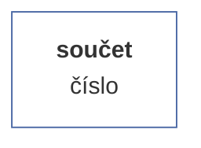

# Dokumentace statistických metod vektorů

Vektorové funkce jsou statistické metody, které jsou prováděny nad instancemi vektorů. Jednoduchým příkladem je funkce 'sum', která sečte všechny neprázdné hodnoty v (numerickém vektoru). Vektorových metod je k dispozici celkem kolem 30, přičemž některé jsou prosté (jako např. 'sum')., jiné jsou buďto výpočetně komplexnější (testy normality), mají komplexní výstup (např. histogram) nebo vyžadují ke svému výpočtu upřesnit parametry (argumenty). Metody lze vyvolávat dvěma způsoby, buďto přímo voláním metody z instance vektoru - např vector.sum() - nebo voláním přes obecnou metodu **analyze**, např. *vector.analyze('sum').run()*. Více přístupů lze zvolit i v zadávání argumentů. Ty lze buď zadávat dle pořadí uvedeném v dokumentaci jako členy argumentů - např. parties.pci('ODS', 0.95) - nebo pomocí jediného objektu, který pomocí svých vlastnosti přesně definuje hodnoty argumenty - např. parties.pci({value: 'ODS', alpha: 0.95}). Volání metod přes obecnou funkci **analyze** je efektivní v několika ohledech, mj. proto, že umožňuje sekvenční provádění analýzy (např. před výpočtem validovat argumenty pomocí metody *with*) a také kvůli zápisu metadat do instance třídy VectorAnalysis, konkrétně vstupní a výstupní velikost vzorku (objekt *sample* a vlastnosti *raw* a *net*) a časové parametry (object *time* a vlastnosti *from* a *to*, ze kterých metoda *duration* přístupná z instance analytické třídy počítá celkovou dobu zpracování výsledků.

| funkce | metoda |
| :--- | :--- |
| sum | [Součet](#sum) |

## [Součet](#sum)

Vrátí součet všech neprázdných číselných hodnot vektoru.


### Před-výpočetní úprava dat

Odstraní z vektoru všechny prázdné hodnoty (buňky).

### Příklady syntaxe

```js
var cashflow = new NumericVector(200,250,150,320,240,-250,10,-320).sum();  /* = 600 */
```

### Schéma výsledku

