# Dokumentace statistických metod vektorů

Vektorové funkce jsou statistické metody, které jsou prováděny nad instancemi vektorů. Jednoduchým příkladem je funkce 'sum', která sečte všechny neprázdné hodnoty v (numerickém vektoru). Vektorových metod je k dispozici celkem kolem 30, přičemž některé jsou prosté (jako např. 'sum')., jiné jsou buďto výpočetně komplexnější (testy normality), mají komplexní výstup (např. histogram) nebo vyžadují ke svému výpočtu upřesnit parametry (argumenty). Metody lze vyvolávat dvěma způsoby, buďto přímo voláním metody z instance vektoru - např vector.sum() - nebo voláním přes obecnou metodu **analyze**, např. *vector.analyze('sum').run()*. Více přístupů lze zvolit i v zadávání argumentů. Ty lze buď zadávat dle pořadí uvedeném v dokumentaci jako členy argumentů - např. parties.pci('ODS', 0.95) - nebo pomocí jediného objektu, který pomocí svých vlastnosti přesně definuje hodnoty argumenty - např. parties.pci({value: 'ODS', alpha: 0.95}). Volání metod přes obecnou funkci **analyze** je efektivní v několika ohledech, mj. proto, že umožňuje sekvenční provádění analýzy (např. před výpočtem validovat argumenty pomocí metody *with*) a také kvůli zápisu metadat do instance třídy VectorAnalysis, konkrétně vstupní a výstupní velikost vzorku (objekt *sample* a vlastnosti *raw* a *net*) a časové parametry (object *time* a vlastnosti *from* a *to*, ze kterých metoda *duration* přístupná z instance analytické třídy počítá celkovou dobu zpracování výsledků.

| funkce | metoda |
| :--- | :--- |
| sum | [Součet](#sum) |
| count | [Počet](#count) |
| mode | [Modus](#mode) |
| avg | [Aritmetický průměr](#avg) |
| min | [Minimum](#min) |
| max | [Maximum](#max) |
| range | [Variační rozpětí](#range) |
| geomean | [Geometrický průměr](#geomean) |
| harmean | [Harmonický průměr](#harmean) |
| median | [Medián](#median) |
| percentile | [Percentil](#percentile) |
| stdev | [Směrodatná odchylka](#stdev) |
| variance | [Rozptyl](#variance) |
| varc | [Variační koeficient](#varc) |
| histogram | [Histogram](#histogram) |
| frequency | [Frekvenční tabulka](#frequency) |
| sem | [Střední chyba průměru](#sem) |
| skewness | [Šikmost](#skewness) |
| kurtosis | [Špičatost](#kurtosis) |
| mci | [Interval spolehlivosti průměru](#mci) |
| pci | [Interval spolehlivosti podílu](#pci) |
| ttest | [Jednovýběrový t-test](#ttest) |
| swtest | [Shapirův-Wilkův W test](#swtest) |
| kstest | [Kolmogorov-Smirnovův test](#kstest) |

## [Součet] {#sum}

Vrátí součet všech neprázdných číselných hodnot vektoru.


### Před-výpočetní úprava dat

Odstraní z vektoru všechny prázdné hodnoty (buňky).

### Příklady syntaxe

```js
var cashflow = new NumericVector(200,250,150,320,240,-250,10,-320).sum();  /* = 600 */
```

### Schéma výsledku


## [Počet] {#count}

Vrátí počet všech členů vektoru, včetně prázdných hodnot.

### Příklady syntaxe

```js
var total_numeric = new NumericVector(200,250,null,150,320,240,-250,null,10,-320).count();  /* = 10 */
var total_string = new StringVector("A","B","C","D").count();  /* = 4 */
var total_boolean = new BooleanVector(true, true, false, null, false, true).count();  /* = 6 */
```

### Schéma výsledku

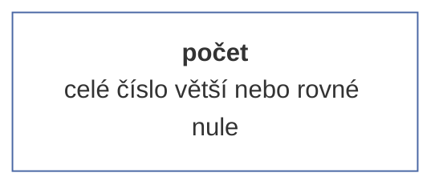

## [Modus] {#mode}

Vrátí nejčastější hodnotu ve vektoru (pokud je nejčastější prázdná hodnota, vrátí prázdnou hodnotu). Pokud je nejčastějších hodnot více (např. četnost hodnot X  a Y je shodná), vrátí tu hodnotu, kterou ve vektoru nalezne jako první.

### Příklady syntaxe

```js
var x = new NumericVector(1,2,3,4,3,4,5,3).mode(); /* = 3 */
var y = new StringVector("a",null,null,"b","c","d",null,"b").mode(); /* = null */
var z = new BooleanVector(true, false, true).mode(); /* = true */
```

### Schéma výsledku

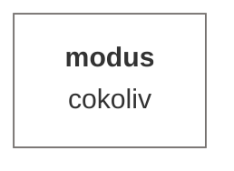

## [Aritmetický průměr] {#avg}

Vrátí aritmetický průměr (tedy podíl součtu a počtu hodnot vektoru) ze všech neprázdných hodnot (tedy včetně nul).


### Před-výpočetní úprava dat

Odstraní z vektoru všechny prázdné hodnoty (buňky).

### Příklady syntaxe

```js
var avgCashFlow = new NumericVector(200,250,150,320,240,-250,10,-320).avg();  /* = 75 */
```

### Schéma výsledku

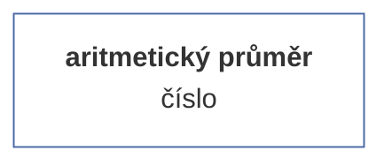

## [Minimum] {#min}

Vrátí nejnižší hodnotu z neprázdných hodnot. V případě textu vrátí první hodnotu z abecedního řazení.


### Před-výpočetní úprava dat

Odstraní z vektoru všechny prázdné hodnoty (buňky).

### Příklady syntaxe

```js
var numeric_min = new NumericVector(4.5, 3.9, 5, 6, 7, 5.7, 9.1, 5.3, 7.2, 6.9, 6, 7.5, 5.3, 7.1, 8.2, 1).min(); /* = 1 */;
var string_min = new StringVector("Norwood", "Pearson", "Fisher", "Nightingale", "Gauss", "Poisson").min(); /* = Fisher */
```


## [Maximum] {#max}

Vrátí nejvyšší hodnotu z neprázdných hodnot. V případě textu vrátí poslední hodnotu z abecedního řazení.


### Před-výpočetní úprava dat

Odstraní z vektoru všechny prázdné hodnoty (buňky).

### Příklady syntaxe

```js
var numeric_max = new NumericVector(4.5, 3.9, 5, 6, 7, 5.7, 9.1, 5.3, 7.2, 6.9, 6, 7.5, 5.3, 7.1, 8.2, 1).max(); /* = 9.1 */;
var string_max = new StringVector("Norwood", "Pearson", "Fisher", "Nightingale", "Gauss", "Poisson").max(); /* = Poisson */
```

### Schéma výsledku

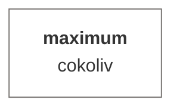

## [Variační rozpětí] {#range}

Vrátí rozdíl největší a nejmenší neprázdné hodnoty.


### Před-výpočetní úprava dat

Odstraní z vektoru všechny prázdné hodnoty (buňky).

### Příklady syntaxe

```js
var range = new NumericVector(5,2,-15,-16.3,12,null, null, 12,13,7).range(); /* = 22 */
```

### Schéma výsledku

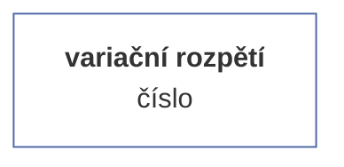

## [Geometrický průměr] {#geomean}

Geometrický průměr je statistický ukazatel, který se používá k výpočtu průměrné hodnoty nějakého množství čísel nebo veličin. Na rozdíl od aritmetického průměru, který se počítá jako součet všech hodnot v sadě dělený počtem těchto hodnot, se geometrický průměr počítá jako n-tá odmocnina součinu n čísel v sadě. Geometrický průměr se často používá pro výpočet růstu nebo kumulativního výnosu v investicích, protože zohledňuje změny v procentuálním růstu hodnot v průběhu času. Dále se používá v geometrii pro výpočet průměrné délky strany n-úhelníku a v biologii pro výpočet průměrné velikosti buněk nebo organismů v populaci.


### Před-výpočetní úprava dat

Odstraní z vektoru všechny prázdné hodnoty (buňky).

### Příklady syntaxe

```js
var x = new framework.NumericVector(20,19,21,22,21,18,23,22,27,16,17,19,19,21,29,24,23,25,24,21,22,19).geomean(); /* = 21.24*/
```

### Schéma výsledku

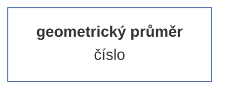

## [Harmonický průměr] {#harmean}

Harmonický průměr je statistický ukazatel, který se používá k výpočtu průměrné hodnoty nějakého množství čísel nebo veličin. Na rozdíl od aritmetického průměru a geometrického průměru, které jsou založeny na sčítání nebo násobení hodnot, se harmonický průměr počítá jako podíl počtu čísel v sadě a součtu jejich převrácených hodnot. Harmonický průměr se používá v situacích, kdy je důležité zohlednit, jak se rychlost nebo výkon mění v průběhu času nebo v různých situacích. Například se používá k výpočtu průměrné rychlosti, průměrného výkonu nebo průměrného odporu v elektronických obvodech. Také se používá v oblasti finance pro výpočet průměrného výnosu z investic v různých časových obdobích.


### Před-výpočetní úprava dat

Odstraní z vektoru všechny prázdné hodnoty (buňky).

### Příklady syntaxe

```js
var x = new NumericVector(20,19,21,22,21,18,23,22,27,16,17,19,19,21,29,24,23,25,24,21,22,19).harmean(); /* = 21.03*/
```

### Schéma výsledku

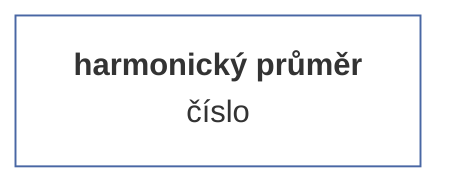

## [Medián] {#median}

Vrátí medián neboli střední hodnotu z neprázdných hodnot vektoru. Jedná se o 50% percentil.


### Před-výpočetní úprava dat

Odstraní z vektoru všechny prázdné hodnoty (buňky).

### Příklady syntaxe

```js
var median = new NumericVector(20,19,21,22,21,18,23,22,27,16,17,19,19,21,29,24,23,25,24,21,22,19).median(); /* = 21*/
```

### Schéma výsledku

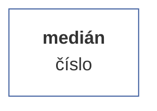

## [Percentil] {#percentile}

Pomocí percentilu můžeme zkoumat rozdělení numerické řady, a to tak, že řadu nejprve seřadíme od nejmenšího po největšího člena (číslo), a následně vybereme první N % členů (toto N je parametrem), kdy poslední člen ve výběru představuje daný percentil, konkrétní číslo. Pokud je počet členů ve výběru sudý, počítá se percentil jako průměr z dvou sousedících hodnot, pokud je sudý, percentilem je právě poslední hodnota.

### Argumenty

| id |popis |typ hodnoty |validátor |povinný |defaultní hodnota |
| :--- |:--- |:--- |:--- |:--- |:--- |
| <b>k</b> | hodnota percentilu | desetinné číslo mezi 1 a 0 (včetně) | <sub>Ověří, zdali se jedná o celé kladné číslo větší než nula. V opačném případě vyvolá chybu.<sub> | ✔️ |  |

### Před-výpočetní úprava dat

Odstraní z vektoru všechny prázdné hodnoty (buňky).

### Příklady syntaxe

```js
var score = new NumericVector(10,20,15,25,23,19,18,17,24,23);
var median = score.percentile(0.5); /* = 19.5 */
var q25 = score.percentile(0.25); /* = 17.25 */
var max = score.percentile(1); /* = 25 */
```

### Schéma výsledku

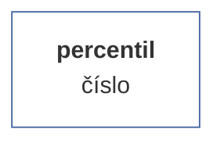

## [Směrodatná odchylka] {#stdev}

Vrátí směrodatnou odchylku neprázdných hodnot. Směrodatná odchylka je statistický ukazatel, který udává, jak moc se hodnoty v daném souboru dat od sebe liší. Směrodatná odchylka je vyjádřena jako číslo, které udává, o kolik se průměrná hodnota odchýlí od skutečné hodnoty v daném souboru dat. Směrodatná odchylka je užitečná při porovnávání velikosti rozptýlení dat v různých souborech nebo v různých skupinách v rámci jednoho souboru dat. Čím je směrodatná odchylka větší, tím více se hodnoty v daném souboru dat od sebe liší.

### Argumenty

| id |popis |typ hodnoty |validátor |povinný |defaultní hodnota |
| :--- |:--- |:--- |:--- |:--- |:--- |
| <b>isSample</b> | výběrový soubor | binární hodnota | <sub>Ověří, zdali je hodnota binární povahy. V opačném případě hodnotu automaticky převede na typ boolean a nevrací tudíž nikdy chybu.<sub> |  | false |

### Před-výpočetní úprava dat

Odstraní z vektoru všechny prázdné hodnoty (buňky).

### Příklady syntaxe

```js
var population = new NumericVector(10,20,15,25,23,19,18,17,24,23).stdev();  /* = 4.41 */
var sample = new NumericVector(10,20,15,25,23,19,18,17,24,23).stdev(true); /* = 4.65 */
```

### Schéma výsledku

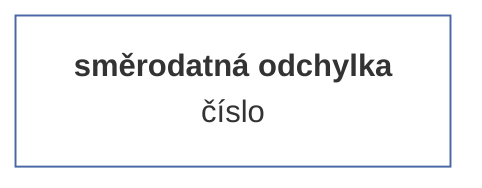

## [Rozptyl] {#variance}

Vrátí hodnotu rozptylu tohoto vektoru. Hodnota rozptylu je rovná druhé mocnině ze směrodatné odchylky.

### Argumenty

| id |popis |typ hodnoty |validátor |povinný |defaultní hodnota |
| :--- |:--- |:--- |:--- |:--- |:--- |
| <b>isSample</b> | výběrový soubor | binární hodnota | <sub>Ověří, zdali je hodnota binární povahy. V opačném případě hodnotu automaticky převede na typ boolean a nevrací tudíž nikdy chybu.<sub> |  | false |

### Před-výpočetní úprava dat

Odstraní z vektoru všechny prázdné hodnoty (buňky).

### Příklady syntaxe

```js
var population = new NumericVector(10,20,15,25,23,19,18,17,24,23).variance();  /* = 19.44 */
var sample = new NumericVector(10,20,15,25,23,19,18,17,24,23).variance(true); /* = 21.6 */
```

### Schéma výsledku

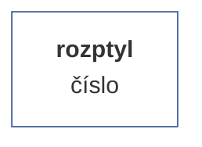

## [Variační koeficient] {#varc}

Variační koeficient (také nazývaný relativní rozptyl) je statistický ukazatel, který měří míru variability nebo rozptýlení dat vzhledem k jejich střední hodnotě. Je to bezrozměrná míra variability, která umožňuje porovnávat rozptyl různých souborů dat bez ohledu na jednotky, ve kterých jsou data vyjádřena. Variační koeficient se počítá jako poměr směrodatné odchylky (sigma) a střední hodnoty (x) v sadě dat, násobený 100 pro vyjádření v procentech. okud je variační koeficient nízký, znamená to, že data jsou poměrně homogenní nebo málo rozptýlená vzhledem k průměru. Pokud je naopak vysoký, znamená to, že data jsou velmi různorodá nebo se výrazně liší od průměru.Variační koeficient se používá především k porovnávání variability mezi různými soubory dat. Například se často používá v biologii, medicíně, ekonomii, psychologii a sociologii pro měření variability různých populací nebo skupin.

### Argumenty

| id |popis |typ hodnoty |validátor |povinný |defaultní hodnota |
| :--- |:--- |:--- |:--- |:--- |:--- |
| <b>isSample</b> | výběrový soubor | binární hodnota | <sub>Ověří, zdali je hodnota binární povahy. V opačném případě hodnotu automaticky převede na typ boolean a nevrací tudíž nikdy chybu.<sub> |  | false |
### Příklady syntaxe

```js
var population = new NumericVector(10,20,15,25,23,19,18,17,24,23).varc();  /* = 0.227 */
var sample = new NumericVector(10,20,15,25,23,19,18,17,24,23).varc(true); /* = 0.24 */
```

### Schéma výsledku

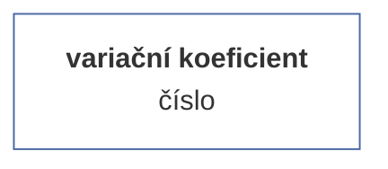

## [Histogram] {#histogram}

Vrátí matici histogramu daného vektoru. Metodu lze volit s upřesněním parametrů nebo i bez nich. Pokud není upřesněn parametr 'maximální počet intervalů' (maxIntervals), je jeho hodnota automaticky vypočítána jako variační rozpětí/odmocnina z počtu prvků. Pokud je uveden parametr 'pevná velikost intervalu' (fixedInterval), je brána tato hodnota jako rozhodující pro počet intervalu. Obě dvě hodnoty nejsou slučitelné (ačkoliv nevrací chybu), při zadání obou dvou je jako prioritní brán parametr maxIntervals.

### Argumenty

| id |popis |typ hodnoty |validátor |povinný |defaultní hodnota |
| :--- |:--- |:--- |:--- |:--- |:--- |
| <b>max</b> | maximální počet intervalů | číslo | <sub>Ověří, zdali se jedná o celé kladné číslo větší než nula. V opačném případě vyvolá chybu.<sub> |  |  |
| <b>fix</b> | pevná velikost intervalu | kladné číslo | <sub>Ověří, zdali se jedná o celé kladné číslo větší než nula. V opačném případě vyvolá chybu.<sub> |  |  |

### Před-výpočetní úprava dat

Odstraní z vektoru všechny prázdné hodnoty (buňky).

### Příklady syntaxe

#### Bez upřesnění intervalu

<sub>Metoda je volána bez parametrů, tzn. že velikost intervalu je automaticky spočítána jako (maximum-minimum)/odmocnina(počet prvků).</sub>

```js
var score = new NumericVector(4.5,3.9,5,6,7,5.7,9.1,5.3,null, 7.2,6.9,6,7.5,5.3,7.1,8.2,1, null);
var h1 = score.histogram();
var h2 = score.analyze("histogram").run();
// h1 = h2.result
```

#### Se specifikací počtu intervalů

<sub>Argument 'max' upřesní, na kolik kategorií (intervalů) má být histogram rozdělen. Argument 'max' je možné upřesnit buďto jako první parametr, nebo - pokud je argumentem objekt - jako vlatnost 'max'.</sub>

```js
var score = new NumericVector(4.5,3.9,5,6,7,5.7,9.1,5.3,7.2,6.9,6,7.5,5.3,7.1,8.2,1);
var h1 = score.histogram(4);
var h2 = score.analyze("histogram").run(4);
var h3 = score.histogram({max: 4});
var h4 = score.analyze("histogram").run({max: 4});
// h1 = h3 = h2.result = h4.result
```

#### Se specifikací velikosti intervalu

<sub>Argument 'fix' nastaví pevnou velikost intervalu. Argument je možné upřesnit buďto jako druhý parametr (v tom případě musí být první argument null), nebo - pokud je argumentem objekt - jako vlatnost 'fix'. Argument 'max' má před argumentem 'fix' prioritu.</sub>

```js
var score = new NumericVector(4.5,3.9,5,6,7,5.7,9.1,5.3,7.2,6.9,6,7.5,5.3,7.1,8.2,1);
var h1 = score.histogram(null, 3);
var h2 = score.analyze("histogram").run(null, 3);
var h3 = score.histogram({fix: 3});
var h4 = score.analyze("histogram").run({fix: 3});
// h1 = h3 = h2.result = h4.result
```

### Schéma výsledku

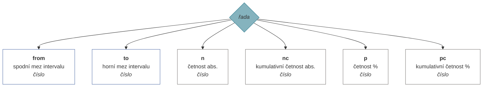

## [Frekvenční tabulka] {#frequency}

Vrátí object frekvenční tabulky s rozpadem prvků a jejich četností.

### Argumenty

| id |popis |typ hodnoty |validátor |povinný |defaultní hodnota |
| :--- |:--- |:--- |:--- |:--- |:--- |
| <b>order</b> | způsob řazení dat tabulky | enumerace | <sub>Ověří, zdali je zadaná hodnota klíčem enumerace (seznamu možných hodnot). Pokud ne, vyhodí chybu.<br><br><b>1</b> = dle četnosti sestupně (max-min)<br><b>2</b> = dle četnosti vzestupně (min-max)<br><b>3</b> = dle hodnoty vzestupně (A-Z)<br><b>4</b> = dle hodnoty sestupně (Z-A)<br><sub> |  | 1 |
### Příklady syntaxe

```js
var numeric_vector_no_order = new NumericVector(5,2,3,2,3,3,1,6,3).frequency();
```

```js
var string_vector_desc_value = new StringVector("E","B","C","B","C","C","A","F","C").frequency({order: 3});
```

```js
var boolean_vector_desc_frequency = new BooleanVector(true, false, null, true, null, null).frequency(4);
```

### Schéma výsledku

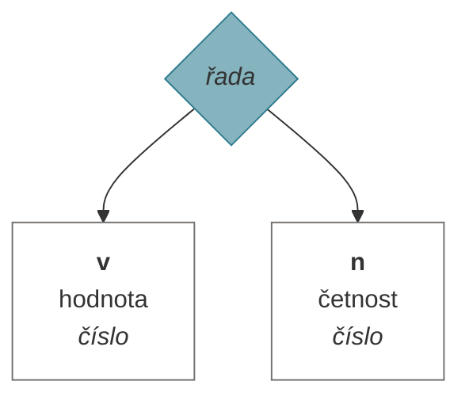

## [Střední chyba průměru] {#sem}

Vrátí hodnotu směrodatné chyby odhadu průměru. Střední chyba průměru (anglicky 'standard error of the mean', odtud zkratka SEM) je statistická míra variability výběrového průměru odhadovaného parametru v celé populaci. Jedná se o odhad standardní odchylky průměru výběrového souboru. Střední chyba průměru se vypočítá jako poměr odhadované standardní odchylky výběrového průměru k odmocnině z velikosti výběru. Čím větší je velikost výběru, tím menší je střední chyba průměru, což znamená, že odhad výběrového průměru je přesnější a blíže se shoduje s průměrem celé populace. Střední chyba průměru je užitečná pro odhadování intervalů spolehlivosti výběrového průměru, což umožňuje určit, jak přesně odhaduje průměr populace.


### Před-výpočetní úprava dat

Odstraní z vektoru všechny prázdné hodnoty (buňky).

### Příklady syntaxe

```js
var sem = new NumericVector(20,19,21,22,21,18,23,22,27,16,17,19,19,21,29,24,23,25,24,21,22,19).SEM(); /* = 0.67*/
```

### Schéma výsledku

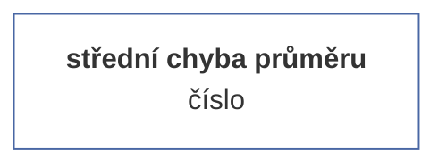

## [Šikmost] {#skewness}

Vrátí zešikmení rozdělení, tedy asymetrii rozdělení kolem střední hodnoty vektoru.

### Argumenty

| id |popis |typ hodnoty |validátor |povinný |defaultní hodnota |
| :--- |:--- |:--- |:--- |:--- |:--- |
| <b>isSample</b> | výběrový soubor | binární hodnota | <sub>Ověří, zdali je hodnota binární povahy. V opačném případě hodnotu automaticky převede na typ boolean a nevrací tudíž nikdy chybu.<sub> |  | false |

### Před-výpočetní úprava dat

Odstraní z vektoru všechny prázdné hodnoty (buňky).

### Příklady syntaxe

```js
var skewness_population = new NumericVector(20,19,21,22,21,18,23,22,27,16,17,19,19,21,29,24,23,25,24,21,22,19).skewness(); /* = 0.52*/
var skewness_sample = new NumericVector(20,19,21,22,21,18,23,22,27,16,17,19,19,21,29,24,23,25,24,21,22,19).skewness(true); /* = 0.027*/
```

### Schéma výsledku

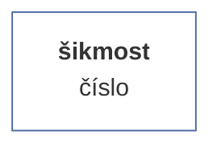

## [Špičatost] {#kurtosis}

Vrátí hodnotu excesu množiny dat. Ve statistice špičatost (kurtosis) označuje míru, jak moc se hodnoty v sbírce dat liší od průměrné hodnoty. Špičatost se obvykle počítá pro křivku rozdělení dat, která je grafickým zobrazením rozložení hodnot v dané sbírce dat.
Existují dva základní typy špičatosti: platykurtóza a leptokurtóza. Platykurtóza se vyskytuje, když hodnoty vektoru jsou rozloženy víceméně rovnoměrně kolem průměrné hodnoty. Toto rozložení se projevuje jako křivka rozdělení tvaru písmene U, která má plochý vrchol. Naopak leptokurtóza se vyskytuje, když hodnoty v sbírce dat jsou rozloženy s výraznou odchylkou od průměrné hodnoty. Toto rozložení se projevuje jako křivka rozdělení tvaru 'písmene špičatého kopce' nebo 'písmene špičatého údolí'.
Špičatost se používá k určení, zda je rozložení hodnot v sbírce dat víceméně rovnoměrné, nebo zda existují nějaké výrazné odchylky od průměrné hodnoty. Špičatost se často používá spolu s dalšími metrikami, jako je medián, šikmost a kvantily, které vám pomohou lépe porozumět rozložení dat a určit, zda existují nějaké výrazné odchylky od průměrné hodnoty.


### Před-výpočetní úprava dat

Odstraní z vektoru všechny prázdné hodnoty (buňky).

### Příklady syntaxe

```js
var kurtosis = new NumericVector(20,19,21,22,21,18,23,22,27,16,17,19,19,21,29,24,23,25,24,21,22,19).kurtosis(); /* = 0.425*/
```

### Schéma výsledku

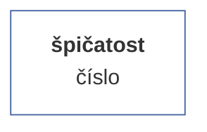

## [Interval spolehlivosti průměru] {#mci}

Vrátí statistický protokol odhadu intervalu spolehlivosti průměru výběrového souboru při určité hladině významnosti. Pokud je počet případů menší než 30, je použito Studentovo T-rozdělení, jinak je použito standardizované normální rozdělení.

### Argumenty

| id |popis |typ hodnoty |validátor |povinný |defaultní hodnota |
| :--- |:--- |:--- |:--- |:--- |:--- |
| <b>alpha</b> | hladina významnosti | desetinné číslo mezi 1 a 0 (včetně) | <sub>Ověří, zdali se jedná o celé kladné číslo větší než nula. V opačném případě vyvolá chybu.<sub> |  | 0.95 |

### Před-výpočetní úprava dat

Odstraní z vektoru všechny prázdné hodnoty (buňky).

### Příklady syntaxe

```js
var v = new NumericVector([2,2,3,3,4,4,5,5,6,7,8,9,10,11,10,9,8,7,7,6,6,5,5]).mci(0.95);
```

### Schéma výsledku

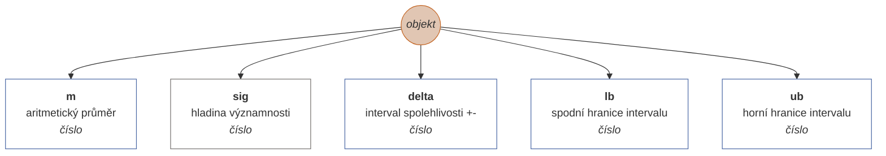

## [Interval spolehlivosti podílu] {#pci}

Vrátí statistický protokol odhadu intervalu spolehlivosti podílu výběrového souboru při určité hladině významnosti.

### Argumenty

| id |popis |typ hodnoty |validátor |povinný |defaultní hodnota |
| :--- |:--- |:--- |:--- |:--- |:--- |
| <b>value</b> | hledaná hodnota | cokoliv | <sub>-<sub> | ✔️ |  |
| <b>alpha</b> | hladina významnosti | desetinné číslo mezi 1 a 0 (včetně) | <sub>Ověří, zdali se jedná o celé kladné číslo větší než nula. V opačném případě vyvolá chybu.<sub> |  | 0.95 |

### Před-výpočetní úprava dat

Odstraní z vektoru všechny prázdné hodnoty (buňky).

### Příklady syntaxe

```js
var v = new NumericVector([2,2,3,3,4,4,5,5,6,7,8,9,10,11,10,9,8,7,7,6,6,5,5]).pci(5, 0.95);
```

### Schéma výsledku

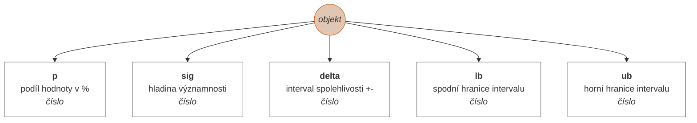

## [Jednovýběrový t-test] {#ttest}

Vrátí statistický protokol pro jednovýběrový t-test při zadání populačního průměru.

### Argumenty

| id |popis |typ hodnoty |validátor |povinný |defaultní hodnota |
| :--- |:--- |:--- |:--- |:--- |:--- |
| <b>populationMean</b> | populační průměr | číslo | <sub>Ověří, zdali je hodnota číslo. V opačném případě vyvolá chybu.<sub> | ✔️ |  |

### Před-výpočetní úprava dat

Odstraní z vektoru všechny prázdné hodnoty (buňky).

### Příklady syntaxe

```js
var T = new NumericVector(4.5,3.9,5,6,7,5.7,9.1,5.3,7.2,6.9,6,7.5,5.3,7.1,8.2,1).ttest(10);
```

### Schéma výsledku

```mermaid
graph TD
ttest((<i>objekt</i>))
style ttest fill:#E1C6B3;
style ttest stroke:#C36422;
ttest --> t[<b>t</b><br>hodnota testu T <br><i>číslo</i>]
style t fill:#FFFFFF;
style t stroke:#4967A4;
ttest --> p[<b>p</b><br>významnost <br><i>číslo</i>]
style p fill:#FFFFFF;
style p stroke:#75716F;
ttest --> n[<b>n</b><br>počet případů <br><i>číslo</i>]
style n fill:#FFFFFF;
style n stroke:#75716F;

```

## [Shapirův-Wilkův W test] {#swtest}

Vrátí statistický protokol Shapiro-Wilkova W testu normality rozdělení hodnot vektoru. Shapiro-Wilk test je statistický test, který se používá k testování hypotézy, že data pocházejí z normálního rozdělení. Tento test je často používán k ověření normality dat v rámci statistické analýzy. Test Shapiro-Wilk se zakládá na porovnání hodnoty kvartilů dat s hodnotami kvartilů normálního rozdělení. Když jsou hodnoty kvartilů dat podobné hodnotám kvartilů normálního rozdělení, je pravděpodobné, že data pocházejí z normálního rozdělení. V opačném případě je pravděpodobné, že data nejsou normální. Při použití testu Shapiro-Wilk je třeba si uvědomit, že tento test má nízkou citlivost pro velké vzorky, tj. pro velké vzorky může být test méně spolehlivý při detekci ne-normality. Proto se pro velké vzorky často používají jiné testy normality, jako například test Anderson-Darling nebo test Kolmogorov-Smirnov.


### Před-výpočetní úprava dat

Odstraní z vektoru všechny prázdné hodnoty (buňky).

### Příklady syntaxe

```js
var sw = new NumericVector(2,2,3,3,4,4,5,5,6,7,8,9,10,11,10,9,8,7,7,6,6,5,5).swtest();
```

### Schéma výsledku

```mermaid
graph TD
shapirowilk((<i>objekt</i>))
style shapirowilk fill:#E1C6B3;
style shapirowilk stroke:#C36422;
shapirowilk --> W[<b>W</b><br>hodnota W-testu <br><i>číslo</i>]
style W fill:#FFFFFF;
style W stroke:#4967A4;
shapirowilk --> df[<b>df</b><br>stupně volnosti <br><i>číslo</i>]
style df fill:#FFFFFF;
style df stroke:#75716F;
shapirowilk --> p[<b>p</b><br>významnost <br><i>číslo</i>]
style p fill:#FFFFFF;
style p stroke:#75716F;

```

## [Kolmogorov-Smirnovův test] {#kstest}

Vrátí statistický protokol Komogorov-Smirnovova testu normality rozdělení hodnot vektoru. Aktuálně nepočítá hladinu významnosti testu. Kolmogorov-Smirnov test (často také zkracovaný jako K-S test) je statistický test, který se používá k testování hypotézy, že data pocházejí z určitého rozdělení. Tento test porovnává rozdělení dat s teoretickým rozdělením, které se předpokládá, že data vycházejí, a vyhodnocuje, zda jsou datové hodnoty s teoretickým rozdělením dostatečně blízko, aby se mohla hypotéza o tom, že data pocházejí z daného rozdělení, považovat za pravdivou.Test Kolmogorov-Smirnov se často používá k ověření normality dat, ale může být také použit k ověření, zda data pocházejí z jiného teoretického rozdělení, jako je například exponenciální nebo binomické rozdělení. Test Kolmogorov-Smirnov je obecně považován za jeden z nejpřesnějších testů normality, ale má omezenou citlivost pro malé vzorky, tj. pro malé vzorky může být méně spolehlivý při detekci ne-normality. Pro malé vzorky se proto často používají jiné testy normality, jako například test Shapiro-Wilk nebo test Anderson-Darling.


### Před-výpočetní úprava dat

Odstraní z vektoru všechny prázdné hodnoty (buňky).

### Příklady syntaxe

```js
var sw = new NumericVector(2,2,3,3,4,4,5,5,6,7,8,9,10,11,10,9,8,7,7,6,6,5,5).kstest();
```

### Schéma výsledku

```mermaid
graph TD
kstest((<i>objekt</i>))
style kstest fill:#E1C6B3;
style kstest stroke:#C36422;
kstest --> T[<b>T</b><br>hodnota Kolmogorov-Smirnovova testu <br><i>číslo</i>]
style T fill:#FFFFFF;
style T stroke:#4967A4;
kstest --> df[<b>df</b><br>stupně volnosti <br><i>číslo</i>]
style df fill:#FFFFFF;
style df stroke:#75716F;
kstest --> p[<b>p</b><br>významnost <br><i>číslo</i>]
style p fill:#FFFFFF;
style p stroke:#75716F;

```