# Vector statistical methods documentation

Vector functions are statistical methods that are performed on vector instances. A simple example is the 'sum' function, which sums all the non-empty values in (a numeric vector). There are a total of around 30 vector methods available, while some are simple (such as 'sum'), others are either computationally more complex (normality tests), have a complex output (e.g. a histogram) or require parameters to be specified for their calculation (arguments ). Methods can be invoked in two ways, either by calling the method directly from the vector instance - eg vector.sum() - or by calling via the general **analysis** method, eg *vector.analyze('sum').run()*. Multiple approaches can also be chosen in entering arguments. These can either be entered according to the order specified in the documentation as members of the arguments - e.g. parties.pci('ODS', 0.95) - or using a single object that precisely defines the argument values using its properties - e.g. parties.pci({value: ' ODS', alpha: 0.95}). Calling methods via the general function **analysis** is effective in several ways, among other things, because it allows the sequential execution of the analysis (e.g. before the calculation, validate the arguments using the *with* method) and also because of writing metadata to the instance of the VectorAnalysis class, specifically the input and output sample size (object *sample* and properties *raw* and *net*) and time parameters (object *time* and properties *from* and *to*, from which the method *duration* accessible from the instance of the analysis class calculates the total result processing time.

| function | method |
| :--- | :--- |
| sum | [Sum](#sum) |
| count | [Count](#count) |
| mode | [Mode](#mode) |
| avg | [Arithmetic mean](#avg) |
| min | [Minimum](#min) |
| max | [Maximum](#max) |
| range | [Range](#range) |
| geomean | [Geometric mean](#geomean) |
| harmean | [Harmonic mean](#harmean) |
| median | [Median](#median) |
| percentile | [Percentile](#percentile) |
| stdev | [Standard deviation](#stdev) |
| variance | [Variance](#variance) |
| varc | [Coefficient of variation](#varc) |
| histogram | [Histogram](#histogram) |
| frequency | [Frequency table](#frequency) |
| sem | [Standard error of the mean](#sem) |
| skewness | [Skewness](#skewness) |
| kurtosis | [Kurtosis](#kurtosis) |
| mci | [Confidence interval of the mean](#mci) |
| pci | [Confidence interval of the proportion](#pci) |
| ttest | [One-sample t-test](#ttest) |
| swtest | [Shapiro-Wilk W test](#swtest) |
| kstest | [Kolmogorov-Smirnov test](#kstest) |

## [Sum](#sum)

Returns the sum of all non-empty numeric values of a vector.


### Pre-calculation data modification

Removes all empty values (blank cells) from th vector.

### Syntax examples

```js
var cashflow = new NumericVector(200,250,150,320,240,-250,10,-320).sum();  /* = 600 */
```

### Output schema

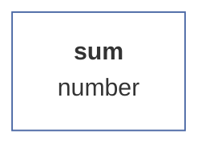

## [Count](#count)

Returns the count of all members of a vector, including empty values.

### Syntax examples

```js
var total_numeric = new NumericVector(200,250,null,150,320,240,-250,null,10,-320).count();  /* = 10 */
var total_string = new StringVector("A","B","C","D").count();  /* = 4 */
var total_boolean = new BooleanVector(true, true, false, null, false, true).count();  /* = 6 */
```

### Output schema

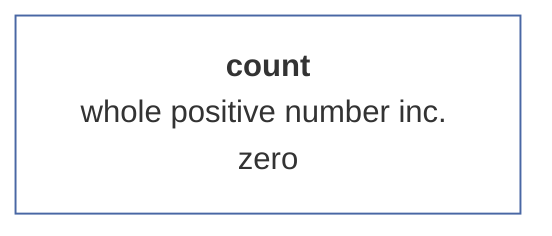

## [Mode](#mode)

Returns the most frequent value in the vector (if the most frequent value is empty, returns the empty value). If there are more of the most frequent values (e.g. the frequency of X and Y values is the same), it returns the first value found in the vector.

### Syntax examples

```js
var x = new NumericVector(1,2,3,4,3,4,5,3).mode(); /* = 3 */
var y = new StringVector("a",null,null,"b","c","d",null,"b").mode(); /* = null */
var z = new BooleanVector(true, false, true).mode(); /* = true */
```

### Output schema

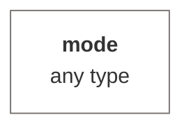

## [Arithmetic mean](#avg)

Returns the arithmetic mean (i.e. the quotient of the sum and the number of vector values) of all non-empty values (i.e. including zeros).


### Pre-calculation data modification

Removes all empty values (blank cells) from th vector.

### Syntax examples

```js
var avgCashFlow = new NumericVector(200,250,150,320,240,-250,10,-320).avg();  /* = 75 */
```

### Output schema

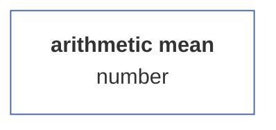

## [Minimum](#min)

Returns the least non-empty value. For text, returns the first value from the alphabetical order.


### Pre-calculation data modification

Removes all empty values (blank cells) from th vector.

### Syntax examples

```js
var numeric_min = new NumericVector(4.5, 3.9, 5, 6, 7, 5.7, 9.1, 5.3, 7.2, 6.9, 6, 7.5, 5.3, 7.1, 8.2, 1).min(); /* = 1 */;
var string_min = new StringVector("Norwood", "Pearson", "Fisher", "Nightingale", "Gauss", "Poisson").min(); /* = Fisher */
```

### Output schema

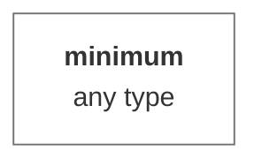

## [Maximum](#max)

Returns the highest non-empty value. In the case of text, it returns the last value from the alphabetical order.


### Pre-calculation data modification

Removes all empty values (blank cells) from th vector.

### Syntax examples

```js
var numeric_max = new NumericVector(4.5, 3.9, 5, 6, 7, 5.7, 9.1, 5.3, 7.2, 6.9, 6, 7.5, 5.3, 7.1, 8.2, 1).max(); /* = 9.1 */;
var string_max = new StringVector("Norwood", "Pearson", "Fisher", "Nightingale", "Gauss", "Poisson").max(); /* = Poisson */
```

### Output schema

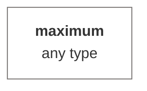

## [Range](#range)

Returns the difference between the largest and smallest non-empty values.


### Pre-calculation data modification

Removes all empty values (blank cells) from th vector.

### Syntax examples

```js
var range = new NumericVector(5,2,-15,-16.3,12,null, null, 12,13,7).range(); /* = 22 */
```

### Output schema

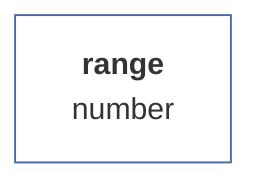

## [Geometric mean](#geomean)

The geometric mean is a statistical indicator that is used to calculate the average value of some number or quantity. Unlike the arithmetic mean, which is calculated as the sum of all values in a set divided by the number of those values, the geometric mean is calculated as the nth root of the product of n numbers in the set. The geometric mean is often used to calculate growth or cumulative return in investments because it accounts for changes in the percentage growth of values over time. It is also used in geometry to calculate the average side length of an n-gon and in biology to calculate the average size of cells or organisms in a population.


### Pre-calculation data modification

Removes all empty values (blank cells) from th vector.

### Syntax examples

```js
var x = new framework.NumericVector(20,19,21,22,21,18,23,22,27,16,17,19,19,21,29,24,23,25,24,21,22,19).geomean(); /* = 21.24*/
```

### Output schema

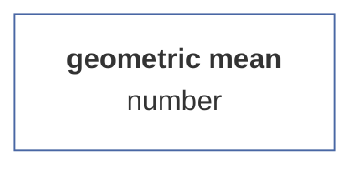

## [Harmonic mean](#harmean)

The harmonic mean is a statistical indicator that is used to calculate the average value of some number or quantity. Unlike the arithmetic mean and the geometric mean, which are based on the addition or multiplication of values, the harmonic mean is calculated as the quotient of the number of numbers in the set and the sum of their reciprocals. The harmonic mean is used in situations where it is important to account for how speed or power changes over time or in different situations. For example, it is used to calculate average speed, average power or average resistance in electronic circuits. It is also used in finance to calculate the average return on investments over different time periods.


### Pre-calculation data modification

Removes all empty values (blank cells) from th vector.

### Syntax examples

```js
var x = new NumericVector(20,19,21,22,21,18,23,22,27,16,17,19,19,21,29,24,23,25,24,21,22,19).harmean(); /* = 21.03*/
```

### Output schema

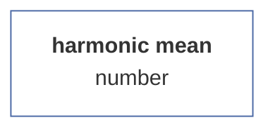

## [Median](#median)

Returns the median, or middle value, of the non-empty values of a vector. This is the 50% percentile.


### Pre-calculation data modification

Removes all empty values (blank cells) from th vector.

### Syntax examples

```js
var median = new NumericVector(20,19,21,22,21,18,23,22,27,16,17,19,19,21,29,24,23,25,24,21,22,19).median(); /* = 21*/
```

### Output schema

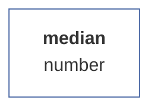

## [Percentile](#percentile)

Using the percentile, we can examine the distribution of a numerical series, by first sorting the series from the smallest to the largest member (number), and then selecting the first N % of members (this N is a parameter), where the last member in the selection represents the given percentile, a specific number . If the number of members in the sample is even, the percentile is calculated as the average of two adjacent values, if it is even, the percentile is just the last value.

### Arguments

| id |description |value type |validator |required |default value |
| :--- |:--- |:--- |:--- |:--- |:--- |
| <b>alpha</b> | percentile value | decimal number between 1 and 0 (including) | <sub>Checks if it is a positive integer greater than zero. Otherwise, it will throw an error.<sub> | ✔️ | 0.95 |

### Pre-calculation data modification

Removes all empty values (blank cells) from th vector.

### Syntax examples

```js
var score = new NumericVector(10,20,15,25,23,19,18,17,24,23);
var median = score.percentile(0.5); /* = 19.5 */
var q25 = score.percentile(0.25); /* = 17.25 */
var max = score.percentile(1); /* = 25 */
```

### Output schema

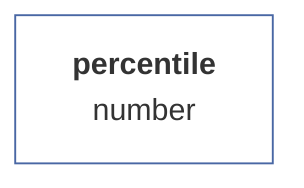

## [Standard deviation](#stdev)

Returns the standard deviation of non-empty values. The standard deviation is a statistical indicator that indicates how much the values in a given data set differ from each other. The standard deviation is expressed as a number that indicates how much the average value deviates from the true value in a given data set. The standard deviation is useful when comparing the amount of dispersion of data in different sets or in different groups within a single data set. The larger the standard deviation, the more the values in a given data set differ from each other.

### Arguments

| id |description |value type |validator |required |default value |
| :--- |:--- |:--- |:--- |:--- |:--- |
| <b>isSample</b> | is sample | boolean value | <sub>Checks if the value is binary in nature. Otherwise, it automatically converts the value to the boolean type and therefore never returns an error.<sub> |  | false |

### Pre-calculation data modification

Removes all empty values (blank cells) from th vector.

### Syntax examples

```js
var population = new NumericVector(10,20,15,25,23,19,18,17,24,23).stdev();  /* = 4.41 */
var sample = new NumericVector(10,20,15,25,23,19,18,17,24,23).stdev(true); /* = 4.65 */
```

### Output schema

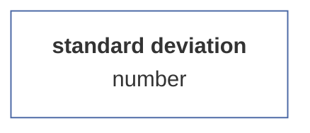

## [Variance](#variance)

Returns the variance value of this vector. The variance value is equal to the square of the standard deviation.

### Arguments

| id |description |value type |validator |required |default value |
| :--- |:--- |:--- |:--- |:--- |:--- |
| <b>isSample</b> | is sample | boolean value | <sub>Checks if the value is binary in nature. Otherwise, it automatically converts the value to the boolean type and therefore never returns an error.<sub> |  | false |

### Pre-calculation data modification

Removes all empty values (blank cells) from th vector.

### Syntax examples

```js
var population = new NumericVector(10,20,15,25,23,19,18,17,24,23).variance();  /* = 19.44 */
var sample = new NumericVector(10,20,15,25,23,19,18,17,24,23).variance(true); /* = 21.6 */
```

### Output schema

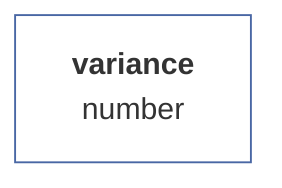

## [Coefficient of variation](#varc)

The coefficient of variation (also called relative variance) is a statistical indicator that measures the degree of variability or dispersion of data relative to its mean value. It is a dimensionless measure of variability that allows the variance of different data sets to be compared regardless of the units in which the data are expressed. The coefficient of variation is calculated as the ratio of the standard deviation (sigma) to the mean (x) in the data set, multiplied by 100 to express it as a percentage. where the coefficient of variation is low, it means that the data are relatively homogeneous or not widely dispersed relative to the mean. If, on the other hand, it is high, it means that the data is very diverse or significantly different from the average. The coefficient of variation is mainly used to compare the variability between different data sets. For example, it is often used in biology, medicine, economics, psychology, and sociology to measure the variability of different populations or groups.

### Arguments

| id |description |value type |validator |required |default value |
| :--- |:--- |:--- |:--- |:--- |:--- |
| <b>isSample</b> | is sample | boolean value | <sub>Checks if the value is binary in nature. Otherwise, it automatically converts the value to the boolean type and therefore never returns an error.<sub> |  | false |
### Syntax examples

```js
var population = new NumericVector(10,20,15,25,23,19,18,17,24,23).varc();  /* = 0.227 */
var sample = new NumericVector(10,20,15,25,23,19,18,17,24,23).varc(true); /* = 0.24 */
```

### Output schema

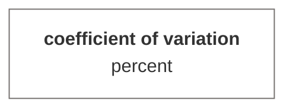

## [Histogram](#histogram)

Returns the histogram matrix of the given vector. The method can be chosen with or without parameter specification. If the parameter 'maximum number of intervals' (maxIntervals) is not specified, its value is automatically calculated as the variation range/root of the number of elements. If the parameter 'fixed interval size' (fixedInterval) is specified, this value is taken as decisive for the number of intervals. The two values are not compatible (although they do not return an error), when specifying both, the maxIntervals parameter is taken as a priority.

### Arguments

| id |description |value type |validator |required |default value |
| :--- |:--- |:--- |:--- |:--- |:--- |
| <b>max</b> | maximum intervals | number | <sub>Checks if it is a positive integer greater than zero. Otherwise, it will throw an error.<sub> |  |  |
| <b>fix</b> | fixed interval | positive decimal | <sub>Checks if it is a positive integer greater than zero. Otherwise, it will throw an error.<sub> |  |  |

### Pre-calculation data modification

Removes all empty values (blank cells) from th vector.

### Syntax examples

#### No interval configuration

<sub>The method is called without parameters, i.e. that the size of the interval is automatically calculated as (maximum-minimum)/root(number of elements).</sub>

```js
var score = new NumericVector(4.5,3.9,5,6,7,5.7,9.1,5.3,null, 7.2,6.9,6,7.5,5.3,7.1,8.2,1, null);
var h1 = score.histogram();
var h2 = score.analyze("histogram").run();
// h1 = h2.result
```

#### Total of intervals specified

<sub>The 'max' argument specifies how many categories (intervals) the histogram should be divided into. The 'max' argument can be specified either as the first parameter or - if the argument is an object - as the 'max' property.</sub>

```js
var score = new NumericVector(4.5,3.9,5,6,7,5.7,9.1,5.3,7.2,6.9,6,7.5,5.3,7.1,8.2,1);
var h1 = score.histogram(4);
var h2 = score.analyze("histogram").run(4);
var h3 = score.histogram({max: 4});
var h4 = score.analyze("histogram").run({max: 4});
// h1 = h3 = h2.result = h4.result
```

#### Interval size specified

<sub>The 'fix' argument sets a fixed interval size. The argument can be specified either as a second parameter (in which case the first argument must be null), or - if the argument is an object - as a 'fix' attribute. The 'max' argument takes precedence over the 'fix' argument.</sub>

```js
var score = new NumericVector(4.5,3.9,5,6,7,5.7,9.1,5.3,7.2,6.9,6,7.5,5.3,7.1,8.2,1);
var h1 = score.histogram(null, 3);
var h2 = score.analyze("histogram").run(null, 3);
var h3 = score.histogram({fix: 3});
var h4 = score.analyze("histogram").run({fix: 3});
// h1 = h3 = h2.result = h4.result
```

### Output schema

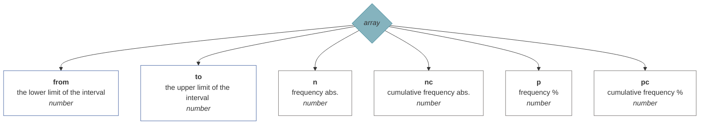

## [Frequency table](#frequency)

Returns a frequency table object with the breakdown of elements and their frequency.

### Arguments

| id |description |value type |validator |required |default value |
| :--- |:--- |:--- |:--- |:--- |:--- |
| <b>order</b> | table order mode | enumerator | <sub>Checks if the specified value is the key of an enumeration (list of possible values). If not, it throws an error.<br><br><b>1</b> = by frequency descending<br><b>2</b> = by frequency ascending<br><b>3</b> = by value ascending<br><b>4</b> = by value descending<br><sub> |  | 1 |
### Syntax examples

```js
var numeric_vector_no_order = new NumericVector(5,2,3,2,3,3,1,6,3).frequency();
```

```js
var string_vector_desc_value = new StringVector("E","B","C","B","C","C","A","F","C").frequency({order: 3});
```

```js
var boolean_vector_desc_frequency = new BooleanVector(true, false, null, true, null, null).frequency(4);
```

### Output schema

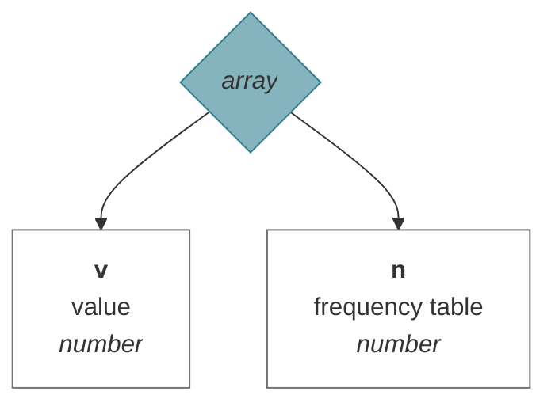

## [Standard error of the mean](#sem)

Returns the value of the standard error of the estimate of the mean. The standard error of the mean is a statistical measure of the variability of the sample mean of the estimated parameter in the entire population. This is an estimate of the standard deviation of the sample mean. The mean error of the mean is calculated as the ratio of the estimated standard deviation of the sample mean to the square root of the sample size. The larger the sample size, the smaller the mean error of the mean, meaning that the estimate of the sample mean is more accurate and more closely aligned with the entire population mean. The mean error of the mean is useful for estimating confidence intervals of the sample mean, which allows us to determine how accurately it estimates the population mean.


### Pre-calculation data modification

Removes all empty values (blank cells) from th vector.

### Syntax examples

```js
var sem = new NumericVector(20,19,21,22,21,18,23,22,27,16,17,19,19,21,29,24,23,25,24,21,22,19).SEM(); /* = 0.67*/
```

### Output schema

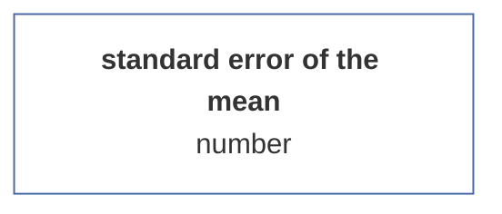

## [Skewness](#skewness)

Returns the skewness of the distribution, i.e. the asymmetry of the distribution around the mean value of the vector.

### Arguments

| id |description |value type |validator |required |default value |
| :--- |:--- |:--- |:--- |:--- |:--- |
| <b>isSample</b> | is sample | boolean value | <sub>Checks if the value is binary in nature. Otherwise, it automatically converts the value to the boolean type and therefore never returns an error.<sub> |  | false |

### Pre-calculation data modification

Removes all empty values (blank cells) from th vector.

### Syntax examples

```js
var skewness_population = new NumericVector(20,19,21,22,21,18,23,22,27,16,17,19,19,21,29,24,23,25,24,21,22,19).skewness(); /* = 0.52*/
var skewness_sample = new NumericVector(20,19,21,22,21,18,23,22,27,16,17,19,19,21,29,24,23,25,24,21,22,19).skewness(true); /* = 0.027*/
```

### Output schema

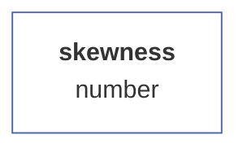

## [Kurtosis](#kurtosis)

Returns the excess value of the data set. In statistics, kurtosis refers to the measure of how much the values in a collection of data differ from the mean value. Skewness is usually calculated for a data distribution curve, which is a graphical representation of the distribution of values in a given collection of data.
There are two basic types of kurtosis: platykurtosis and leptokurtosis. Platykurtosis occurs when the values of a vector are distributed more or less uniformly around the mean value. This distribution appears as a U-shaped distribution curve that has a flat top. Conversely, leptokurtosis occurs when the values in a data collection are distributed with a significant deviation from the mean value. This distribution manifests itself as a 'peaked hill letter' or 'pointed valley letter' shaped distribution curve.
Skewedness is used to determine whether the distribution of values in a collection of data is more or less uniform, or whether there are any significant deviations from the mean value. Skewness is often used along with other metrics such as median, skewness, and quantiles to help you better understand the distribution of data and determine if there are any significant deviations from the mean value.


### Pre-calculation data modification

Removes all empty values (blank cells) from th vector.

### Syntax examples

```js
var kurtosis = new NumericVector(20,19,21,22,21,18,23,22,27,16,17,19,19,21,29,24,23,25,24,21,22,19).kurtosis(); /* = 0.425*/
```

### Output schema

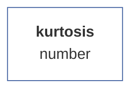

## [Confidence interval of the mean](#mci)

Returns the statistical log of the confidence interval estimate of the sample mean at a specified significance level. If the number of cases is less than 30, the Student's T-distribution is used, otherwise the standardized normal distribution is used.

### Arguments

| id |description |value type |validator |required |default value |
| :--- |:--- |:--- |:--- |:--- |:--- |
| <b>k</b> | level of importance | decimal number between 1 and 0 (including) | <sub>Checks if it is a positive integer greater than zero. Otherwise, it will throw an error.<sub> |  | 0.95 |

### Pre-calculation data modification

Removes all empty values (blank cells) from th vector.

### Syntax examples

```js
var v = new NumericVector([2,2,3,3,4,4,5,5,6,7,8,9,10,11,10,9,8,7,7,6,6,5,5]).mci(0.95);
```

### Output schema

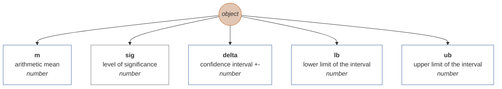

## [Confidence interval of the proportion](#pci)

Returns the statistical log of the confidence interval estimate of the sample proportion at a specified significance level.

### Arguments

| id |description |value type |validator |required |default value |
| :--- |:--- |:--- |:--- |:--- |:--- |
| <b>value</b> | the lookup value | any type | <sub>-<sub> | ✔️ |  |
| <b>alpha</b> | level of importance | decimal number between 1 and 0 (including) | <sub>Checks if it is a positive integer greater than zero. Otherwise, it will throw an error.<sub> |  | 0.95 |

### Pre-calculation data modification

Removes all empty values (blank cells) from th vector.

### Syntax examples

```js
var v = new NumericVector([2,2,3,3,4,4,5,5,6,7,8,9,10,11,10,9,8,7,7,6,6,5,5]).pci(5, 0.95);
```

### Output schema

```mermaid
graph TD
pci((<i>object</i>))
style pci fill:#E1C6B3;
style pci stroke:#C36422;
pci --> p[<b>p</b><br>value share in % <br><i>number</i>]
style p fill:#FFFFFF;
style p stroke:#75716F;
pci --> sig[<b>sig</b><br>level of significance <br><i>number</i>]
style sig fill:#FFFFFF;
style sig stroke:#75716F;
pci --> delta[<b>delta</b><br>confidence interval +- <br><i>number</i>]
style delta fill:#FFFFFF;
style delta stroke:#75716F;
pci --> lb[<b>lb</b><br>lower limit of the interval <br><i>number</i>]
style lb fill:#FFFFFF;
style lb stroke:#75716F;
pci --> ub[<b>ub</b><br>upper limit of the interval <br><i>number</i>]
style ub fill:#FFFFFF;
style ub stroke:#75716F;

```

## [One-sample t-test](#ttest)

Returns the statistical log for a one-sample t-test given the population mean.

### Arguments

| id |description |value type |validator |required |default value |
| :--- |:--- |:--- |:--- |:--- |:--- |
| <b>populationMean</b> | population mean | number | <sub>Checks if the value is a number. Otherwise, it will throw an error.<sub> | ✔️ |  |

### Pre-calculation data modification

Removes all empty values (blank cells) from th vector.

### Syntax examples

```js
var T = new NumericVector(4.5,3.9,5,6,7,5.7,9.1,5.3,7.2,6.9,6,7.5,5.3,7.1,8.2,1).ttest(10);
```

### Output schema

```mermaid
graph TD
ttest((<i>object</i>))
style ttest fill:#E1C6B3;
style ttest stroke:#C36422;
ttest --> t[<b>t</b><br>T-value <br><i>number</i>]
style t fill:#FFFFFF;
style t stroke:#4967A4;
ttest --> p[<b>p</b><br>significance <br><i>number</i>]
style p fill:#FFFFFF;
style p stroke:#75716F;
ttest --> n[<b>n</b><br>total of cases <br><i>number</i>]
style n fill:#FFFFFF;
style n stroke:#75716F;

```

## [Shapiro-Wilk W test](#swtest)

Returns the statistical log of the Shapiro-Wilk W test of normality of the distribution of vector values. The Shapiro-Wilk test is a statistical test used to test the hypothesis that the data come from a normal distribution. This test is often used to verify the normality of data in statistical analysis. The Shapiro-Wilk test is based on comparing the value of the quartiles of the data with the values of the quartiles of a normal distribution. When the quartile values of the data are similar to the quartile values of the normal distribution, it is likely that the data comes from a normal distribution. Otherwise, it is likely that the data is not normal. When using the Shapiro-Wilk test, it should be noted that this test has low sensitivity for large samples, i.e. for large samples the test may be less reliable in detecting non-normality. Therefore, other tests of normality, such as the Anderson-Darling test or the Kolmogorov-Smirnov test, are often used for large samples.


### Pre-calculation data modification

Removes all empty values (blank cells) from th vector.

### Syntax examples

```js
var sw = new NumericVector(2,2,3,3,4,4,5,5,6,7,8,9,10,11,10,9,8,7,7,6,6,5,5).swtest();
```

### Output schema

```mermaid
graph TD
shapirowilk((<i>object</i>))
style shapirowilk fill:#E1C6B3;
style shapirowilk stroke:#C36422;
shapirowilk --> W[<b>W</b><br>W-test value <br><i>number</i>]
style W fill:#FFFFFF;
style W stroke:#4967A4;
shapirowilk --> df[<b>df</b><br>degrees of freedom <br><i>number</i>]
style df fill:#FFFFFF;
style df stroke:#75716F;
shapirowilk --> p[<b>p</b><br>significance <br><i>number</i>]
style p fill:#FFFFFF;
style p stroke:#75716F;

```

## [Kolmogorov-Smirnov test](#kstest)

Returns the statistical log of the Komogorov-Smirnov normality test of the distribution of vector values. It does not currently calculate the significance level of the test. The Kolmogorov-Smirnov test (often abbreviated as the K-S test) is a statistical test used to test the hypothesis that data come from a particular distribution. This test compares the data distribution to the theoretical distribution that the data is assumed to come from and evaluates whether the data values are close enough to the theoretical distribution that the hypothesis that the data come from the given distribution can be considered true.Kolmogorov test -Smirnov is often used to test the normality of data, but it can also be used to test if the data comes from another theoretical distribution, such as the exponential or binomial distribution. The Kolmogorov-Smirnov test is generally considered to be one of the most accurate tests of normality, but it has limited sensitivity for small samples, i.e. it may be less reliable in detecting non-normality for small samples. Therefore, other tests of normality, such as the Shapiro-Wilk test or the Anderson-Darling test, are often used for small samples.


### Pre-calculation data modification

Removes all empty values (blank cells) from th vector.

### Syntax examples

```js
var sw = new NumericVector(2,2,3,3,4,4,5,5,6,7,8,9,10,11,10,9,8,7,7,6,6,5,5).kstest();
```

### Output schema

```mermaid
graph TD
kstest((<i>object</i>))
style kstest fill:#E1C6B3;
style kstest stroke:#C36422;
kstest --> T[<b>T</b><br>Kolmogorov-Smirnov test value <br><i>number</i>]
style T fill:#FFFFFF;
style T stroke:#4967A4;
kstest --> df[<b>df</b><br>degrees of freedom <br><i>number</i>]
style df fill:#FFFFFF;
style df stroke:#75716F;
kstest --> p[<b>p</b><br>significance <br><i>number</i>]
style p fill:#FFFFFF;
style p stroke:#75716F;

```

# Matrix statistical methods documentation

Matrix methods represent statistical methods that can be performed on a given matrix. In general, they can be called in two ways: either directly (e.g. {Matrix}.correlPearson(0,1)) or using the generic 'analyze' method, e.g. {Matrix}.analyze('correlPearson').run(0,1) . The difference between the first and the second method is that in the first method we touch the pure result (in the given example an object with properties r and p), in the second case we get back the entire MatrixAnalysis class, containing in addition to the result also metadata (such as sample information, duration calculation, etc.) as well as the input model, specification of arguments, etc. Therefore, if you need to store metadata during the calculation, it is advisable to call the methods via the 'analysis' function, where the parameter is the name of the method.

Each method has specified arguments and their validators. Method validators verify whether the parameters provided by the user are in accordance with the expected inputs of the calculation functions, and in many cases they are also able to convert compatible types (such as Array x Vector). Validators often work in several steps, ie. if they fail to validate the input value in one way, they have perhaps two other conversion strategies in store. The value of validators lies in the fact that the calculation method receives really such parameters on the basis of which it calculates the resulting statistics correctly.

A number of methods have a specified so-called preprocessor, which is a function that adjusts the input data of calculation functions to the required format. Most often, it is that it discards rows with empty values from the input vectors. In some methods, however, it makes deeper changes, e.g. matrix transformation according to a certain key (e.g. ANOVA). Preprocessors have one more function, namely that they save statistics of the input (raw) and calculated (net) file in the data.

| function | method |
| :--- | :--- |
| linreg | [Linear regression](#linreg) |
| correlPearson | [Pearson correlation coefficient](#correlPearson) |
| correlSpearman | [Spearman's correlation coefficient](#correlSpearman) |
| correlGamma | [Gamma coefficient](#correlGamma) |
| correlKendall | [Kendall's correlation](#correlKendall) |
| correlPartial | [Partial correlation](#correlPartial) |
| correlBiserial | [Biserial correlation](#correlBiserial) |
| anovaow | [ANOVA (one-way)](#anovaow) |
| ttestind | [T-test (independent)](#ttestind) |
| ttestpair | [T-test (paired)](#ttestpair) |
| mwu | [Mann-Whitney test](#mwu) |
| wcxpaired | [Wilcoxon Signed-Ranks Test for Paired Samples](#wcxpaired) |
| friedman | [Friedman's ANOVA](#friedman) |
| contingency | [Contingency](#contingency) |

## [Linear regression](#linreg)

Linear regression is a statistical method used to find the relationship between two continuous variables. These variables are usually labeled as the dependent variable and the independent variable. The goal of linear regression is to find the best linear approximation of the dependent variable as a function of the independent variable. Linear regression is used to predict the value of the dependent variable for a given value of the independent variable when there is a linear relationship between them. This relationship is represented using a linear regression equation that describes how the values of the dependent variable change depending on the values of the independent variable. Linear regression is often used in various fields such as economics, sociology, biology, psychology, engineering and others.

The method allows us to specify for which transformation of the model (eg linear, logarithmic) we are looking for the coefficient of determination.

### Arguments

| id |description |value type |validator |required |default value |
| :--- |:--- |:--- |:--- |:--- |:--- |
| <b>n</b> | independent variable (x) | numeric vector | <sub>It checks whether the argument is of type numeric vector, or whether it is a valid identifier of a numeric vector in a matrix, or - if the argument is of type array - tries to convert the array to a numeric vector using the 'numerify' function. If neither variant fails, it throws an error.<sub> | ✔️ |  |
| <b>x</b> | dependent variable (y) | numeric vector | <sub>It checks whether the argument is of type numeric vector, or whether it is a valid identifier of a numeric vector in a matrix, or - if the argument is of type array - tries to convert the array to a numeric vector using the 'numerify' function. If neither variant fails, it throws an error.<sub> | ✔️ |  |
| <b>model</b> | regression model | enumerator | <sub>Checks if the specified value is the key of an enumeration (list of possible values). If not, it throws an error.<br><br><b>1</b> = linear<br><b>2</b> = log<br><b>3</b> = hyperbole<br><b>4</b> = exponential<br><b>5</b> = quadratic<br><sub> |  | 1 |

### Pre-calculation data modification

Removes from the input vectors (matrix) all rows in which there is at least one empty value.

### Syntax examples

```js
var M = new Matrix(
new NumericVector(180,197,240,210,180,160,179,185,183,150,110,190,170).name("independent x"),
new NumericVector(75,82,100,80,75,60,75,71,77,63,46,81,70).name("dependent y")
);
var lr_a = M.linreg(0,1); // with model argument missing (set to 1 by default)
var lr_b = M.linreg(0,1,4); // regression model set to 4 (exponential transformation)
var lr_c = M.analyze("linreg").run({x: 0, y: "dependent y", model: undefined}); // same as lr_a
var lr_b = M.analyze("linreg").run({x: "independent x", y: 1, model: 4}); // same as lr_b
// lr_a = lr_c.result
// lb_b = lr_d.result
```

### Output schema

```mermaid
graph TD
linreg((<i>object</i>))
style linreg fill:#E1C6B3;
style linreg stroke:#C36422;
linreg --> r2[<b>r2</b><br>coefficient of determination <br><i>number</i>]
style r2 fill:#FFFFFF;
style r2 stroke:#4967A4;
linreg --> r[<b>r</b><br>Pearson correlation coefficient <br><i>number</i>]
style r fill:#FFFFFF;
style r stroke:#4967A4;
linreg --> F[<b>F</b><br>F test <br><i>number</i>]
style F fill:#FFFFFF;
style F stroke:#4967A4;
linreg --> p[<b>p</b><br>significance <br><i>number</i>]
style p fill:#FFFFFF;
style p stroke:#75716F;
linreg --> beta0[<b>beta0</b><br>constant <br><i>number</i>]
style beta0 fill:#FFFFFF;
style beta0 stroke:#4967A4;
linreg --> beta1[<b>beta1</b><br>coefficient <br><i>number</i>]
style beta1 fill:#FFFFFF;
style beta1 stroke:#4967A4;

```

## [Pearson correlation coefficient](#correlPearson)

Returns the statistical log of the Pearson correlation coefficient.
The Pearson correlation is a statistical method used to measure the relationship between two quantities. Its goal is to find out if there is a linear relationship between these quantities and what its intensity is.
Pearson's correlation is calculated using a formula called Pearson's correlation coefficient. This coefficient ranges from -1 to 1 and indicates how strong the relationship is between the quantities. If the coefficient is close to -1, it means that there is a strong negative relationship between the quantities, which means that when the value of one quantity increases, the value of the other quantity decreases. On the contrary, if the coefficient is close to 1, it means that there is a strong positive relationship between the quantities, which means that when the value of one quantity increases, the value of the other quantity also increases. If the coefficient is close to 0, it means that there is no relationship between the quantities or the relationship is very weak.
Pearson's correlation is mainly used to compare two quantitative quantities, i.e. quantities that can be measured on a scale with exact values (for example, age, height or weight). It can be used to determine whether there is a relationship between these quantities and what its character is. For example, Pearson's correlation can be used to compare age and weight and see if there is a relationship between these quantities and what its nature is. It can also be used to compare the results of two different tests and see if there is a relationship between the results of those tests. Source: https://chat.openai.com/chat

### Arguments

| id |description |value type |validator |required |default value |
| :--- |:--- |:--- |:--- |:--- |:--- |
| <b>y</b> | first variable | numeric vector | <sub>It checks whether the argument is of type numeric vector, or whether it is a valid identifier of a numeric vector in a matrix, or - if the argument is of type array - tries to convert the array to a numeric vector using the 'numerify' function. If neither variant fails, it throws an error.<sub> | ✔️ |  |
| <b>x</b> | second variable | numeric vector | <sub>It checks whether the argument is of type numeric vector, or whether it is a valid identifier of a numeric vector in a matrix, or - if the argument is of type array - tries to convert the array to a numeric vector using the 'numerify' function. If neither variant fails, it throws an error.<sub> | ✔️ |  |

### Pre-calculation data modification

Removes from the input vectors (matrix) all rows in which there is at least one empty value.

### Syntax examples

```js
var M = new Matrix(
new NumericVector(180,197,240,210,180,160,179,185,183,150,110,190,170).name("height"),
new NumericVector(75,82,100,80,75,60,75,71,77,63,46,81,70).name("weight")
);
var rxy_a = M.analyze("correlPearson").run(0,1);
var rxy_b = M.correlPearson("height","weight");
// rxy_a.result = rxy_b
```

### Output schema

```mermaid
graph TD
correlPearson((<i>object</i>))
style correlPearson fill:#E1C6B3;
style correlPearson stroke:#C36422;
correlPearson --> r[<b>r</b><br>Pearson correlation coefficient <br><i>number</i>]
style r fill:#FFFFFF;
style r stroke:#4967A4;
correlPearson --> p[<b>p</b><br>significance <br><i>number</i>]
style p fill:#FFFFFF;
style p stroke:#75716F;

```

## [Spearman's correlation coefficient](#correlSpearman)

Returns the statistical log of the Spearman rank correlation coefficient. Unlike the Pearson correlation, the Spearman method is based on a comparison of the order of magnitude of the values of the input variables.

### Arguments

| id |description |value type |validator |required |default value |
| :--- |:--- |:--- |:--- |:--- |:--- |
| <b>y</b> | first variable | numeric vector | <sub>It checks whether the argument is of type numeric vector, or whether it is a valid identifier of a numeric vector in a matrix, or - if the argument is of type array - tries to convert the array to a numeric vector using the 'numerify' function. If neither variant fails, it throws an error.<sub> | ✔️ |  |
| <b>x</b> | second variable | numeric vector | <sub>It checks whether the argument is of type numeric vector, or whether it is a valid identifier of a numeric vector in a matrix, or - if the argument is of type array - tries to convert the array to a numeric vector using the 'numerify' function. If neither variant fails, it throws an error.<sub> | ✔️ |  |

### Pre-calculation data modification

Removes from the input vectors (matrix) all rows in which there is at least one empty value.

### Syntax examples

```js
var M = new Matrix(
new NumericVector(3,7,5,10,9,8,4,1,6,2).name("design rating"),
new NumericVector(4,9,2,10,8,7,6,3,5,1).name("utility rating")
);
var rs_a = M.analyze("correlSpearman").run(0,1);
var rs_b = M.correlSpearman("design rating","utility rating");
// rs_a.result = rs_b
```

### Output schema

```mermaid
graph TD
correlSpearman((<i>object</i>))
style correlSpearman fill:#E1C6B3;
style correlSpearman stroke:#C36422;
correlSpearman --> r[<b>r</b><br>Spearman's correlation coefficient <br><i>number</i>]
style r fill:#FFFFFF;
style r stroke:#4967A4;
correlSpearman --> df[<b>df</b><br>degrees of freedom <br><i>number</i>]
style df fill:#FFFFFF;
style df stroke:#75716F;
correlSpearman --> p[<b>p</b><br>significance <br><i>number</i>]
style p fill:#FFFFFF;
style p stroke:#75716F;

```

## [Gamma coefficient](#correlGamma)

The Goodman-Kruskal gamma is similar to the ordinal correlation coefficient, i.e. a test that measures the dependence between two ordinal variables. For that reason, it can take on the same values as other correlation coefficients (e.g. Pearson's or Spearman's) and is interpreted in the same way. This test is recommended over other rank-oriented correlation methods when your data has many ties.

### Arguments

| id |description |value type |validator |required |default value |
| :--- |:--- |:--- |:--- |:--- |:--- |
| <b>y</b> | first variable | numeric vector | <sub>It checks whether the argument is of type numeric vector, or whether it is a valid identifier of a numeric vector in a matrix, or - if the argument is of type array - tries to convert the array to a numeric vector using the 'numerify' function. If neither variant fails, it throws an error.<sub> | ✔️ |  |
| <b>x</b> | second variable | numeric vector | <sub>It checks whether the argument is of type numeric vector, or whether it is a valid identifier of a numeric vector in a matrix, or - if the argument is of type array - tries to convert the array to a numeric vector using the 'numerify' function. If neither variant fails, it throws an error.<sub> | ✔️ |  |

### Pre-calculation data modification

Removes from the input vectors (matrix) all rows in which there is at least one empty value.

### Output schema

```mermaid
graph TD
correlGamma((<i>object</i>))
style correlGamma fill:#E1C6B3;
style correlGamma stroke:#C36422;
correlGamma --> r[<b>r</b><br>The Goodman-Kruskal gamma <br><i>number</i>]
style r fill:#FFFFFF;
style r stroke:#4967A4;
correlGamma --> p[<b>p</b><br>significance <br><i>number</i>]
style p fill:#FFFFFF;
style p stroke:#75716F;

```

## [Kendall's correlation](#correlKendall)

Returns the statistical log of Kendall's Tau-B correlation coefficient. If you were to calculate the same operation in SPSS, you would probably get a slightly different result. Apparently, this is due to the different sensitivity to decimal places in the two systems. However, it should not have a major influence on the interpretation of the result.

### Arguments

| id |description |value type |validator |required |default value |
| :--- |:--- |:--- |:--- |:--- |:--- |
| <b>y</b> | first variable | numeric vector | <sub>It checks whether the argument is of type numeric vector, or whether it is a valid identifier of a numeric vector in a matrix, or - if the argument is of type array - tries to convert the array to a numeric vector using the 'numerify' function. If neither variant fails, it throws an error.<sub> | ✔️ |  |
| <b>x</b> | second variable | numeric vector | <sub>It checks whether the argument is of type numeric vector, or whether it is a valid identifier of a numeric vector in a matrix, or - if the argument is of type array - tries to convert the array to a numeric vector using the 'numerify' function. If neither variant fails, it throws an error.<sub> | ✔️ |  |

### Pre-calculation data modification

Removes from the input vectors (matrix) all rows in which there is at least one empty value.

### Syntax examples

```js
var M = new Matrix(
new NumericVector(3,7,5,10,9,8,4,1,6,2).name("design rating"),
new NumericVector(4,9,2,10,8,7,6,3,5,1).name("utility rating")
);
var rk_a = M.analyze("correlKendall").run(0,1);
var rk_b = M.correlKendall("design rating","utility rating");
// rk_a.result = rk_b
```

### Output schema

```mermaid
graph TD
correlKendall((<i>object</i>))
style correlKendall fill:#E1C6B3;
style correlKendall stroke:#C36422;
correlKendall --> taub[<b>taub</b><br>Tau-b <br><i>number</i>]
style taub fill:#FFFFFF;
style taub stroke:#4967A4;
correlKendall --> taua[<b>taua</b><br>Tau-a <br><i>number</i>]
style taua fill:#FFFFFF;
style taua stroke:#4967A4;
correlKendall --> df[<b>df</b><br>degrees of freedom <br><i>number</i>]
style df fill:#FFFFFF;
style df stroke:#75716F;
correlKendall --> p[<b>p</b><br>significance <br><i>number</i>]
style p fill:#FFFFFF;
style p stroke:#75716F;

```

## [Partial correlation](#correlPartial)

Partial correlation is a statistical method that allows you to find out what the relationship is between two variables while taking into account the influence of a third variable. This is useful if you want to see if there is a direct relationship between two variables without being affected by the influence of other variables. For example, if you want to find out if there is a relationship between level of training and success at work, it may be useful to consider the effect of age or gender as well. In that case, you could use partial correlation to find the relationship between level of training and success at work while controlling for the effects of age and gender. The partial correlation is calculated using a formula that is derived from the Pearson correlation coefficient. It is important to note that partial correlation does not imply causation, i.e. that one variable does not cause the other, but only shows that there is some association between them. Source: https://chat.openai.com/chat.

### Arguments

| id |description |value type |validator |required |default value |
| :--- |:--- |:--- |:--- |:--- |:--- |
| <b>y</b> | first variable | numeric vector | <sub>It checks whether the argument is of type numeric vector, or whether it is a valid identifier of a numeric vector in a matrix, or - if the argument is of type array - tries to convert the array to a numeric vector using the 'numerify' function. If neither variant fails, it throws an error.<sub> | ✔️ |  |
| <b>x</b> | second variable | numeric vector | <sub>It checks whether the argument is of type numeric vector, or whether it is a valid identifier of a numeric vector in a matrix, or - if the argument is of type array - tries to convert the array to a numeric vector using the 'numerify' function. If neither variant fails, it throws an error.<sub> | ✔️ |  |
| <b>y</b> | third (control) variable | numeric vector | <sub>It checks whether the argument is of type numeric vector, or whether it is a valid identifier of a numeric vector in a matrix, or - if the argument is of type array - tries to convert the array to a numeric vector using the 'numerify' function. If neither variant fails, it throws an error.<sub> | ✔️ |  |

### Pre-calculation data modification

Removes from the input vectors (matrix) all rows in which there is at least one empty value.

### Syntax examples

```js
var M = new Matrix(
new NumericVector(180,197,240,210,180,160,179,185,183,150,110,190,170).name("x"),
new NumericVector(75,82,100,80,75,60,75,71,77,63,46,81,70).name("y"),
new NumericVector(79,81,103,84,72,55,78,76,82,65,49,83,74).name("z")
);
var rp_a = M.analyze("correlPartial").run(0,1,2);
var rp_b = M.correlPartial("x","y","z");
// rp_a.result = rp_b
```

### Output schema

```mermaid
graph TD
correlPartial((<i>object</i>))
style correlPartial fill:#E1C6B3;
style correlPartial stroke:#C36422;
correlPartial --> r[<b>r</b><br>Pearson correlation coefficient <br><i>number</i>]
style r fill:#FFFFFF;
style r stroke:#4967A4;
correlPartial --> p[<b>p</b><br>significance <br><i>number</i>]
style p fill:#FFFFFF;
style p stroke:#75716F;

```

## [Biserial correlation](#correlBiserial)

Biserial correlation is a statistical method that is used to evaluate the relationship between two binary variables (ie variables that can have only two possible values, such as 'yes' or 'no'). Binary variables are often used in the social sciences, for example when examining the relationship between education and employment or between smoking and health. Biserial correlation is calculated using a formula that is derived from the Pearson correlation coefficient. It is important to note that biserial correlation does not imply causation, i.e. that one variable does not cause the other, but only shows that there is some association between them.

### Arguments

| id |description |value type |validator |required |default value |
| :--- |:--- |:--- |:--- |:--- |:--- |
| <b>x</b> | first variable | binary (boolean) vector | <sub>Checks if the argument is either a binary (boolean) vector, its identifier, or an array convertible to a binary vector. Otherwise, it throws an error,<sub> | ✔️ |  |
| <b>z</b> | second variable | numeric vector | <sub>It checks whether the argument is of type numeric vector, or whether it is a valid identifier of a numeric vector in a matrix, or - if the argument is of type array - tries to convert the array to a numeric vector using the 'numerify' function. If neither variant fails, it throws an error.<sub> | ✔️ |  |

### Pre-calculation data modification

Removes from the input vectors (matrix) all rows in which there is at least one empty value.

### Output schema

```mermaid
graph TD
correlPearson((<i>object</i>))
style correlPearson fill:#E1C6B3;
style correlPearson stroke:#C36422;
correlPearson --> r[<b>r</b><br>Pearson correlation coefficient <br><i>number</i>]
style r fill:#FFFFFF;
style r stroke:#4967A4;
correlPearson --> p[<b>p</b><br>significance <br><i>number</i>]
style p fill:#FFFFFF;
style p stroke:#75716F;

```

## [ANOVA (one-way)](#anovaow)

Returns the One-way ANOVA statistical log. The method has two arguments. The first consists of a series of numerical vectors, where at least one vector is mandatory. The second argument is optional and represents the grouping factor, i.e. a text variable that determines whether the numerical factor belongs to the group in the rows. If the second parameter is specified, only the first of the first group of vectors is taken into account.

### Arguments

| id |description |value type |validator |required |default value |
| :--- |:--- |:--- |:--- |:--- |:--- |
| <b>vectors</b> | input vector/s | numeric vector or a matrix (array) of numeric vectors | <sub>Checks whether the argument is either a numeric vector, its identifier, or a series convertible to a numeric vector, or whether it is a series of numeric vectors (or values that are either vectors, identifiers, or values convertible to numeric vectors - in any combination). If even one of the variants fails, it throws an error.<sub> | ✔️ |  |
| <b>columns</b> | grouping variable | any vector | <sub>Verifies if the argument is of type vector, or if it is a valid identifier of a vector in a matrix, or - if the argument is of type array - it tries to convert the array to a vector using the 'vectorify' function. If neither variant fails, it throws an error.<sub> | ✔️ |  |

### Pre-calculation data modification

If the arguments specify a factor variable (the second argument), the first argument (either a numeric vector or the first vector in the matrix, if the first argument is a matrix) is decomposed according to the factor values into a new matrix. If the arguments are without a factor (ie the second argument is empty), it takes all the numeric vectors from the first argument 'vectors' (matrix) and then removes the rows with empty values. If the 'factor' argument is not specified and the 'vectors' argument contains only a single vector or is itself a numeric vector, an error will be thrown (without the factor, at least two numeric vectors are required in the first argument).

### Syntax examples

```js
var M = new Matrix(
new NumericVector(180,197,240,210,180,160,179,185,183,150,110,190,170).name("x"),
new NumericVector(75,82,100,80,75,60,75,71,77,63,46,81,70).name("y"),
new NumericVector(275,282,300,280,275,260,275,271,277,263,246,281,270).name("z")
);
var anova = M.analyze("anovaow").run({vectors: [0,1,2]});
```

### Output schema

```mermaid
graph TD
anovaow((<i>object</i>))
style anovaow fill:#E1C6B3;
style anovaow stroke:#C36422;
anovaow --> F[<b>F</b><br>F test <br><i>number</i>]
style F fill:#FFFFFF;
style F stroke:#4967A4;
anovaow --> P2[<b>P2</b><br>dependence coefficient <br><i>number</i>]
style P2 fill:#FFFFFF;
style P2 stroke:#4967A4;
anovaow --> p[<b>p</b><br>significance <br><i>number</i>]
style p fill:#FFFFFF;
style p stroke:#75716F;
anovaow --> n[<b>n</b><br>total of cases <br><i>number</i>]
style n fill:#FFFFFF;
style n stroke:#75716F;
anovaow --> ANOVA((<b>ANOVA</b><br><u>ANOVA statistics</u>))
ANOVA((<b>ANOVA</b><br><u>ANOVA statistics</u><br><i>object</i>))
style ANOVA fill:#E1C6B3;
style ANOVA stroke:#C36422;
ANOVA --> totalOfGroups[<b>totalOfGroups</b><br>total of groups <br><i>number</i>]
style totalOfGroups fill:#FFFFFF;
style totalOfGroups stroke:#75716F;
ANOVA --> betweenGroups((<b>betweenGroups</b><br><u>intergroup effects</u>))
betweenGroups((<b>betweenGroups</b><br><u>intergroup effects</u><br><i>object</i>))
style betweenGroups fill:#E1C6B3;
style betweenGroups stroke:#C36422;
betweenGroups --> sumOfSquares[<b>sumOfSquares</b><br>sum of squares <br><i>number</i>]
style sumOfSquares fill:#FFFFFF;
style sumOfSquares stroke:#4967A4;
betweenGroups --> df[<b>df</b><br>degrees of freedom <br><i>number</i>]
style df fill:#FFFFFF;
style df stroke:#75716F;
ANOVA --> withinGroups((<b>withinGroups</b><br><u>intragroup effects</u>))
withinGroups((<b>withinGroups</b><br><u>intragroup effects</u><br><i>object</i>))
style withinGroups fill:#E1C6B3;
style withinGroups stroke:#C36422;
withinGroups --> sumOfSquares[<b>sumOfSquares</b><br>sum of squares <br><i>number</i>]
style sumOfSquares fill:#FFFFFF;
style sumOfSquares stroke:#4967A4;
withinGroups --> df[<b>df</b><br>degrees of freedom <br><i>number</i>]
style df fill:#FFFFFF;
style df stroke:#75716F;
ANOVA --> total((<b>total</b><br><u>total</u>))
total((<b>total</b><br><u>total</u><br><i>object</i>))
style total fill:#E1C6B3;
style total stroke:#C36422;
total --> sumOfSquares[<b>sumOfSquares</b><br>sum of squares <br><i>number</i>]
style sumOfSquares fill:#FFFFFF;
style sumOfSquares stroke:#4967A4;
total --> df[<b>df</b><br>degrees of freedom <br><i>number</i>]
style df fill:#FFFFFF;
style df stroke:#75716F;

```

## [T-test (independent)](#ttestind)

Returns the statistical log of the Student's t-test for two independent samples that are defined by an eigenvariable (that is, two numeric vectors). Arguments are either two numeric vectors, or one numeric and only a factor vector (usually text, but can also be numeric or binary). If a vector that has more than two unique values is used as a factor, only the first two unique values found are considered for the test (the others are ignored) - in this case, the information about the size of the pure sample is irrelevant, however, the level of significance to which the sample size enters, it is already based on pure cases.

### Arguments

| id |description |value type |validator |required |default value |
| :--- |:--- |:--- |:--- |:--- |:--- |
| <b>vectors</b> | input vector/s | numeric vector or a matrix (array) of numeric vectors | <sub>Checks whether the argument is either a numeric vector, its identifier, or a series convertible to a numeric vector, or whether it is a series of numeric vectors (or values that are either vectors, identifiers, or values convertible to numeric vectors - in any combination). If even one of the variants fails, it throws an error.<sub> | ✔️ |  |
| <b>factor</b> | grouping variable | any vector | <sub>Verifies if the argument is of type vector, or if it is a valid identifier of a vector in a matrix, or - if the argument is of type array - it tries to convert the array to a vector using the 'vectorify' function. If neither variant fails, it throws an error.<sub> | ✔️ |  |
### Syntax examples

#### Arguments as object properties

<sub>The method has two parameters: vectors (first and mandatory) and factor (second, optional). In the given example, a single object is specified as an argument, which specifies the values of the individual parameters of the function. In this method, it is possible to specify the vectors parameter even as a single vector.</sub>

```js
var M = new Matrix(
new NumericVector(4,5,6,7,8,9,10,7,7,6).name("x"),
new NumericVector(10,11,9,8,7,8,9,4,5,10).name("y")
);
var ttestind_a = M.analyze("ttestind").run({vectors: [0,1]});
var ttestind_b = M.ttestind({vectors: [0,1]});
// ttestind_a.result === mqu_b
```

#### Arguments as an array

<sub>Arguments are ordered in the standard way. It is essential to follow the order of the arguments here, and in addition, the first argument should ideally be in array format, e.g. [vector1, vector2].</sub>

```js
var M = new Matrix(
new NumericVector(4,5,6,7,8,9,10,7,7,6).name("x"),
new NumericVector(10,11,9,8,7,8,9,4,5,10).name("y")
);
var ttestind_a = M.analyze("ttestind").run([0,1]);
var ttestind_b = M.ttestind(["x","y"]);
// ttestind_a.result === mqu_b
```

#### Factor' parameter implementation

<sub>As the second parameter, a factor is specified, i.e. a variable according to which the vector argument is transformed (or the first vector, if several numerical vectors are entered).</sub>

```js
var M = new Matrix(
new NumericVector(4,5,6,7,8,9,10,7,7,6,10,11,9,8,7,8,9,4,5,10).name("score"),
new StringVector("A","A","A","A","A","A","A","A","A","A","B","B","B","B","B","B","B","B","B","B",).name("group")
);
var ttestind_a = M.analyze("ttestind").run({vectors: 0, factor: 1});
var ttestind_b = M.ttestind({vectors: 0, factor: 1});
var ttestind_c = M.analyze("ttestind").run(0, 1);
var ttestind_d = M.ttestind(0, 1);
var ttestind_e = M.analyze("ttestind").run([0], 1);
```

### Output schema

```mermaid
graph TD
ttestind((<i>object</i>))
style ttestind fill:#E1C6B3;
style ttestind stroke:#C36422;
ttestind --> t[<b>t</b><br>T-value <br><i>number</i>]
style t fill:#FFFFFF;
style t stroke:#4967A4;
ttestind --> p[<b>p</b><br>significance <br><i>number</i>]
style p fill:#FFFFFF;
style p stroke:#75716F;
ttestind --> df[<b>df</b><br>degrees of freedom <br><i>number</i>]
style df fill:#FFFFFF;
style df stroke:#75716F;

```

## [T-test (paired)](#ttestpair)

Returns the statistical log of a paired t-test for two dependent samples. Empty values are cut out in the row cross-section, i.e. that if at least one value is missing in one row, the entire row is cut from the analysis.

### Arguments

| id |description |value type |validator |required |default value |
| :--- |:--- |:--- |:--- |:--- |:--- |
| <b>y</b> | first variable | numeric vector | <sub>It checks whether the argument is of type numeric vector, or whether it is a valid identifier of a numeric vector in a matrix, or - if the argument is of type array - tries to convert the array to a numeric vector using the 'numerify' function. If neither variant fails, it throws an error.<sub> | ✔️ |  |
| <b>x</b> | second variable | numeric vector | <sub>It checks whether the argument is of type numeric vector, or whether it is a valid identifier of a numeric vector in a matrix, or - if the argument is of type array - tries to convert the array to a numeric vector using the 'numerify' function. If neither variant fails, it throws an error.<sub> | ✔️ |  |

### Pre-calculation data modification

Removes from the input vectors (matrix) all rows in which there is at least one empty value.

### Syntax examples

```js
var M = new Matrix(
new NumericVector(4,5,6,7,8,9,10,7,7,6).name("pre-score"),
new NumericVector(10,11,12,13,14,8,9,10,11,10).name("post-score")
);
var ttest_a = M.analyze("ttestpair").run(0,1);
var ttest_b = M.ttestpair("pre-score","post-score");
// ttest_a.result = ttest_b
```

### Output schema

```mermaid
graph TD
ttestpair((<i>object</i>))
style ttestpair fill:#E1C6B3;
style ttestpair stroke:#C36422;
ttestpair --> t[<b>t</b><br>T-value <br><i>number</i>]
style t fill:#FFFFFF;
style t stroke:#4967A4;
ttestpair --> p[<b>p</b><br>significance <br><i>number</i>]
style p fill:#FFFFFF;
style p stroke:#75716F;
ttestpair --> df[<b>df</b><br>degrees of freedom <br><i>number</i>]
style df fill:#FFFFFF;
style df stroke:#75716F;

```

## [Mann-Whitney test](#mwu)

Returns the statistical log of the Mann-Whitney U test. It is a non-parametric null hypothesis test that compares randomly selected values of X and Y from two populations, with the probability that X is greater than Y equal to the probability that Y is greater than X.

### Arguments

| id |description |value type |validator |required |default value |
| :--- |:--- |:--- |:--- |:--- |:--- |
| <b>vectors</b> | input vector/s | numeric vector or a matrix (array) of numeric vectors | <sub>Checks whether the argument is either a numeric vector, its identifier, or a series convertible to a numeric vector, or whether it is a series of numeric vectors (or values that are either vectors, identifiers, or values convertible to numeric vectors - in any combination). If even one of the variants fails, it throws an error.<sub> | ✔️ |  |
| <b>factor</b> | grouping variable | any vector | <sub>Verifies if the argument is of type vector, or if it is a valid identifier of a vector in a matrix, or - if the argument is of type array - it tries to convert the array to a vector using the 'vectorify' function. If neither variant fails, it throws an error.<sub> | ✔️ |  |

### Pre-calculation data modification

If the arguments specify a factor variable (the second argument), the first argument (either a numeric vector or the first vector in the matrix, if it is the first argument of the matrix) is decomposed according to the values of the factor into a new matrix. If the arguments are without a factor (i.e. the second argument is empty), it takes the first two vectors from the first argument 'vectors' (matrix) and then deletes the rows with empty values. In case the argument 'factor' and the argument 'vectors' are not specified contains only a single vector or is itself a numeric vector, throws an error (at least two numeric vectors are required in the first argument without a factor).

### Syntax examples

#### Arguments as object properties

<sub>The method has two parameters: vectors (first and mandatory) and factor (second, optional). In the given example, a single object is specified as an argument, which specifies the values of the individual parameters of the function. In this method, it is possible to specify the vectors parameter even as a single vector.</sub>

```js
var M = new Matrix(
new NumericVector(4,5,6,7,8,9,10,7,7,6).name("x"),
new NumericVector(10,11,9,8,7,8,9,4,5,10).name("y")
);
var mwu_a = M.analyze("mwu").run({vectors: [0,1]});
var mwu_b = M.mwu({vectors: [0,1]});
// mwu_a.result === mqu_b
```

#### Arguments as an array

<sub>Arguments are ordered in the standard way. It is essential to follow the order of the arguments here, and in addition, the first argument should ideally be in array format, e.g. [vector1, vector2].</sub>

```js
var M = new Matrix(
new NumericVector(4,5,6,7,8,9,10,7,7,6).name("x"),
new NumericVector(10,11,9,8,7,8,9,4,5,10).name("y")
);
var mwu_a = M.analyze("mwu").run([0,1]);
var mwu_b = M.mwu(["x","y"]);
// mwu_a.result === mqu_b
```

#### Factor' parameter implementation

<sub>As the second parameter, a factor is specified, i.e. a variable according to which the vector argument is transformed (or the first vector, if several numerical vectors are entered).</sub>

```js
var M = new Matrix(
new NumericVector(4,5,6,7,8,9,10,7,7,6,10,11,9,8,7,8,9,4,5,10).name("score"),
new StringVector("A","A","A","A","A","A","A","A","A","A","B","B","B","B","B","B","B","B","B","B",).name("group")
);
var mwu_a = M.analyze("mwu").run({vectors: 0, factor: 1});
var mwu_b = M.mwu({vectors: 0, factor: 1});
var mwu_c = M.analyze("mwu").run(0, 1);
var mwu_d = M.mwu(0, 1);
var mwu_e = M.analyze("mwu").run([0], 1);
```

### Output schema

```mermaid
graph TD
mwu((<i>object</i>))
style mwu fill:#E1C6B3;
style mwu stroke:#C36422;
mwu --> U[<b>U</b><br>U test <br><i>number</i>]
style U fill:#FFFFFF;
style U stroke:#4967A4;
mwu --> Z[<b>Z</b><br>Z test <br><i>number</i>]
style Z fill:#FFFFFF;
style Z stroke:#4967A4;
mwu --> p[<b>p</b><br>significance <br><i>number</i>]
style p fill:#FFFFFF;
style p stroke:#75716F;

```

## [Wilcoxon Signed-Ranks Test for Paired Samples](#wcxpaired)

The Wilcoxon signed-ranks test is a non-parametric statistical test used to determine whether two related or paired samples have the same median or not. It is used when the data is not normally distributed or the assumption of equal variances is violated. This test is suitable for small sample sizes.

### Arguments

| id |description |value type |validator |required |default value |
| :--- |:--- |:--- |:--- |:--- |:--- |
| <b>y</b> | first variable | numeric vector | <sub>It checks whether the argument is of type numeric vector, or whether it is a valid identifier of a numeric vector in a matrix, or - if the argument is of type array - tries to convert the array to a numeric vector using the 'numerify' function. If neither variant fails, it throws an error.<sub> | ✔️ |  |
| <b>x</b> | second variable | numeric vector | <sub>It checks whether the argument is of type numeric vector, or whether it is a valid identifier of a numeric vector in a matrix, or - if the argument is of type array - tries to convert the array to a numeric vector using the 'numerify' function. If neither variant fails, it throws an error.<sub> | ✔️ |  |

### Pre-calculation data modification

Removes from the input vectors (matrix) all rows in which there is at least one empty value.

### Syntax examples

```js
var M = new Matrix(
new NumericVector(15,8,11,19,13,4,16,5,9,15,12,11,14,4,11,17,14,5,9,8,9,11,11,12,17,12,5,5,15,0).name("wife"),
new NumericVector(17,19,18,19,17,5,13,0,16,21,12,9,10,17,12,24,12,12,8,16,12,7,17,13,20,9,13,11,11,12).name("husband")
);
var wcx_a = M.analyze("wcxpaired").run("wife", "husband");
var wcx_b = M.wcxpaired(0,1);
// wcx_a.result = wcx_b
```

### Output schema

```mermaid
graph TD
wcxpaired((<i>object</i>))
style wcxpaired fill:#E1C6B3;
style wcxpaired stroke:#C36422;
wcxpaired --> Z[<b>Z</b><br>Z test <br><i>number</i>]
style Z fill:#FFFFFF;
style Z stroke:#4967A4;
wcxpaired --> p[<b>p</b><br>significance <br><i>number</i>]
style p fill:#FFFFFF;
style p stroke:#75716F;

```

## [Friedman's ANOVA](#friedman)

The Friedman test is a non-parametric statistical test developed by Milton Friedman. Similar to the parametric repeated measures ANOVA, it is used to detect differences in treatments across multiple test attempts. The procedure involves ranking each row (or block) together, then considering the values of ranks by columns. Applicable to complete block designs, it is thus a special case of the Durbin test.

### Arguments

| id |description |value type |validator |required |default value |
| :--- |:--- |:--- |:--- |:--- |:--- |
| <b>vectors</b> | input vector/s | numeric vector or a matrix (array) of numeric vectors | <sub>Checks whether the argument is either a numeric vector, its identifier, or a series convertible to a numeric vector, or whether it is a series of numeric vectors (or values that are either vectors, identifiers, or values convertible to numeric vectors - in any combination). If even one of the variants fails, it throws an error.<sub> | ✔️ |  |

### Pre-calculation data modification

Removes from the input vectors (matrix) all rows in which there is at least one empty value.

### Syntax examples

```js
var M = new Matrix(
new NumericVector(10,8,7,9,7,4,5,6,5,10,4,7).name("white"),
new NumericVector(7,5,8,6,5,7,9,6,4,6,7,3).name("red"),
new NumericVector(8,5,6,4,7,5,3,7,6,4,4,3).name("rose")
);
var friedman_a = M.analyze("friedman").run([0,1,2]);
var friedman_b = M.friedman(["white","red","rose"]);
// friedman_a.result = friedman_b
```

### Output schema

```mermaid
graph TD
friedman((<i>object</i>))
style friedman fill:#E1C6B3;
style friedman stroke:#C36422;
friedman --> Q[<b>Q</b><br>Friedman's Q test <br><i>number</i>]
style Q fill:#FFFFFF;
style Q stroke:#4967A4;
friedman --> df[<b>df</b><br>degrees of freedom <br><i>number</i>]
style df fill:#FFFFFF;
style df stroke:#75716F;
friedman --> p[<b>p</b><br>significance <br><i>number</i>]
style p fill:#FFFFFF;
style p stroke:#75716F;

```

## [Contingency](#contingency)

Returns the contingency statistics log. The parameters of the method are a) row variable, b) column variable, and optionally c) frequency of group a/b (if empty, intersection frequency is taken to be 1). The output of the method is both contingency statistics (chi^2), Cramer's V, Pearson's C, etc.

### Arguments

| id |description |value type |validator |required |default value |
| :--- |:--- |:--- |:--- |:--- |:--- |
| <b>factor</b> | row variable | any vector | <sub>Verifies if the argument is of type vector, or if it is a valid identifier of a vector in a matrix, or - if the argument is of type array - it tries to convert the array to a vector using the 'vectorify' function. If neither variant fails, it throws an error.<sub> | ✔️ |  |
| <b>rows</b> | column variable | any vector | <sub>Verifies if the argument is of type vector, or if it is a valid identifier of a vector in a matrix, or - if the argument is of type array - it tries to convert the array to a vector using the 'vectorify' function. If neither variant fails, it throws an error.<sub> | ✔️ |  |
| <b>y</b> | frequency variable | numeric vector | <sub>It checks whether the argument is of type numeric vector, or whether it is a valid identifier of a numeric vector in a matrix, or - if the argument is of type array - tries to convert the array to a numeric vector using the 'numerify' function. If neither variant fails, it throws an error.<sub> |  |  |

### Pre-calculation data modification

Removes from the input vectors (matrix) all rows in which there is at least one empty value.

### Syntax examples

#### Without specifying frequencies

<sub>The method replaces the missing argument with an automatically generated n (frequency) vector, each value of which is equal to 1. Briefly, the input table takes the form of raw, unaggregated data.</sub>

```js
var M = new Matrix(
new StringVector("A","A","A","A","A","A","B","B","B","B","B","B").name("R"),
new StringVector("A","A","A","B","B","B","C","C","C","C","C","C").name("C")
);
var c_a = M.contingency(0,1);
var c_b = M.analyze("contingency").run(0,1);
var c_c = M.analyze("contingency").run({rows: 0, columns: 1});
// c_a = c_b.result = c_c.result
```

#### With specifying frequencies

<sub>The last argument consists of aggregated frequencies, i.e. that the input table is already aggregated.</sub>

```js
var M = new Matrix(
new StringVector("elementary","elementary","elementary","elementary","high school","high school","high school","high school","college","college","college","college").name("grade"),
new StringVector("A","B","C","D","A","B","C","D","A","B","C","D").name("group"),
new NumericVector(39,25,25,27,17,30,40,29,12,41,62,53).name("frequencies")
);
var c_a = M.contingency(0,1,2);
var c_b = M.analyze("contingency").run(0,1,2);
var c_c = M.analyze("contingency").run("grade","group","frequencies");
var c_d = M.analyze("contingency").run({rows: 0, columns: 1, n: 2});
// c_a = c_b.result = c_c.result = c_d.result
```

### Output schema

```mermaid
graph TD
contingency((<i>object</i>))
style contingency fill:#E1C6B3;
style contingency stroke:#C36422;
contingency --> phi[<b>phi</b><br>phi^2 test <br><i>number</i>]
style phi fill:#FFFFFF;
style phi stroke:#4967A4;
contingency --> p[<b>p</b><br>significance <br><i>number</i>]
style p fill:#FFFFFF;
style p stroke:#75716F;
contingency --> df[<b>df</b><br>degrees of freedom <br><i>number</i>]
style df fill:#FFFFFF;
style df stroke:#75716F;
contingency --> C[<b>C</b><br>Pearson C <br><i>number</i>]
style C fill:#FFFFFF;
style C stroke:#4967A4;
contingency --> V[<b>V</b><br>Cramér V <br><i>number</i>]
style V fill:#FFFFFF;
style V stroke:#4967A4;

```