# Matrix statistical methods documentation

Matrix methods represent statistical methods that can be performed on a given matrix. In general, they can be called in two ways: either directly (e.g. {Matrix}.correlPearson(0,1)) or using the generic 'analyze' method, e.g. {Matrix}.analyze('correlPearson').run(0,1) . The difference between the first and the second method is that in the first method we touch the pure result (in the given example an object with properties r and p), in the second case we get back the entire MatrixAnalysis class, containing in addition to the result also metadata (such as sample information, duration calculation, etc.) as well as the input model, specification of arguments, etc. Therefore, if you need to store metadata during the calculation, it is advisable to call the methods via the 'analysis' function, where the parameter is the name of the method.

Each method has specified arguments and their validators. Method validators verify whether the parameters provided by the user are in accordance with the expected inputs of the calculation functions, and in many cases they are also able to convert compatible types (such as Array x Vector). Validators often work in several steps, ie. if they fail to validate the input value in one way, they have perhaps two other conversion strategies in store. The value of validators lies in the fact that the calculation method receives really such parameters on the basis of which it calculates the resulting statistics correctly.

A number of methods have a specified so-called preprocessor, which is a function that adjusts the input data of calculation functions to the required format. Most often, it is that it discards rows with empty values from the input vectors. In some methods, however, it makes deeper changes, e.g. matrix transformation according to a certain key (e.g. ANOVA). Preprocessors have one more function, namely that they save statistics of the input (raw) and calculated (net) file in the data.

| function | method |
| :--- | :--- |
| linreg | [Linear regression](#linreg) |
| correlPearson | [Pearson correlation coefficient](#correlPearson) |
| correlSpearman | [Spearman's correlation coefficient](#correlSpearman) |
| correlGamma | [Gamma coefficient](#correlGamma) |
| correlKendall | [Kendall's correlation](#correlKendall) |
| correlPartial | [Partial correlation](#correlPartial) |
| correlBiserial | [Biserial correlation](#correlBiserial) |
| anovaow | [ANOVA (one-way)](#anovaow) |
| ttestind | [T-test (independent)](#ttestind) |
| ttestpair | [T-test (paired)](#ttestpair) |
| mwu | [Mann-Whitney test](#mwu) |
| wcxpaired | [Wilcoxon Signed-Ranks Test for Paired Samples](#wcxpaired) |
| friedman | [Friedman's ANOVA](#friedman) |
| contingency | [Contingency](#contingency) |

## [Linear regression](#linreg)

Linear regression is a statistical method used to find the relationship between two continuous variables. These variables are usually labeled as the dependent variable and the independent variable. The goal of linear regression is to find the best linear approximation of the dependent variable as a function of the independent variable. Linear regression is used to predict the value of the dependent variable for a given value of the independent variable when there is a linear relationship between them. This relationship is represented using a linear regression equation that describes how the values of the dependent variable change depending on the values of the independent variable. Linear regression is often used in various fields such as economics, sociology, biology, psychology, engineering and others.

The method allows us to specify for which transformation of the model (eg linear, logarithmic) we are looking for the coefficient of determination.

### Arguments

| id |description |value type |validator |required |default value |
| :--- |:--- |:--- |:--- |:--- |:--- |
| <b>n</b> | independent variable (x) | numeric vector | <sub>It checks whether the argument is of type numeric vector, or whether it is a valid identifier of a numeric vector in a matrix, or - if the argument is of type array - tries to convert the array to a numeric vector using the 'numerify' function. If neither variant fails, it throws an error.<sub> | ✔️ |  |
| <b>x</b> | dependent variable (y) | numeric vector | <sub>It checks whether the argument is of type numeric vector, or whether it is a valid identifier of a numeric vector in a matrix, or - if the argument is of type array - tries to convert the array to a numeric vector using the 'numerify' function. If neither variant fails, it throws an error.<sub> | ✔️ |  |
| <b>model</b> | regression model | enumerator | <sub>Checks if the specified value is the key of an enumeration (list of possible values). If not, it throws an error.<br><br><b>1</b> = linear<br><b>2</b> = log<br><b>3</b> = hyperbole<br><b>4</b> = exponential<br><b>5</b> = quadratic<br><sub> |  | 1 |

### Pre-calculation data modification

Removes from the input vectors (matrix) all rows in which there is at least one empty value.

### Syntax examples

```js
var M = new Matrix(
new NumericVector(180,197,240,210,180,160,179,185,183,150,110,190,170).name("independent x"),
new NumericVector(75,82,100,80,75,60,75,71,77,63,46,81,70).name("dependent y")
);
var lr_a = M.linreg(0,1); // with model argument missing (set to 1 by default)
var lr_b = M.linreg(0,1,4); // regression model set to 4 (exponential transformation)
var lr_c = M.analyze("linreg").run({x: 0, y: "dependent y", model: undefined}); // same as lr_a
var lr_b = M.analyze("linreg").run({x: "independent x", y: 1, model: 4}); // same as lr_b
// lr_a = lr_c.result
// lb_b = lr_d.result
```

### Output schema

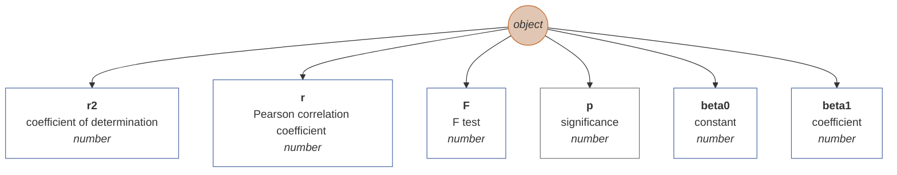

## [Pearson correlation coefficient](#correlPearson)

Returns the statistical log of the Pearson correlation coefficient.
The Pearson correlation is a statistical method used to measure the relationship between two quantities. Its goal is to find out if there is a linear relationship between these quantities and what its intensity is.
Pearson's correlation is calculated using a formula called Pearson's correlation coefficient. This coefficient ranges from -1 to 1 and indicates how strong the relationship is between the quantities. If the coefficient is close to -1, it means that there is a strong negative relationship between the quantities, which means that when the value of one quantity increases, the value of the other quantity decreases. On the contrary, if the coefficient is close to 1, it means that there is a strong positive relationship between the quantities, which means that when the value of one quantity increases, the value of the other quantity also increases. If the coefficient is close to 0, it means that there is no relationship between the quantities or the relationship is very weak.
Pearson's correlation is mainly used to compare two quantitative quantities, i.e. quantities that can be measured on a scale with exact values (for example, age, height or weight). It can be used to determine whether there is a relationship between these quantities and what its character is. For example, Pearson's correlation can be used to compare age and weight and see if there is a relationship between these quantities and what its nature is. It can also be used to compare the results of two different tests and see if there is a relationship between the results of those tests. Source: https://chat.openai.com/chat

### Arguments

| id |description |value type |validator |required |default value |
| :--- |:--- |:--- |:--- |:--- |:--- |
| <b>y</b> | first variable | numeric vector | <sub>It checks whether the argument is of type numeric vector, or whether it is a valid identifier of a numeric vector in a matrix, or - if the argument is of type array - tries to convert the array to a numeric vector using the 'numerify' function. If neither variant fails, it throws an error.<sub> | ✔️ |  |
| <b>x</b> | second variable | numeric vector | <sub>It checks whether the argument is of type numeric vector, or whether it is a valid identifier of a numeric vector in a matrix, or - if the argument is of type array - tries to convert the array to a numeric vector using the 'numerify' function. If neither variant fails, it throws an error.<sub> | ✔️ |  |

### Pre-calculation data modification

Removes from the input vectors (matrix) all rows in which there is at least one empty value.

### Syntax examples

```js
var M = new Matrix(
new NumericVector(180,197,240,210,180,160,179,185,183,150,110,190,170).name("height"),
new NumericVector(75,82,100,80,75,60,75,71,77,63,46,81,70).name("weight")
);
var rxy_a = M.analyze("correlPearson").run(0,1);
var rxy_b = M.correlPearson("height","weight");
// rxy_a.result = rxy_b
```

### Output schema

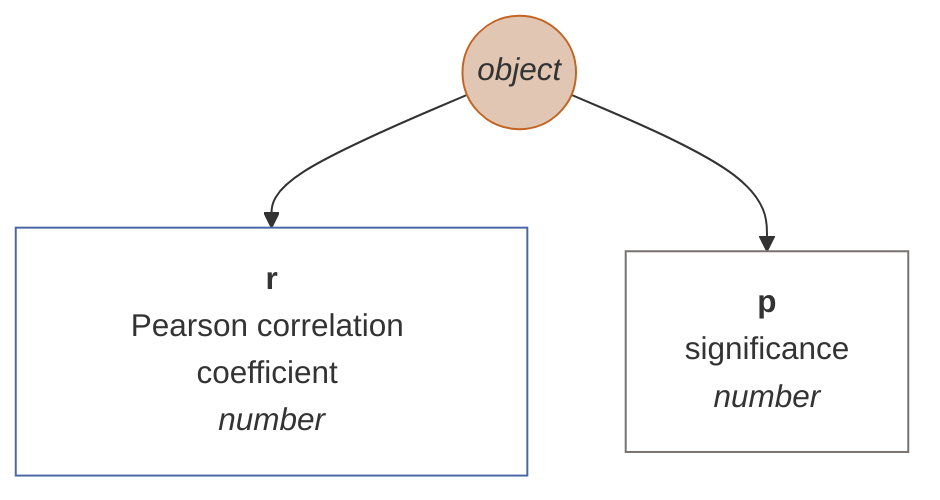

## [Spearman's correlation coefficient](#correlSpearman)

Returns the statistical log of the Spearman rank correlation coefficient. Unlike the Pearson correlation, the Spearman method is based on a comparison of the order of magnitude of the values of the input variables.

### Arguments

| id |description |value type |validator |required |default value |
| :--- |:--- |:--- |:--- |:--- |:--- |
| <b>y</b> | first variable | numeric vector | <sub>It checks whether the argument is of type numeric vector, or whether it is a valid identifier of a numeric vector in a matrix, or - if the argument is of type array - tries to convert the array to a numeric vector using the 'numerify' function. If neither variant fails, it throws an error.<sub> | ✔️ |  |
| <b>x</b> | second variable | numeric vector | <sub>It checks whether the argument is of type numeric vector, or whether it is a valid identifier of a numeric vector in a matrix, or - if the argument is of type array - tries to convert the array to a numeric vector using the 'numerify' function. If neither variant fails, it throws an error.<sub> | ✔️ |  |

### Pre-calculation data modification

Removes from the input vectors (matrix) all rows in which there is at least one empty value.

### Syntax examples

```js
var M = new Matrix(
new NumericVector(3,7,5,10,9,8,4,1,6,2).name("design rating"),
new NumericVector(4,9,2,10,8,7,6,3,5,1).name("utility rating")
);
var rs_a = M.analyze("correlSpearman").run(0,1);
var rs_b = M.correlSpearman("design rating","utility rating");
// rs_a.result = rs_b
```

### Output schema

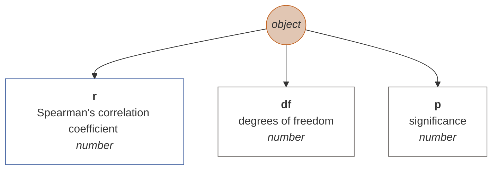

## [Gamma coefficient](#correlGamma)

The Goodman-Kruskal gamma is similar to the ordinal correlation coefficient, i.e. a test that measures the dependence between two ordinal variables. For that reason, it can take on the same values as other correlation coefficients (e.g. Pearson's or Spearman's) and is interpreted in the same way. This test is recommended over other rank-oriented correlation methods when your data has many ties.

### Arguments

| id |description |value type |validator |required |default value |
| :--- |:--- |:--- |:--- |:--- |:--- |
| <b>y</b> | first variable | numeric vector | <sub>It checks whether the argument is of type numeric vector, or whether it is a valid identifier of a numeric vector in a matrix, or - if the argument is of type array - tries to convert the array to a numeric vector using the 'numerify' function. If neither variant fails, it throws an error.<sub> | ✔️ |  |
| <b>x</b> | second variable | numeric vector | <sub>It checks whether the argument is of type numeric vector, or whether it is a valid identifier of a numeric vector in a matrix, or - if the argument is of type array - tries to convert the array to a numeric vector using the 'numerify' function. If neither variant fails, it throws an error.<sub> | ✔️ |  |

### Pre-calculation data modification

Removes from the input vectors (matrix) all rows in which there is at least one empty value.

### Output schema

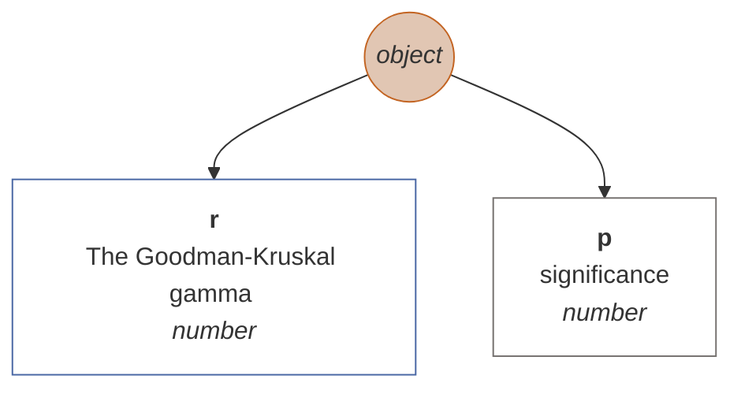

## [Kendall's correlation](#correlKendall)

Returns the statistical log of Kendall's Tau-B correlation coefficient. If you were to calculate the same operation in SPSS, you would probably get a slightly different result. Apparently, this is due to the different sensitivity to decimal places in the two systems. However, it should not have a major influence on the interpretation of the result.

### Arguments

| id |description |value type |validator |required |default value |
| :--- |:--- |:--- |:--- |:--- |:--- |
| <b>y</b> | first variable | numeric vector | <sub>It checks whether the argument is of type numeric vector, or whether it is a valid identifier of a numeric vector in a matrix, or - if the argument is of type array - tries to convert the array to a numeric vector using the 'numerify' function. If neither variant fails, it throws an error.<sub> | ✔️ |  |
| <b>x</b> | second variable | numeric vector | <sub>It checks whether the argument is of type numeric vector, or whether it is a valid identifier of a numeric vector in a matrix, or - if the argument is of type array - tries to convert the array to a numeric vector using the 'numerify' function. If neither variant fails, it throws an error.<sub> | ✔️ |  |

### Pre-calculation data modification

Removes from the input vectors (matrix) all rows in which there is at least one empty value.

### Syntax examples

```js
var M = new Matrix(
new NumericVector(3,7,5,10,9,8,4,1,6,2).name("design rating"),
new NumericVector(4,9,2,10,8,7,6,3,5,1).name("utility rating")
);
var rk_a = M.analyze("correlKendall").run(0,1);
var rk_b = M.correlKendall("design rating","utility rating");
// rk_a.result = rk_b
```

### Output schema

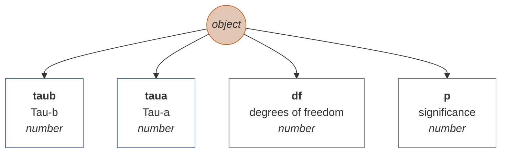

## [Partial correlation](#correlPartial)

Partial correlation is a statistical method that allows you to find out what the relationship is between two variables while taking into account the influence of a third variable. This is useful if you want to see if there is a direct relationship between two variables without being affected by the influence of other variables. For example, if you want to find out if there is a relationship between level of training and success at work, it may be useful to consider the effect of age or gender as well. In that case, you could use partial correlation to find the relationship between level of training and success at work while controlling for the effects of age and gender. The partial correlation is calculated using a formula that is derived from the Pearson correlation coefficient. It is important to note that partial correlation does not imply causation, i.e. that one variable does not cause the other, but only shows that there is some association between them. Source: https://chat.openai.com/chat.

### Arguments

| id |description |value type |validator |required |default value |
| :--- |:--- |:--- |:--- |:--- |:--- |
| <b>y</b> | first variable | numeric vector | <sub>It checks whether the argument is of type numeric vector, or whether it is a valid identifier of a numeric vector in a matrix, or - if the argument is of type array - tries to convert the array to a numeric vector using the 'numerify' function. If neither variant fails, it throws an error.<sub> | ✔️ |  |
| <b>x</b> | second variable | numeric vector | <sub>It checks whether the argument is of type numeric vector, or whether it is a valid identifier of a numeric vector in a matrix, or - if the argument is of type array - tries to convert the array to a numeric vector using the 'numerify' function. If neither variant fails, it throws an error.<sub> | ✔️ |  |
| <b>y</b> | third (control) variable | numeric vector | <sub>It checks whether the argument is of type numeric vector, or whether it is a valid identifier of a numeric vector in a matrix, or - if the argument is of type array - tries to convert the array to a numeric vector using the 'numerify' function. If neither variant fails, it throws an error.<sub> | ✔️ |  |

### Pre-calculation data modification

Removes from the input vectors (matrix) all rows in which there is at least one empty value.

### Syntax examples

```js
var M = new Matrix(
new NumericVector(180,197,240,210,180,160,179,185,183,150,110,190,170).name("x"),
new NumericVector(75,82,100,80,75,60,75,71,77,63,46,81,70).name("y"),
new NumericVector(79,81,103,84,72,55,78,76,82,65,49,83,74).name("z")
);
var rp_a = M.analyze("correlPartial").run(0,1,2);
var rp_b = M.correlPartial("x","y","z");
// rp_a.result = rp_b
```

### Output schema


## [Biserial correlation](#correlBiserial)

Biserial correlation is a statistical method that is used to evaluate the relationship between two binary variables (ie variables that can have only two possible values, such as 'yes' or 'no'). Binary variables are often used in the social sciences, for example when examining the relationship between education and employment or between smoking and health. Biserial correlation is calculated using a formula that is derived from the Pearson correlation coefficient. It is important to note that biserial correlation does not imply causation, i.e. that one variable does not cause the other, but only shows that there is some association between them.

### Arguments

| id |description |value type |validator |required |default value |
| :--- |:--- |:--- |:--- |:--- |:--- |
| <b>x</b> | first variable | binary (boolean) vector | <sub>Checks if the argument is either a binary (boolean) vector, its identifier, or an array convertible to a binary vector. Otherwise, it throws an error,<sub> | ✔️ |  |
| <b>z</b> | second variable | numeric vector | <sub>It checks whether the argument is of type numeric vector, or whether it is a valid identifier of a numeric vector in a matrix, or - if the argument is of type array - tries to convert the array to a numeric vector using the 'numerify' function. If neither variant fails, it throws an error.<sub> | ✔️ |  |

### Pre-calculation data modification

Removes from the input vectors (matrix) all rows in which there is at least one empty value.

### Output schema


## [ANOVA (one-way)](#anovaow)

Returns the One-way ANOVA statistical log. The method has two arguments. The first consists of a series of numerical vectors, where at least one vector is mandatory. The second argument is optional and represents the grouping factor, i.e. a text variable that determines whether the numerical factor belongs to the group in the rows. If the second parameter is specified, only the first of the first group of vectors is taken into account.

### Arguments

| id |description |value type |validator |required |default value |
| :--- |:--- |:--- |:--- |:--- |:--- |
| <b>vectors</b> | input vector/s | numeric vector or a matrix (array) of numeric vectors | <sub>Checks whether the argument is either a numeric vector, its identifier, or a series convertible to a numeric vector, or whether it is a series of numeric vectors (or values that are either vectors, identifiers, or values convertible to numeric vectors - in any combination). If even one of the variants fails, it throws an error.<sub> | ✔️ |  |
| <b>columns</b> | grouping variable | any vector | <sub>Verifies if the argument is of type vector, or if it is a valid identifier of a vector in a matrix, or - if the argument is of type array - it tries to convert the array to a vector using the 'vectorify' function. If neither variant fails, it throws an error.<sub> | ✔️ |  |

### Pre-calculation data modification

If the arguments specify a factor variable (the second argument), the first argument (either a numeric vector or the first vector in the matrix, if the first argument is a matrix) is decomposed according to the factor values into a new matrix. If the arguments are without a factor (ie the second argument is empty), it takes all the numeric vectors from the first argument 'vectors' (matrix) and then removes the rows with empty values. If the 'factor' argument is not specified and the 'vectors' argument contains only a single vector or is itself a numeric vector, an error will be thrown (without the factor, at least two numeric vectors are required in the first argument).

### Syntax examples

```js
var M = new Matrix(
new NumericVector(180,197,240,210,180,160,179,185,183,150,110,190,170).name("x"),
new NumericVector(75,82,100,80,75,60,75,71,77,63,46,81,70).name("y"),
new NumericVector(275,282,300,280,275,260,275,271,277,263,246,281,270).name("z")
);
var anova = M.analyze("anovaow").run({vectors: [0,1,2]});
```

### Output schema

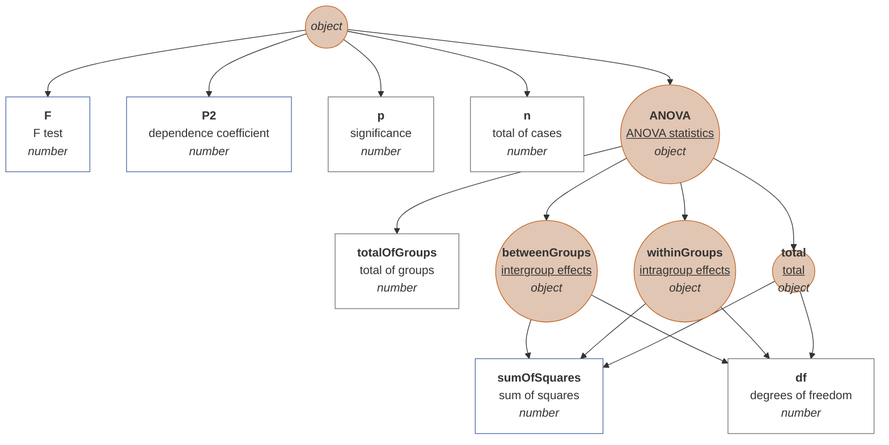

## [T-test (independent)](#ttestind)

Returns the statistical log of the Student's t-test for two independent samples that are defined by an eigenvariable (that is, two numeric vectors). Arguments are either two numeric vectors, or one numeric and only a factor vector (usually text, but can also be numeric or binary). If a vector that has more than two unique values is used as a factor, only the first two unique values found are considered for the test (the others are ignored) - in this case, the information about the size of the pure sample is irrelevant, however, the level of significance to which the sample size enters, it is already based on pure cases.

### Arguments

| id |description |value type |validator |required |default value |
| :--- |:--- |:--- |:--- |:--- |:--- |
| <b>vectors</b> | input vector/s | numeric vector or a matrix (array) of numeric vectors | <sub>Checks whether the argument is either a numeric vector, its identifier, or a series convertible to a numeric vector, or whether it is a series of numeric vectors (or values that are either vectors, identifiers, or values convertible to numeric vectors - in any combination). If even one of the variants fails, it throws an error.<sub> | ✔️ |  |
| <b>factor</b> | grouping variable | any vector | <sub>Verifies if the argument is of type vector, or if it is a valid identifier of a vector in a matrix, or - if the argument is of type array - it tries to convert the array to a vector using the 'vectorify' function. If neither variant fails, it throws an error.<sub> | ✔️ |  |
### Syntax examples

#### Arguments as object properties

<sub>The method has two parameters: vectors (first and mandatory) and factor (second, optional). In the given example, a single object is specified as an argument, which specifies the values of the individual parameters of the function. In this method, it is possible to specify the vectors parameter even as a single vector.</sub>

```js
var M = new Matrix(
new NumericVector(4,5,6,7,8,9,10,7,7,6).name("x"),
new NumericVector(10,11,9,8,7,8,9,4,5,10).name("y")
);
var ttestind_a = M.analyze("ttestind").run({vectors: [0,1]});
var ttestind_b = M.ttestind({vectors: [0,1]});
// ttestind_a.result === mqu_b
```

#### Arguments as an array

<sub>Arguments are ordered in the standard way. It is essential to follow the order of the arguments here, and in addition, the first argument should ideally be in array format, e.g. [vector1, vector2].</sub>

```js
var M = new Matrix(
new NumericVector(4,5,6,7,8,9,10,7,7,6).name("x"),
new NumericVector(10,11,9,8,7,8,9,4,5,10).name("y")
);
var ttestind_a = M.analyze("ttestind").run([0,1]);
var ttestind_b = M.ttestind(["x","y"]);
// ttestind_a.result === mqu_b
```

#### Factor' parameter implementation

<sub>As the second parameter, a factor is specified, i.e. a variable according to which the vector argument is transformed (or the first vector, if several numerical vectors are entered).</sub>

```js
var M = new Matrix(
new NumericVector(4,5,6,7,8,9,10,7,7,6,10,11,9,8,7,8,9,4,5,10).name("score"),
new StringVector("A","A","A","A","A","A","A","A","A","A","B","B","B","B","B","B","B","B","B","B",).name("group")
);
var ttestind_a = M.analyze("ttestind").run({vectors: 0, factor: 1});
var ttestind_b = M.ttestind({vectors: 0, factor: 1});
var ttestind_c = M.analyze("ttestind").run(0, 1);
var ttestind_d = M.ttestind(0, 1);
var ttestind_e = M.analyze("ttestind").run([0], 1);
```

### Output schema

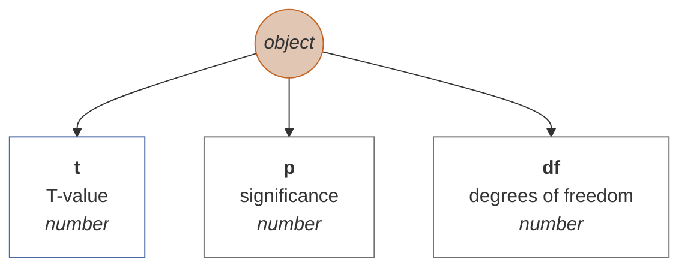

## [T-test (paired)](#ttestpair)

Returns the statistical log of a paired t-test for two dependent samples. Empty values are cut out in the row cross-section, i.e. that if at least one value is missing in one row, the entire row is cut from the analysis.

### Arguments

| id |description |value type |validator |required |default value |
| :--- |:--- |:--- |:--- |:--- |:--- |
| <b>y</b> | first variable | numeric vector | <sub>It checks whether the argument is of type numeric vector, or whether it is a valid identifier of a numeric vector in a matrix, or - if the argument is of type array - tries to convert the array to a numeric vector using the 'numerify' function. If neither variant fails, it throws an error.<sub> | ✔️ |  |
| <b>x</b> | second variable | numeric vector | <sub>It checks whether the argument is of type numeric vector, or whether it is a valid identifier of a numeric vector in a matrix, or - if the argument is of type array - tries to convert the array to a numeric vector using the 'numerify' function. If neither variant fails, it throws an error.<sub> | ✔️ |  |

### Pre-calculation data modification

Removes from the input vectors (matrix) all rows in which there is at least one empty value.

### Syntax examples

```js
var M = new Matrix(
new NumericVector(4,5,6,7,8,9,10,7,7,6).name("pre-score"),
new NumericVector(10,11,12,13,14,8,9,10,11,10).name("post-score")
);
var ttest_a = M.analyze("ttestpair").run(0,1);
var ttest_b = M.ttestpair("pre-score","post-score");
// ttest_a.result = ttest_b
```

### Output schema


## [Mann-Whitney test](#mwu)

Returns the statistical log of the Mann-Whitney U test. It is a non-parametric null hypothesis test that compares randomly selected values of X and Y from two populations, with the probability that X is greater than Y equal to the probability that Y is greater than X.

### Arguments

| id |description |value type |validator |required |default value |
| :--- |:--- |:--- |:--- |:--- |:--- |
| <b>vectors</b> | input vector/s | numeric vector or a matrix (array) of numeric vectors | <sub>Checks whether the argument is either a numeric vector, its identifier, or a series convertible to a numeric vector, or whether it is a series of numeric vectors (or values that are either vectors, identifiers, or values convertible to numeric vectors - in any combination). If even one of the variants fails, it throws an error.<sub> | ✔️ |  |
| <b>factor</b> | grouping variable | any vector | <sub>Verifies if the argument is of type vector, or if it is a valid identifier of a vector in a matrix, or - if the argument is of type array - it tries to convert the array to a vector using the 'vectorify' function. If neither variant fails, it throws an error.<sub> | ✔️ |  |

### Pre-calculation data modification

If the arguments specify a factor variable (the second argument), the first argument (either a numeric vector or the first vector in the matrix, if it is the first argument of the matrix) is decomposed according to the values of the factor into a new matrix. If the arguments are without a factor (i.e. the second argument is empty), it takes the first two vectors from the first argument 'vectors' (matrix) and then deletes the rows with empty values. In case the argument 'factor' and the argument 'vectors' are not specified contains only a single vector or is itself a numeric vector, throws an error (at least two numeric vectors are required in the first argument without a factor).

### Syntax examples

#### Arguments as object properties

<sub>The method has two parameters: vectors (first and mandatory) and factor (second, optional). In the given example, a single object is specified as an argument, which specifies the values of the individual parameters of the function. In this method, it is possible to specify the vectors parameter even as a single vector.</sub>

```js
var M = new Matrix(
new NumericVector(4,5,6,7,8,9,10,7,7,6).name("x"),
new NumericVector(10,11,9,8,7,8,9,4,5,10).name("y")
);
var mwu_a = M.analyze("mwu").run({vectors: [0,1]});
var mwu_b = M.mwu({vectors: [0,1]});
// mwu_a.result === mqu_b
```

#### Arguments as an array

<sub>Arguments are ordered in the standard way. It is essential to follow the order of the arguments here, and in addition, the first argument should ideally be in array format, e.g. [vector1, vector2].</sub>

```js
var M = new Matrix(
new NumericVector(4,5,6,7,8,9,10,7,7,6).name("x"),
new NumericVector(10,11,9,8,7,8,9,4,5,10).name("y")
);
var mwu_a = M.analyze("mwu").run([0,1]);
var mwu_b = M.mwu(["x","y"]);
// mwu_a.result === mqu_b
```

#### Factor' parameter implementation

<sub>As the second parameter, a factor is specified, i.e. a variable according to which the vector argument is transformed (or the first vector, if several numerical vectors are entered).</sub>

```js
var M = new Matrix(
new NumericVector(4,5,6,7,8,9,10,7,7,6,10,11,9,8,7,8,9,4,5,10).name("score"),
new StringVector("A","A","A","A","A","A","A","A","A","A","B","B","B","B","B","B","B","B","B","B",).name("group")
);
var mwu_a = M.analyze("mwu").run({vectors: 0, factor: 1});
var mwu_b = M.mwu({vectors: 0, factor: 1});
var mwu_c = M.analyze("mwu").run(0, 1);
var mwu_d = M.mwu(0, 1);
var mwu_e = M.analyze("mwu").run([0], 1);
```

### Output schema

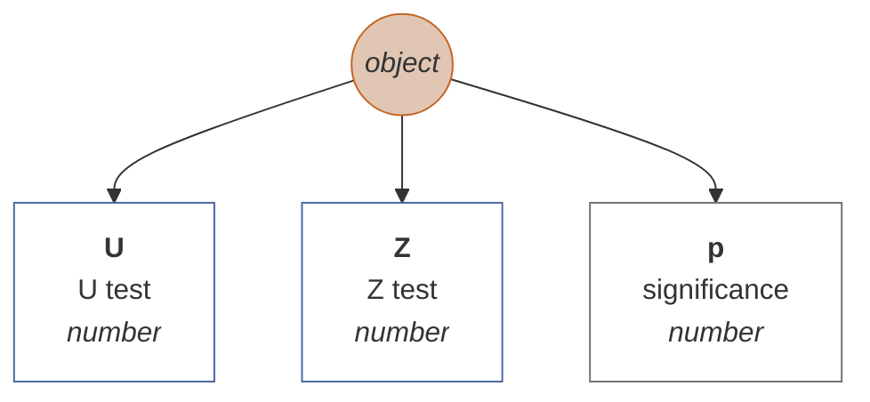

## [Wilcoxon Signed-Ranks Test for Paired Samples](#wcxpaired)

The Wilcoxon signed-ranks test is a non-parametric statistical test used to determine whether two related or paired samples have the same median or not. It is used when the data is not normally distributed or the assumption of equal variances is violated. This test is suitable for small sample sizes.

### Arguments

| id |description |value type |validator |required |default value |
| :--- |:--- |:--- |:--- |:--- |:--- |
| <b>y</b> | first variable | numeric vector | <sub>It checks whether the argument is of type numeric vector, or whether it is a valid identifier of a numeric vector in a matrix, or - if the argument is of type array - tries to convert the array to a numeric vector using the 'numerify' function. If neither variant fails, it throws an error.<sub> | ✔️ |  |
| <b>x</b> | second variable | numeric vector | <sub>It checks whether the argument is of type numeric vector, or whether it is a valid identifier of a numeric vector in a matrix, or - if the argument is of type array - tries to convert the array to a numeric vector using the 'numerify' function. If neither variant fails, it throws an error.<sub> | ✔️ |  |

### Pre-calculation data modification

Removes from the input vectors (matrix) all rows in which there is at least one empty value.

### Syntax examples

```js
var M = new Matrix(
new NumericVector(15,8,11,19,13,4,16,5,9,15,12,11,14,4,11,17,14,5,9,8,9,11,11,12,17,12,5,5,15,0).name("wife"),
new NumericVector(17,19,18,19,17,5,13,0,16,21,12,9,10,17,12,24,12,12,8,16,12,7,17,13,20,9,13,11,11,12).name("husband")
);
var wcx_a = M.analyze("wcxpaired").run("wife", "husband");
var wcx_b = M.wcxpaired(0,1);
// wcx_a.result = wcx_b
```

### Output schema

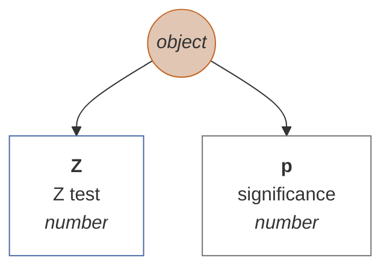

## [Friedman's ANOVA](#friedman)

The Friedman test is a non-parametric statistical test developed by Milton Friedman. Similar to the parametric repeated measures ANOVA, it is used to detect differences in treatments across multiple test attempts. The procedure involves ranking each row (or block) together, then considering the values of ranks by columns. Applicable to complete block designs, it is thus a special case of the Durbin test.

### Arguments

| id |description |value type |validator |required |default value |
| :--- |:--- |:--- |:--- |:--- |:--- |
| <b>vectors</b> | input vector/s | numeric vector or a matrix (array) of numeric vectors | <sub>Checks whether the argument is either a numeric vector, its identifier, or a series convertible to a numeric vector, or whether it is a series of numeric vectors (or values that are either vectors, identifiers, or values convertible to numeric vectors - in any combination). If even one of the variants fails, it throws an error.<sub> | ✔️ |  |

### Pre-calculation data modification

Removes from the input vectors (matrix) all rows in which there is at least one empty value.

### Syntax examples

```js
var M = new Matrix(
new NumericVector(10,8,7,9,7,4,5,6,5,10,4,7).name("white"),
new NumericVector(7,5,8,6,5,7,9,6,4,6,7,3).name("red"),
new NumericVector(8,5,6,4,7,5,3,7,6,4,4,3).name("rose")
);
var friedman_a = M.analyze("friedman").run([0,1,2]);
var friedman_b = M.friedman(["white","red","rose"]);
// friedman_a.result = friedman_b
```

### Output schema

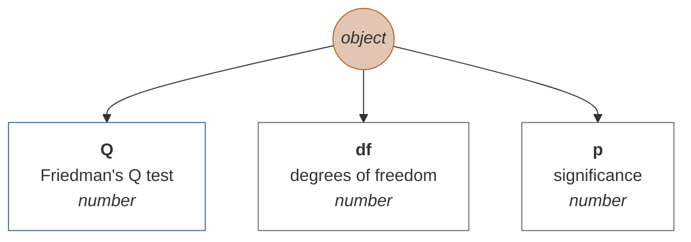

## [Contingency](#contingency)

Returns the contingency statistics log. The parameters of the method are a) row variable, b) column variable, and optionally c) frequency of group a/b (if empty, intersection frequency is taken to be 1). The output of the method is both contingency statistics (chi^2), Cramer's V, Pearson's C, etc.

### Arguments

| id |description |value type |validator |required |default value |
| :--- |:--- |:--- |:--- |:--- |:--- |
| <b>factor</b> | row variable | any vector | <sub>Verifies if the argument is of type vector, or if it is a valid identifier of a vector in a matrix, or - if the argument is of type array - it tries to convert the array to a vector using the 'vectorify' function. If neither variant fails, it throws an error.<sub> | ✔️ |  |
| <b>rows</b> | column variable | any vector | <sub>Verifies if the argument is of type vector, or if it is a valid identifier of a vector in a matrix, or - if the argument is of type array - it tries to convert the array to a vector using the 'vectorify' function. If neither variant fails, it throws an error.<sub> | ✔️ |  |
| <b>y</b> | frequency variable | numeric vector | <sub>It checks whether the argument is of type numeric vector, or whether it is a valid identifier of a numeric vector in a matrix, or - if the argument is of type array - tries to convert the array to a numeric vector using the 'numerify' function. If neither variant fails, it throws an error.<sub> |  |  |

### Pre-calculation data modification

Removes from the input vectors (matrix) all rows in which there is at least one empty value.

### Syntax examples

#### Without specifying frequencies

<sub>The method replaces the missing argument with an automatically generated n (frequency) vector, each value of which is equal to 1. Briefly, the input table takes the form of raw, unaggregated data.</sub>

```js
var M = new Matrix(
new StringVector("A","A","A","A","A","A","B","B","B","B","B","B").name("R"),
new StringVector("A","A","A","B","B","B","C","C","C","C","C","C").name("C")
);
var c_a = M.contingency(0,1);
var c_b = M.analyze("contingency").run(0,1);
var c_c = M.analyze("contingency").run({rows: 0, columns: 1});
// c_a = c_b.result = c_c.result
```

#### With specifying frequencies

<sub>The last argument consists of aggregated frequencies, i.e. that the input table is already aggregated.</sub>

```js
var M = new Matrix(
new StringVector("elementary","elementary","elementary","elementary","high school","high school","high school","high school","college","college","college","college").name("grade"),
new StringVector("A","B","C","D","A","B","C","D","A","B","C","D").name("group"),
new NumericVector(39,25,25,27,17,30,40,29,12,41,62,53).name("frequencies")
);
var c_a = M.contingency(0,1,2);
var c_b = M.analyze("contingency").run(0,1,2);
var c_c = M.analyze("contingency").run("grade","group","frequencies");
var c_d = M.analyze("contingency").run({rows: 0, columns: 1, n: 2});
// c_a = c_b.result = c_c.result = c_d.result
```

### Output schema

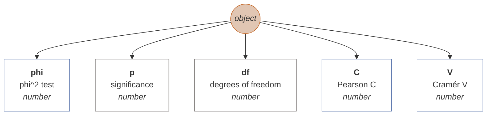