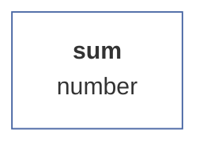

# Vector statistical methods documentation

Vector functions are statistical methods that are performed on vector instances. A simple example is the 'sum' function, which sums all the non-empty values in (a numeric vector). There are a total of around 30 vector methods available, while some are simple (such as 'sum'), others are either computationally more complex (normality tests), have a complex output (e.g. a histogram) or require parameters to be specified for their calculation (arguments ). Methods can be invoked in two ways, either by calling the method directly from the vector instance - eg vector.sum() - or by calling via the general **analysis** method, eg *vector.analyze('sum').run()*. Multiple approaches can also be chosen in entering arguments. These can either be entered according to the order specified in the documentation as members of the arguments - e.g. parties.pci('ODS', 0.95) - or using a single object that precisely defines the argument values using its properties - e.g. parties.pci({value: ' ODS', alpha: 0.95}). Calling methods via the general function **analysis** is effective in several ways, among other things, because it allows the sequential execution of the analysis (e.g. before the calculation, validate the arguments using the *with* method) and also because of writing metadata to the instance of the VectorAnalysis class, specifically the input and output sample size (object *sample* and properties *raw* and *net*) and time parameters (object *time* and properties *from* and *to*, from which the method *duration* accessible from the instance of the analysis class calculates the total result processing time.

| function | method |
| :--- | :--- |
| sum | [Sum](#sum) |

## [Sum](#sum)

Returns the sum of all non-empty numeric values of a vector.


### Pre-calculation data modification

Removes all empty values (blank cells) from th vector.

### Syntax examples

```js
var cashflow = new NumericVector(200,250,150,320,240,-250,10,-320).sum();  /* = 600 */
```

### Output schema

