# Vector statistical methods documentation

Vector functions are statistical methods that are performed on vector instances. A simple example is the 'sum' function, which sums all the non-empty values in (a numeric vector). There are a total of around 30 vector methods available, while some are simple (such as 'sum'), others are either computationally more complex (normality tests), have a complex output (e.g. a histogram) or require parameters to be specified for their calculation (arguments ). Methods can be invoked in two ways, either by calling the method directly from the vector instance - eg vector.sum() - or by calling via the general **analysis** method, eg *vector.analyze('sum').run()*. Multiple approaches can also be chosen in entering arguments. These can either be entered according to the order specified in the documentation as members of the arguments - e.g. parties.pci('ODS', 0.95) - or using a single object that precisely defines the argument values using its properties - e.g. parties.pci({value: ' ODS', alpha: 0.95}). Calling methods via the general function **analysis** is effective in several ways, among other things, because it allows the sequential execution of the analysis (e.g. before the calculation, validate the arguments using the *with* method) and also because of writing metadata to the instance of the VectorAnalysis class, specifically the input and output sample size (object *sample* and properties *raw* and *net*) and time parameters (object *time* and properties *from* and *to*, from which the method *duration* accessible from the instance of the analysis class calculates the total result processing time.

| function | method |
| :--- | :--- |
| sum | [Sum](#sum) |
| count | [Count](#count) |
| mode | [Mode](#mode) |
| avg | [Arithmetic mean](#avg) |
| min | [Minimum](#min) |
| max | [Maximum](#max) |
| range | [Range](#range) |
| geomean | [Geometric mean](#geomean) |
| harmean | [Harmonic mean](#harmean) |
| median | [Median](#median) |
| percentile | [Percentile](#percentile) |
| stdev | [Standard deviation](#stdev) |
| variance | [Variance](#variance) |
| varc | [Coefficient of variation](#varc) |
| histogram | [Histogram](#histogram) |
| frequency | [Frequency table](#frequency) |
| sem | [Standard error of the mean](#sem) |
| skewness | [Skewness](#skewness) |
| kurtosis | [Kurtosis](#kurtosis) |
| mci | [Confidence interval of the mean](#mci) |
| pci | [Confidence interval of the proportion](#pci) |
| ttest | [One-sample t-test](#ttest) |
| swtest | [Shapiro-Wilk W test](#swtest) |
| kstest | [Kolmogorov-Smirnov test](#kstest) |

## [Sum](#sum)

Returns the sum of all non-empty numeric values of a vector.


### Pre-calculation data modification

Removes all empty values (blank cells) from th vector.

### Syntax examples

```js
var cashflow = new NumericVector(200,250,150,320,240,-250,10,-320).sum();  /* = 600 */
```

### Output schema


## [Count](#count)

Returns the count of all members of a vector, including empty values.

### Syntax examples

```js
var total_numeric = new NumericVector(200,250,null,150,320,240,-250,null,10,-320).count();  /* = 10 */
var total_string = new StringVector("A","B","C","D").count();  /* = 4 */
var total_boolean = new BooleanVector(true, true, false, null, false, true).count();  /* = 6 */
```

### Output schema

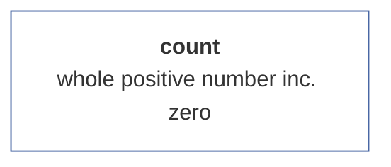

## [Mode](#mode)

Returns the most frequent value in the vector (if the most frequent value is empty, returns the empty value). If there are more of the most frequent values (e.g. the frequency of X and Y values is the same), it returns the first value found in the vector.

### Syntax examples

```js
var x = new NumericVector(1,2,3,4,3,4,5,3).mode(); /* = 3 */
var y = new StringVector("a",null,null,"b","c","d",null,"b").mode(); /* = null */
var z = new BooleanVector(true, false, true).mode(); /* = true */
```

### Output schema

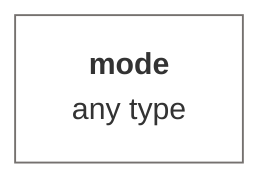

## [Arithmetic mean](#avg)

Returns the arithmetic mean (i.e. the quotient of the sum and the number of vector values) of all non-empty values (i.e. including zeros).


### Pre-calculation data modification

Removes all empty values (blank cells) from th vector.

### Syntax examples

```js
var avgCashFlow = new NumericVector(200,250,150,320,240,-250,10,-320).avg();  /* = 75 */
```

### Output schema

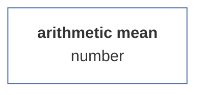

## [Minimum](#min)

Returns the least non-empty value. For text, returns the first value from the alphabetical order.


### Pre-calculation data modification

Removes all empty values (blank cells) from th vector.

### Syntax examples

```js
var numeric_min = new NumericVector(4.5, 3.9, 5, 6, 7, 5.7, 9.1, 5.3, 7.2, 6.9, 6, 7.5, 5.3, 7.1, 8.2, 1).min(); /* = 1 */;
var string_min = new StringVector("Norwood", "Pearson", "Fisher", "Nightingale", "Gauss", "Poisson").min(); /* = Fisher */
```

### Output schema

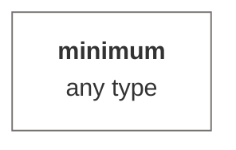

## [Maximum](#max)

Returns the highest non-empty value. In the case of text, it returns the last value from the alphabetical order.


### Pre-calculation data modification

Removes all empty values (blank cells) from th vector.

### Syntax examples

```js
var numeric_max = new NumericVector(4.5, 3.9, 5, 6, 7, 5.7, 9.1, 5.3, 7.2, 6.9, 6, 7.5, 5.3, 7.1, 8.2, 1).max(); /* = 9.1 */;
var string_max = new StringVector("Norwood", "Pearson", "Fisher", "Nightingale", "Gauss", "Poisson").max(); /* = Poisson */
```

### Output schema

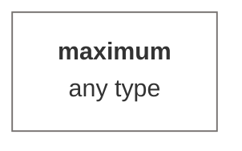

## [Range](#range)

Returns the difference between the largest and smallest non-empty values.


### Pre-calculation data modification

Removes all empty values (blank cells) from th vector.

### Syntax examples

```js
var range = new NumericVector(5,2,-15,-16.3,12,null, null, 12,13,7).range(); /* = 22 */
```

### Output schema

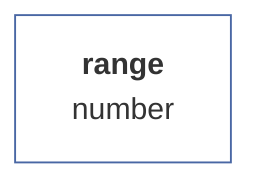

## [Geometric mean](#geomean)

The geometric mean is a statistical indicator that is used to calculate the average value of some number or quantity. Unlike the arithmetic mean, which is calculated as the sum of all values in a set divided by the number of those values, the geometric mean is calculated as the nth root of the product of n numbers in the set. The geometric mean is often used to calculate growth or cumulative return in investments because it accounts for changes in the percentage growth of values over time. It is also used in geometry to calculate the average side length of an n-gon and in biology to calculate the average size of cells or organisms in a population.


### Pre-calculation data modification

Removes all empty values (blank cells) from th vector.

### Syntax examples

```js
var x = new framework.NumericVector(20,19,21,22,21,18,23,22,27,16,17,19,19,21,29,24,23,25,24,21,22,19).geomean(); /* = 21.24*/
```

### Output schema

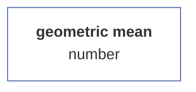

## [Harmonic mean](#harmean)

The harmonic mean is a statistical indicator that is used to calculate the average value of some number or quantity. Unlike the arithmetic mean and the geometric mean, which are based on the addition or multiplication of values, the harmonic mean is calculated as the quotient of the number of numbers in the set and the sum of their reciprocals. The harmonic mean is used in situations where it is important to account for how speed or power changes over time or in different situations. For example, it is used to calculate average speed, average power or average resistance in electronic circuits. It is also used in finance to calculate the average return on investments over different time periods.


### Pre-calculation data modification

Removes all empty values (blank cells) from th vector.

### Syntax examples

```js
var x = new NumericVector(20,19,21,22,21,18,23,22,27,16,17,19,19,21,29,24,23,25,24,21,22,19).harmean(); /* = 21.03*/
```

### Output schema

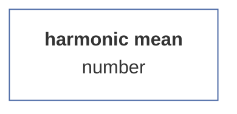

## [Median](#median)

Returns the median, or middle value, of the non-empty values of a vector. This is the 50% percentile.


### Pre-calculation data modification

Removes all empty values (blank cells) from th vector.

### Syntax examples

```js
var median = new NumericVector(20,19,21,22,21,18,23,22,27,16,17,19,19,21,29,24,23,25,24,21,22,19).median(); /* = 21*/
```

### Output schema

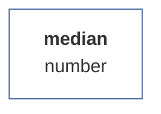

## [Percentile](#percentile)

Using the percentile, we can examine the distribution of a numerical series, by first sorting the series from the smallest to the largest member (number), and then selecting the first N % of members (this N is a parameter), where the last member in the selection represents the given percentile, a specific number . If the number of members in the sample is even, the percentile is calculated as the average of two adjacent values, if it is even, the percentile is just the last value.

### Arguments

| id |description |value type |validator |required |default value |
| :--- |:--- |:--- |:--- |:--- |:--- |
| <b>k</b> | percentile value | decimal number between 1 and 0 (including) | <sub>Checks if it is a positive integer greater than zero. Otherwise, it will throw an error.<sub> | ✔️ | 0.95 |

### Pre-calculation data modification

Removes all empty values (blank cells) from th vector.

### Syntax examples

```js
var score = new NumericVector(10,20,15,25,23,19,18,17,24,23);
var median = score.percentile(0.5); /* = 19.5 */
var q25 = score.percentile(0.25); /* = 17.25 */
var max = score.percentile(1); /* = 25 */
```

### Output schema

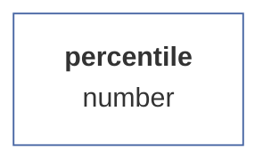

## [Standard deviation](#stdev)

Returns the standard deviation of non-empty values. The standard deviation is a statistical indicator that indicates how much the values in a given data set differ from each other. The standard deviation is expressed as a number that indicates how much the average value deviates from the true value in a given data set. The standard deviation is useful when comparing the amount of dispersion of data in different sets or in different groups within a single data set. The larger the standard deviation, the more the values in a given data set differ from each other.

### Arguments

| id |description |value type |validator |required |default value |
| :--- |:--- |:--- |:--- |:--- |:--- |
| <b>isSample</b> | is sample | boolean value | <sub>Checks if the value is binary in nature. Otherwise, it automatically converts the value to the boolean type and therefore never returns an error.<sub> |  | false |

### Pre-calculation data modification

Removes all empty values (blank cells) from th vector.

### Syntax examples

```js
var population = new NumericVector(10,20,15,25,23,19,18,17,24,23).stdev();  /* = 4.41 */
var sample = new NumericVector(10,20,15,25,23,19,18,17,24,23).stdev(true); /* = 4.65 */
```

### Output schema

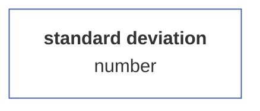

## [Variance](#variance)

Returns the variance value of this vector. The variance value is equal to the square of the standard deviation.

### Arguments

| id |description |value type |validator |required |default value |
| :--- |:--- |:--- |:--- |:--- |:--- |
| <b>isSample</b> | is sample | boolean value | <sub>Checks if the value is binary in nature. Otherwise, it automatically converts the value to the boolean type and therefore never returns an error.<sub> |  | false |

### Pre-calculation data modification

Removes all empty values (blank cells) from th vector.

### Syntax examples

```js
var population = new NumericVector(10,20,15,25,23,19,18,17,24,23).variance();  /* = 19.44 */
var sample = new NumericVector(10,20,15,25,23,19,18,17,24,23).variance(true); /* = 21.6 */
```

### Output schema

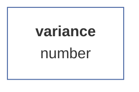

## [Coefficient of variation](#varc)

The coefficient of variation (also called relative variance) is a statistical indicator that measures the degree of variability or dispersion of data relative to its mean value. It is a dimensionless measure of variability that allows the variance of different data sets to be compared regardless of the units in which the data are expressed. The coefficient of variation is calculated as the ratio of the standard deviation (sigma) to the mean (x) in the data set, multiplied by 100 to express it as a percentage. where the coefficient of variation is low, it means that the data are relatively homogeneous or not widely dispersed relative to the mean. If, on the other hand, it is high, it means that the data is very diverse or significantly different from the average. The coefficient of variation is mainly used to compare the variability between different data sets. For example, it is often used in biology, medicine, economics, psychology, and sociology to measure the variability of different populations or groups.

### Arguments

| id |description |value type |validator |required |default value |
| :--- |:--- |:--- |:--- |:--- |:--- |
| <b>isSample</b> | is sample | boolean value | <sub>Checks if the value is binary in nature. Otherwise, it automatically converts the value to the boolean type and therefore never returns an error.<sub> |  | false |
### Syntax examples

```js
var population = new NumericVector(10,20,15,25,23,19,18,17,24,23).varc();  /* = 0.227 */
var sample = new NumericVector(10,20,15,25,23,19,18,17,24,23).varc(true); /* = 0.24 */
```

### Output schema

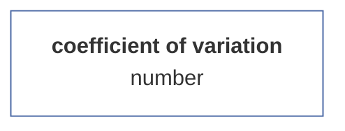

## [Histogram](#histogram)

Returns the histogram matrix of the given vector. The method can be chosen with or without parameter specification. If the parameter 'maximum number of intervals' (maxIntervals) is not specified, its value is automatically calculated as the variation range/root of the number of elements. If the parameter 'fixed interval size' (fixedInterval) is specified, this value is taken as decisive for the number of intervals. The two values are not compatible (although they do not return an error), when specifying both, the maxIntervals parameter is taken as a priority.

### Arguments

| id |description |value type |validator |required |default value |
| :--- |:--- |:--- |:--- |:--- |:--- |
| <b>max</b> | maximum intervals | number | <sub>Checks if it is a positive integer greater than zero. Otherwise, it will throw an error.<sub> |  |  |
| <b>fix</b> | fixed interval | positive decimal | <sub>Checks if it is a positive integer greater than zero. Otherwise, it will throw an error.<sub> |  |  |

### Pre-calculation data modification

Removes all empty values (blank cells) from th vector.

### Syntax examples

#### No interval configuration

<sub>The method is called without parameters, i.e. that the size of the interval is automatically calculated as (maximum-minimum)/root(number of elements).</sub>

```js
var score = new NumericVector(4.5,3.9,5,6,7,5.7,9.1,5.3,null, 7.2,6.9,6,7.5,5.3,7.1,8.2,1, null);
var h1 = score.histogram();
var h2 = score.analyze("histogram").run();
// h1 = h2.result
```

#### Total of intervals specified

<sub>The 'max' argument specifies how many categories (intervals) the histogram should be divided into. The 'max' argument can be specified either as the first parameter or - if the argument is an object - as the 'max' property.</sub>

```js
var score = new NumericVector(4.5,3.9,5,6,7,5.7,9.1,5.3,7.2,6.9,6,7.5,5.3,7.1,8.2,1);
var h1 = score.histogram(4);
var h2 = score.analyze("histogram").run(4);
var h3 = score.histogram({max: 4});
var h4 = score.analyze("histogram").run({max: 4});
// h1 = h3 = h2.result = h4.result
```

#### Interval size specified

<sub>The 'fix' argument sets a fixed interval size. The argument can be specified either as a second parameter (in which case the first argument must be null), or - if the argument is an object - as a 'fix' attribute. The 'max' argument takes precedence over the 'fix' argument.</sub>

```js
var score = new NumericVector(4.5,3.9,5,6,7,5.7,9.1,5.3,7.2,6.9,6,7.5,5.3,7.1,8.2,1);
var h1 = score.histogram(null, 3);
var h2 = score.analyze("histogram").run(null, 3);
var h3 = score.histogram({fix: 3});
var h4 = score.analyze("histogram").run({fix: 3});
// h1 = h3 = h2.result = h4.result
```

### Output schema

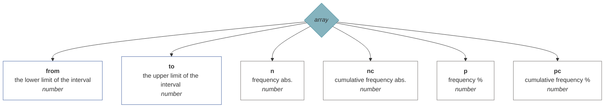

## [Frequency table](#frequency)

Returns a frequency table object with the breakdown of elements and their frequency.

### Arguments

| id |description |value type |validator |required |default value |
| :--- |:--- |:--- |:--- |:--- |:--- |
| <b>order</b> | table order mode | enumerator | <sub>Checks if the specified value is the key of an enumeration (list of possible values). If not, it throws an error.<br><br><b>1</b> = by frequency descending<br><b>2</b> = by frequency ascending<br><b>3</b> = by value ascending<br><b>4</b> = by value descending<br><sub> |  | 1 |
### Syntax examples

```js
var numeric_vector_no_order = new NumericVector(5,2,3,2,3,3,1,6,3).frequency();
```

```js
var string_vector_desc_value = new StringVector("E","B","C","B","C","C","A","F","C").frequency({order: 3});
```

```js
var boolean_vector_desc_frequency = new BooleanVector(true, false, null, true, null, null).frequency(4);
```

### Output schema

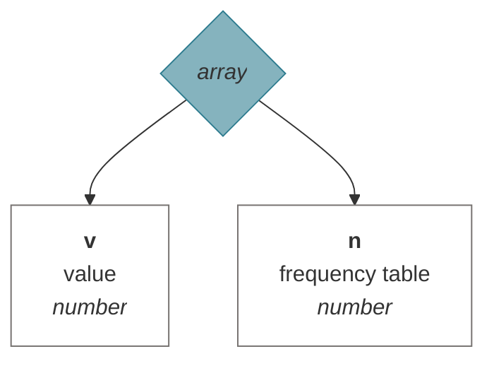

## [Standard error of the mean](#sem)

Returns the value of the standard error of the estimate of the mean. The standard error of the mean is a statistical measure of the variability of the sample mean of the estimated parameter in the entire population. This is an estimate of the standard deviation of the sample mean. The mean error of the mean is calculated as the ratio of the estimated standard deviation of the sample mean to the square root of the sample size. The larger the sample size, the smaller the mean error of the mean, meaning that the estimate of the sample mean is more accurate and more closely aligned with the entire population mean. The mean error of the mean is useful for estimating confidence intervals of the sample mean, which allows us to determine how accurately it estimates the population mean.


### Pre-calculation data modification

Removes all empty values (blank cells) from th vector.

### Syntax examples

```js
var sem = new NumericVector(20,19,21,22,21,18,23,22,27,16,17,19,19,21,29,24,23,25,24,21,22,19).SEM(); /* = 0.67*/
```

### Output schema

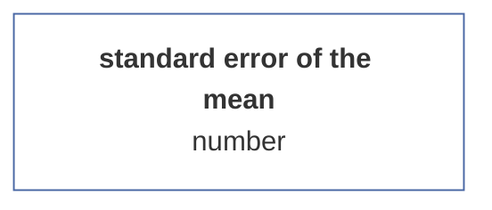

## [Skewness](#skewness)

Returns the skewness of the distribution, i.e. the asymmetry of the distribution around the mean value of the vector.

### Arguments

| id |description |value type |validator |required |default value |
| :--- |:--- |:--- |:--- |:--- |:--- |
| <b>isSample</b> | is sample | boolean value | <sub>Checks if the value is binary in nature. Otherwise, it automatically converts the value to the boolean type and therefore never returns an error.<sub> |  | false |

### Pre-calculation data modification

Removes all empty values (blank cells) from th vector.

### Syntax examples

```js
var skewness_population = new NumericVector(20,19,21,22,21,18,23,22,27,16,17,19,19,21,29,24,23,25,24,21,22,19).skewness(); /* = 0.52*/
var skewness_sample = new NumericVector(20,19,21,22,21,18,23,22,27,16,17,19,19,21,29,24,23,25,24,21,22,19).skewness(true); /* = 0.027*/
```

### Output schema

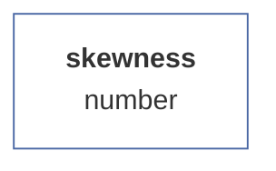

## [Kurtosis](#kurtosis)

Returns the excess value of the data set. In statistics, kurtosis refers to the measure of how much the values in a collection of data differ from the mean value. Skewness is usually calculated for a data distribution curve, which is a graphical representation of the distribution of values in a given collection of data.
There are two basic types of kurtosis: platykurtosis and leptokurtosis. Platykurtosis occurs when the values of a vector are distributed more or less uniformly around the mean value. This distribution appears as a U-shaped distribution curve that has a flat top. Conversely, leptokurtosis occurs when the values in a data collection are distributed with a significant deviation from the mean value. This distribution manifests itself as a 'peaked hill letter' or 'pointed valley letter' shaped distribution curve.
Skewedness is used to determine whether the distribution of values in a collection of data is more or less uniform, or whether there are any significant deviations from the mean value. Skewness is often used along with other metrics such as median, skewness, and quantiles to help you better understand the distribution of data and determine if there are any significant deviations from the mean value.


### Pre-calculation data modification

Removes all empty values (blank cells) from th vector.

### Syntax examples

```js
var kurtosis = new NumericVector(20,19,21,22,21,18,23,22,27,16,17,19,19,21,29,24,23,25,24,21,22,19).kurtosis(); /* = 0.425*/
```

### Output schema

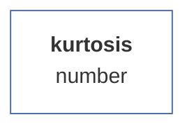

## [Confidence interval of the mean](#mci)

Returns the statistical log of the confidence interval estimate of the sample mean at a specified significance level. If the number of cases is less than 30, the Student's T-distribution is used, otherwise the standardized normal distribution is used.

### Arguments

| id |description |value type |validator |required |default value |
| :--- |:--- |:--- |:--- |:--- |:--- |
| <b>alpha</b> | level of importance | decimal number between 1 and 0 (including) | <sub>Checks if it is a positive integer greater than zero. Otherwise, it will throw an error.<sub> |  | 0.95 |

### Pre-calculation data modification

Removes all empty values (blank cells) from th vector.

### Syntax examples

```js
var v = new NumericVector([2,2,3,3,4,4,5,5,6,7,8,9,10,11,10,9,8,7,7,6,6,5,5]).mci(0.95);
```

### Output schema

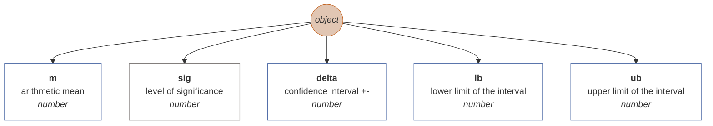

## [Confidence interval of the proportion](#pci)

Returns the statistical log of the confidence interval estimate of the sample proportion at a specified significance level.

### Arguments

| id |description |value type |validator |required |default value |
| :--- |:--- |:--- |:--- |:--- |:--- |
| <b>value</b> | the lookup value | any type | <sub>-<sub> | ✔️ |  |
| <b>alpha</b> | level of importance | decimal number between 1 and 0 (including) | <sub>Checks if it is a positive integer greater than zero. Otherwise, it will throw an error.<sub> |  | 0.95 |

### Pre-calculation data modification

Removes all empty values (blank cells) from th vector.

### Syntax examples

```js
var v = new NumericVector([2,2,3,3,4,4,5,5,6,7,8,9,10,11,10,9,8,7,7,6,6,5,5]).pci(5, 0.95);
```

### Output schema

```mermaid
graph TD
pci((<i>object</i>))
style pci fill:#E1C6B3;
style pci stroke:#C36422;
pci --> p[<b>p</b><br>value share in % <br><i>number</i>]
style p fill:#FFFFFF;
style p stroke:#75716F;
pci --> sig[<b>sig</b><br>level of significance <br><i>number</i>]
style sig fill:#FFFFFF;
style sig stroke:#75716F;
pci --> delta[<b>delta</b><br>confidence interval +- <br><i>number</i>]
style delta fill:#FFFFFF;
style delta stroke:#75716F;
pci --> lb[<b>lb</b><br>lower limit of the interval <br><i>number</i>]
style lb fill:#FFFFFF;
style lb stroke:#75716F;
pci --> ub[<b>ub</b><br>upper limit of the interval <br><i>number</i>]
style ub fill:#FFFFFF;
style ub stroke:#75716F;

```

## [One-sample t-test](#ttest)

Returns the statistical log for a one-sample t-test given the population mean.

### Arguments

| id |description |value type |validator |required |default value |
| :--- |:--- |:--- |:--- |:--- |:--- |
| <b>populationMean</b> | population mean | number | <sub>Checks if the value is a number. Otherwise, it will throw an error.<sub> | ✔️ |  |

### Pre-calculation data modification

Removes all empty values (blank cells) from th vector.

### Syntax examples

```js
var T = new NumericVector(4.5,3.9,5,6,7,5.7,9.1,5.3,7.2,6.9,6,7.5,5.3,7.1,8.2,1).ttest(10);
```

### Output schema

```mermaid
graph TD
ttest((<i>object</i>))
style ttest fill:#E1C6B3;
style ttest stroke:#C36422;
ttest --> t[<b>t</b><br>T-value <br><i>number</i>]
style t fill:#FFFFFF;
style t stroke:#4967A4;
ttest --> p[<b>p</b><br>significance <br><i>number</i>]
style p fill:#FFFFFF;
style p stroke:#75716F;
ttest --> n[<b>n</b><br>total of cases <br><i>number</i>]
style n fill:#FFFFFF;
style n stroke:#75716F;

```

## [Shapiro-Wilk W test](#swtest)

Returns the statistical log of the Shapiro-Wilk W test of normality of the distribution of vector values. The Shapiro-Wilk test is a statistical test used to test the hypothesis that the data come from a normal distribution. This test is often used to verify the normality of data in statistical analysis. The Shapiro-Wilk test is based on comparing the value of the quartiles of the data with the values of the quartiles of a normal distribution. When the quartile values of the data are similar to the quartile values of the normal distribution, it is likely that the data comes from a normal distribution. Otherwise, it is likely that the data is not normal. When using the Shapiro-Wilk test, it should be noted that this test has low sensitivity for large samples, i.e. for large samples the test may be less reliable in detecting non-normality. Therefore, other tests of normality, such as the Anderson-Darling test or the Kolmogorov-Smirnov test, are often used for large samples.


### Pre-calculation data modification

Removes all empty values (blank cells) from th vector.

### Syntax examples

```js
var sw = new NumericVector(2,2,3,3,4,4,5,5,6,7,8,9,10,11,10,9,8,7,7,6,6,5,5).swtest();
```

### Output schema

```mermaid
graph TD
shapirowilk((<i>object</i>))
style shapirowilk fill:#E1C6B3;
style shapirowilk stroke:#C36422;
shapirowilk --> W[<b>W</b><br>W-test value <br><i>number</i>]
style W fill:#FFFFFF;
style W stroke:#4967A4;
shapirowilk --> df[<b>df</b><br>degrees of freedom <br><i>number</i>]
style df fill:#FFFFFF;
style df stroke:#75716F;
shapirowilk --> p[<b>p</b><br>significance <br><i>number</i>]
style p fill:#FFFFFF;
style p stroke:#75716F;

```

## [Kolmogorov-Smirnov test](#kstest)

Returns the statistical log of the Komogorov-Smirnov normality test of the distribution of vector values. It does not currently calculate the significance level of the test. The Kolmogorov-Smirnov test (often abbreviated as the K-S test) is a statistical test used to test the hypothesis that data come from a particular distribution. This test compares the data distribution to the theoretical distribution that the data is assumed to come from and evaluates whether the data values are close enough to the theoretical distribution that the hypothesis that the data come from the given distribution can be considered true.Kolmogorov test -Smirnov is often used to test the normality of data, but it can also be used to test if the data comes from another theoretical distribution, such as the exponential or binomial distribution. The Kolmogorov-Smirnov test is generally considered to be one of the most accurate tests of normality, but it has limited sensitivity for small samples, i.e. it may be less reliable in detecting non-normality for small samples. Therefore, other tests of normality, such as the Shapiro-Wilk test or the Anderson-Darling test, are often used for small samples.


### Pre-calculation data modification

Removes all empty values (blank cells) from th vector.

### Syntax examples

```js
var sw = new NumericVector(2,2,3,3,4,4,5,5,6,7,8,9,10,11,10,9,8,7,7,6,6,5,5).kstest();
```

### Output schema

```mermaid
graph TD
kstest((<i>object</i>))
style kstest fill:#E1C6B3;
style kstest stroke:#C36422;
kstest --> T[<b>T</b><br>Kolmogorov-Smirnov test value <br><i>number</i>]
style T fill:#FFFFFF;
style T stroke:#4967A4;
kstest --> df[<b>df</b><br>degrees of freedom <br><i>number</i>]
style df fill:#FFFFFF;
style df stroke:#75716F;
kstest --> p[<b>p</b><br>significance <br><i>number</i>]
style p fill:#FFFFFF;
style p stroke:#75716F;

```