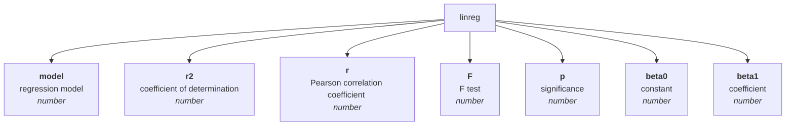
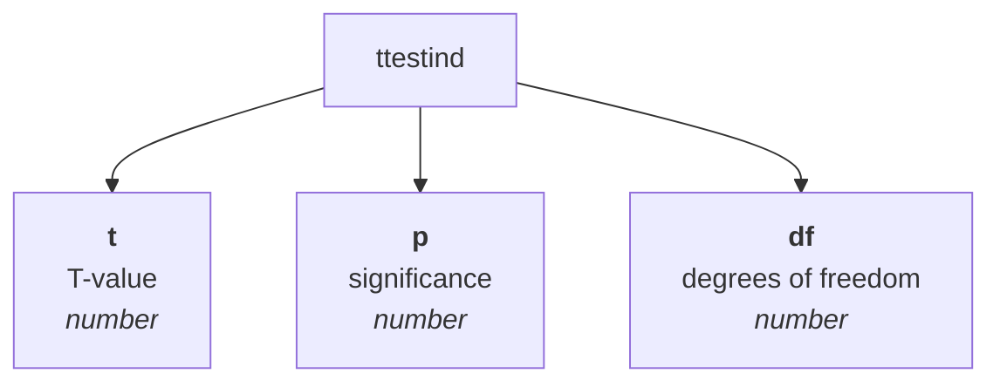
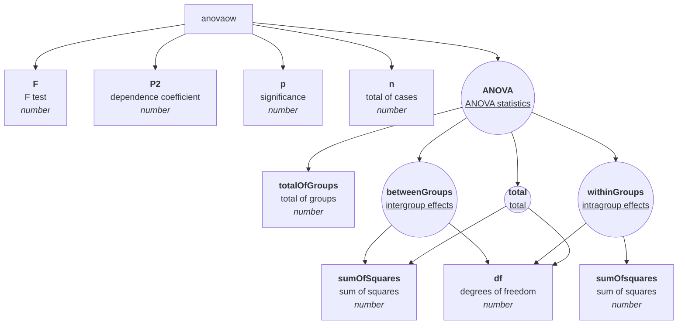
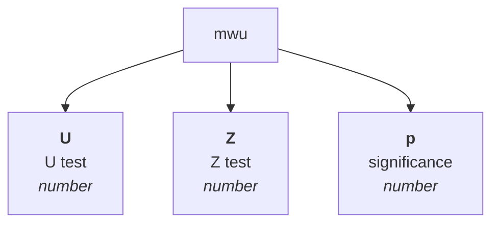

# Matrix statistical analysis methods

Matrix methods represent statistical methods that can be performed on a given matrix. In general, they can be called in two ways: either directly (e.g. {Matrix}.correlPearson(0,1)) or using the generic 'analyze' method, e.g. {Matrix}.analyze('correlPearson').run(0,1) . The difference between the first and the second method is that in the first method we touch the pure result (in the given example an object with properties r and p), in the second case we get back the entire MatrixAnalysis class, containing in addition to the result also metadata (such as sample information, duration calculation, etc.) as well as the input model, specification of arguments, etc. Therefore, if you need to store metadata during the calculation, it is advisable to call the methods via the 'analysis' function, where the parameter is the name of the method.

Each method has specified arguments and their validators. Method validators verify whether the parameters provided by the user are in accordance with the expected inputs of the calculation functions, and in many cases they are also able to convert compatible types (such as Array x Vector). Validators often work in several steps, ie. if they fail to validate the input value in one way, they have perhaps two other conversion strategies in store. The value of validators lies in the fact that the calculation method receives really such parameters on the basis of which it calculates the resulting statistics correctly.

A number of methods have a specified so-called preprocessor, which is a function that adjusts the input data of calculation functions to the required format. Most often, it is that it discards rows with empty values from the input vectors. In some methods, however, it makes deeper changes, e.g. matrix transformation according to a certain key (e.g. ANOVA). Preprocessors have one more function, namely that they save statistics of the input (raw) and calculated (net) file in the data.

| function | method |
| :--- | :--- |
| linreg | [linear regression](#linreg) |
| ttestind | [T-test (independent)](#ttestind) |
| anovaow | [ANOVA (one-way)](#anovaow) |
| mwu | [Mann-Whitney test](#mwu) |

## [linear regression](#linreg)

Linear regression is a statistical method used to find the relationship between two continuous variables. These variables are usually labeled as the dependent variable and the independent variable. The goal of linear regression is to find the best linear approximation of the dependent variable as a function of the independent variable. Linear regression is used to predict the value of the dependent variable for a given value of the independent variable when there is a linear relationship between them. This relationship is represented using a linear regression equation that describes how the values of the dependent variable change depending on the values of the independent variable. Linear regression is often used in various fields such as economics, sociology, biology, psychology, engineering and others.

The method allows us to specify for which transformation of the model (eg linear, logarithmic) we are looking for the coefficient of determination.

### Arguments

| id |description |value type |validator |required |default value |ENUMERACE |
| :--- |:--- |:--- |:--- |:--- |:--- |:--- |
| x | independent variable (x) | numeric vector | It checks whether the argument is of type numeric vector, or whether it is a valid identifier of a numeric vector in a matrix, or - if the argument is of type array - tries to convert the array to a numeric vector using the 'numerify' function. If neither variant fails, it throws an error. | ✔️ |  |
| y | dependent variable (y) | numeric vector | It checks whether the argument is of type numeric vector, or whether it is a valid identifier of a numeric vector in a matrix, or - if the argument is of type array - tries to convert the array to a numeric vector using the 'numerify' function. If neither variant fails, it throws an error. | ✔️ |  |
| model | regression model | enumerator | Checks if the specified value is the key of an enumeration (list of possible values). If not, it throws an error. |  |  |
### Syntax examples

#### 


```js
var M = new Matrix(
new NumericVector(180,197,240,210,180,160,179,185,183,150,110,190,170).name("independent x"),
new NumericVector(75,82,100,80,75,60,75,71,77,63,46,81,70).name("dependent y")
);
var lr_a = M.linreg(0,1); // with model argument missing (set to 1 by default)
var lr_b = M.linreg(0,1,4); // regression model set to 4 (exponential transformation)
var lr_c = M.analyze("linreg").run({x: 0, y: "dependent y", model: undefined}); // same as lr_a
var lr_b = M.analyze("linreg").run({x: "independent x", y: 1, model: 4}); // same as lr_b
// lr_a = lr_c.result
// lb_b = lr_d.result
```

### Schéma výstupu



## [T-test (independent)](#ttestind)

Returns the statistical log of the Student's t-test for two independent samples that are defined by an eigenvariable (that is, two numeric vectors). Arguments are either two numeric vectors, or one numeric and only a factor vector (usually text, but can also be numeric or binary). If a vector that has more than two unique values is used as a factor, only the first two unique values found are considered for the test (the others are ignored) - in this case, the information about the size of the pure sample is irrelevant, however, the level of significance to which the sample size enters, it is already based on pure cases.

### Arguments

| id |description |value type |validator |required |default value |ENUMERACE |
| :--- |:--- |:--- |:--- |:--- |:--- |:--- |
| vectors | numeric vector(s) | numeric vector or a matrix (array) of numeric vectors | Checks whether the argument is either a numeric vector, its identifier, or a series convertible to a numeric vector, or whether it is a series of numeric vectors (or values that are either vectors, identifiers, or values convertible to numeric vectors - in any combination). If even one of the variants fails, it throws an error. | ✔️ |  |
| factor | numeric vector |  | Verifies if the argument is of type vector, or if it is a valid identifier of a vector in a matrix, or - if the argument is of type array - it tries to convert the array to a vector using the 'vectorify' function. If neither variant fails, it throws an error. |  |  |
### Syntax examples

#### Arguments as object properties

<span style="font-size: 0.8rem; font-style="italic"">The method has two parameters: vectors (first and mandatory) and factor (second, optional). In the given example, a single object is specified as an argument, which specifies the values of the individual parameters of the function. In this method, it is possible to specify the vectors parameter even as a single vector.</span>


```js
var M = new Matrix(
new NumericVector(4,5,6,7,8,9,10,7,7,6).name("x"),
new NumericVector(10,11,9,8,7,8,9,4,5,10).name("y")
);
var ttestind_a = M.analyze("ttestind").run({vectors: [0,1]});
var ttestind_b = M.ttestind({vectors: [0,1]});
// ttestind_a.result === mqu_b
```

#### Arguments as an array

<span style="font-size: 0.8rem; font-style="italic"">Arguments are ordered in the standard way. It is essential to follow the order of the arguments here, and in addition, the first argument should ideally be in array format, e.g. [vector1, vector2].</span>


```js
var M = new Matrix(
new NumericVector(4,5,6,7,8,9,10,7,7,6).name("x"),
new NumericVector(10,11,9,8,7,8,9,4,5,10).name("y")
);
var ttestind_a = M.analyze("ttestind").run([0,1]);
var ttestind_b = M.ttestind(["x","y"]);
// ttestind_a.result === mqu_b
```

#### Factor' parameter implementation

<span style="font-size: 0.8rem; font-style="italic"">As the second parameter, a factor is specified, i.e. a variable according to which the vector argument is transformed (or the first vector, if several numerical vectors are entered).</span>


```js
var M = new Matrix(
new NumericVector(4,5,6,7,8,9,10,7,7,6,10,11,9,8,7,8,9,4,5,10).name("score"),
new StringVector("A","A","A","A","A","A","A","A","A","A","B","B","B","B","B","B","B","B","B","B",).name("group")
);
var ttestind_a = M.analyze("ttestind").run({vectors: 0, factor: 1});
var ttestind_b = M.ttestind({vectors: 0, factor: 1});
var ttestind_c = M.analyze("ttestind").run(0, 1);
var ttestind_d = M.ttestind(0, 1);
var ttestind_e = M.analyze("ttestind").run([0], 1);
```

### Schéma výstupu



## [ANOVA (one-way)](#anovaow)

Returns the One-way ANOVA statistical log. The method has two arguments. The first consists of a series of numerical vectors, where at least one vector is mandatory. The second argument is optional and represents the grouping factor, i.e. a text variable that determines whether the numerical factor belongs to the group in the rows. If the second parameter is specified, only the first of the first group of vectors is taken into account.

### Arguments

| id |description |value type |validator |required |default value |ENUMERACE |
| :--- |:--- |:--- |:--- |:--- |:--- |:--- |
| vectors | numeric vector(s) | numeric vector or a matrix (array) of numeric vectors | Checks whether the argument is either a numeric vector, its identifier, or a series convertible to a numeric vector, or whether it is a series of numeric vectors (or values that are either vectors, identifiers, or values convertible to numeric vectors - in any combination). If even one of the variants fails, it throws an error. | ✔️ |  |
| factor | numeric vector |  | Verifies if the argument is of type vector, or if it is a valid identifier of a vector in a matrix, or - if the argument is of type array - it tries to convert the array to a vector using the 'vectorify' function. If neither variant fails, it throws an error. |  |  |

### Preprocessor

Jpe0

### Syntax examples

#### 


```js
var M = new Matrix(
new NumericVector(180,197,240,210,180,160,179,185,183,150,110,190,170).name("x"),
new NumericVector(75,82,100,80,75,60,75,71,77,63,46,81,70).name("y"),
new NumericVector(275,282,300,280,275,260,275,271,277,263,246,281,270).name("z")
);
var anova = M.analyze("anovaow").run({vectors: [0,1,2]});
```

### Schéma výstupu



## [Mann-Whitney test](#mwu)

Returns the statistical log of the Mann-Whitney U test. It is a non-parametric null hypothesis test that compares randomly selected values of X and Y from two populations, with the probability that X is greater than Y equal to the probability that Y is greater than X.

### Arguments

| id |description |value type |validator |required |default value |ENUMERACE |
| :--- |:--- |:--- |:--- |:--- |:--- |:--- |
| vectors | numeric vector(s) | numeric vector or a matrix (array) of numeric vectors | Checks whether the argument is either a numeric vector, its identifier, or a series convertible to a numeric vector, or whether it is a series of numeric vectors (or values that are either vectors, identifiers, or values convertible to numeric vectors - in any combination). If even one of the variants fails, it throws an error. | ✔️ |  |
| factor | numeric vector |  | Verifies if the argument is of type vector, or if it is a valid identifier of a vector in a matrix, or - if the argument is of type array - it tries to convert the array to a vector using the 'vectorify' function. If neither variant fails, it throws an error. |  |  |

### Preprocessor

If the arguments specify a factor variable (the second argument), the first argument (either a numeric vector or the first vector in the matrix, if it is the first argument of the matrix) is decomposed according to the values of the factor into a new matrix. If the arguments are without a factor (i.e. the second argument is empty), it takes the first two vectors from the first argument 'vectors' (matrix) and then deletes the rows with empty values. In case the argument 'factor' and the argument 'vectors' are not specified contains only a single vector or is itself a numeric vector, throws an error (at least two numeric vectors are required in the first argument without a factor).

### Syntax examples

#### Arguments as object properties

<span style="font-size: 0.8rem; font-style="italic"">The method has two parameters: vectors (first and mandatory) and factor (second, optional). In the given example, a single object is specified as an argument, which specifies the values of the individual parameters of the function. In this method, it is possible to specify the vectors parameter even as a single vector.</span>


```js
var M = new Matrix(
new NumericVector(4,5,6,7,8,9,10,7,7,6).name("x"),
new NumericVector(10,11,9,8,7,8,9,4,5,10).name("y")
);
var mwu_a = M.analyze("mwu").run({vectors: [0,1]});
var mwu_b = M.mwu({vectors: [0,1]});
// mwu_a.result === mqu_b
```

#### Arguments as an array

<span style="font-size: 0.8rem; font-style="italic"">Arguments are ordered in the standard way. It is essential to follow the order of the arguments here, and in addition, the first argument should ideally be in array format, e.g. [vector1, vector2].</span>


```js
var M = new Matrix(
new NumericVector(4,5,6,7,8,9,10,7,7,6).name("x"),
new NumericVector(10,11,9,8,7,8,9,4,5,10).name("y")
);
var mwu_a = M.analyze("mwu").run([0,1]);
var mwu_b = M.mwu(["x","y"]);
// mwu_a.result === mqu_b
```

#### Factor' parameter implementation

<span style="font-size: 0.8rem; font-style="italic"">As the second parameter, a factor is specified, i.e. a variable according to which the vector argument is transformed (or the first vector, if several numerical vectors are entered).</span>


```js
var M = new Matrix(
new NumericVector(4,5,6,7,8,9,10,7,7,6,10,11,9,8,7,8,9,4,5,10).name("score"),
new StringVector("A","A","A","A","A","A","A","A","A","A","B","B","B","B","B","B","B","B","B","B",).name("group")
);
var mwu_a = M.analyze("mwu").run({vectors: 0, factor: 1});
var mwu_b = M.mwu({vectors: 0, factor: 1});
var mwu_c = M.analyze("mwu").run(0, 1);
var mwu_d = M.mwu(0, 1);
var mwu_e = M.analyze("mwu").run([0], 1);
```

### Schéma výstupu

