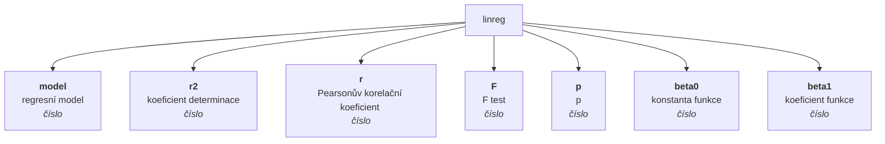
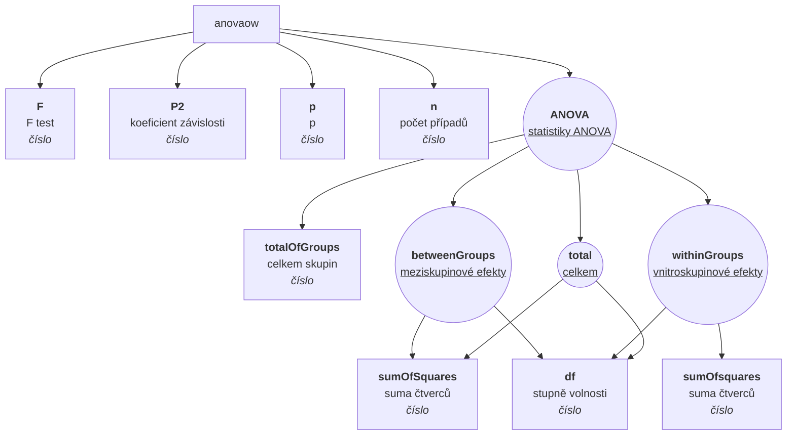
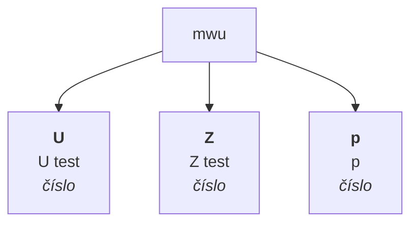

# Dokumentace statistických metod matic

Maticové metody představují statistické metody, které je možné provádět nad danou maticí. Obecně je lze volat dvě způsoby: buďto přímo (např. {Matrix}.correlPearson(0,1), nebo pomocí obecné metody 'analyze', např. {Matrix}.analyze('correlPearson').run(0,1). Rozdíl mezi první a druhým způsobem spočívá v tom, že u první metody dotneme čistý výsledek (u daného příkladu objekt s vlastnostmi r a p), v druhém případě dostaneme zpět celou třídy MatrixAnalysis, obsahující kromě výsledku i metadata (jako jsou informacee o vzorku, trvání výpočtu ad.) a také vstupní model, specifikaci argumentů atd. Pokud tedy potřebujete v průběhu výpočtu uchovávat metadata, je vhodné volat metody přes funkci 'analyze', kde parametr tvoří název metody.

Každá metoda má specifikované argumenty a jejich validátory. Validátory metod ověřují, zdali jsou uživatelem poskytnuté parametry v souladu s očekávanými vstupy výpočetních funkcí a v řadě případů jsou i schopné kompatibilní typy (třeba Array x Vector) překonvertovat. Validátory často fungují v několika krocích, tzn. pokud se jim nezdaří validovat vstupní hodnotu jením způsobem, mají v zásobě třeba ještě dvě další strategie konverze. Hodnota validátorů spočívá v tom, že výpočetní metoda dostane skutečně takové parametry, na základě kterých výslednou statistiku spočítá správně. 

Řada metod má specifikovaný tzv. preprocessor, což je funkce, která vstupní data výpočetních funkcí upraví na potřebný formát. Nejčastěji se jedná o to, že ze vstupních vektorů vyřadí řádky s prázdnámi hodnotami. V některých metodách ale provádí hlubší změny, např. transformaci matice dle určitého klíče (např. ANOVA). Preprocessory mají ještě jednu funkci, a to že do dat ukládají statistiky vstupního (raw) a počítaného (net) souboru.

| funkce | metoda |
| :--- | :--- |
| linreg | [lineární regrese](#linreg) |
| anovaow | [ANOVA (jednofaktorová)](#anovaow) |
| mwu | [Mann-Whitneyho test](#mwu) |

## [lineární regrese](#linreg)

Lineární regrese je statistická metoda používaná k nalezení vztahu mezi dvěma spojitými proměnnými. Tyto proměnné jsou obvykle označeny jako závislá proměnná a nezávislá proměnná. Cílem lineární regrese je najít nejlepší lineární aproximaci závislé proměnné v závislosti na nezávislé proměnné. Lineární regrese se používá k predikci hodnoty závislé proměnné pro danou hodnotu nezávislé proměnné, když mezi nimi existuje lineární vztah. Tento vztah je reprezentován pomocí rovnice lineární regrese, která popisuje, jak se hodnoty závislé proměnné mění v závislosti na hodnotách nezávislé proměnné. Lineární regrese je často používána v různých oblastech, jako je ekonomie, sociologie, biologie, psychologie, inženýrství a dalších.

Metoda umožňuje upřesnit, pro jakou transformaci modelu (např. lineární, logaritmovanou) hledáme koeficient determinace.

### Argumenty

| id |popis |typ hodnoty |validátor |povinný |defaultní hodnota |ENUMERACE |
| :--- |:--- |:--- |:--- |:--- |:--- |:--- |
| x | nezávislá proměnná (x) | numerický vektor | Ověří, zdali je argument typově numerický vektor, nebo zdali se jedná o validní identifkátor numerického vektoru v matici, nebo - pokud je argument typu array - se pokusí řadu pomocí funkce 'numerify' převést na numerický vektor. Pokud se ani jedna z variant nezdaří, vyhodí chybu. | ✔️ |  |
| y | závislá proměnná (y) | numerický vektor | Ověří, zdali je argument typově numerický vektor, nebo zdali se jedná o validní identifkátor numerického vektoru v matici, nebo - pokud je argument typu array - se pokusí řadu pomocí funkce 'numerify' převést na numerický vektor. Pokud se ani jedna z variant nezdaří, vyhodí chybu. | ✔️ |  |
| model | regresní model | enumerace | Ověří, zdali je zadaná hodnota klíčem enumerace (seznamu možných hodnot). Pokud ne, vyhodí chybu. |  |  |
### Příklady syntaxe

#### 


```js
var M = new Matrix(
new NumericVector(180,197,240,210,180,160,179,185,183,150,110,190,170).name("independent x"),
new NumericVector(75,82,100,80,75,60,75,71,77,63,46,81,70).name("dependent y")
);
var lr_a = M.linreg(0,1); // with model argument missing (set to 1 by default)
var lr_b = M.linreg(0,1,4); // regression model set to 4 (exponential transformation)
var lr_c = M.analyze("linreg").run({x: 0, y: "dependent y", model: undefined}); // same as lr_a
var lr_b = M.analyze("linreg").run({x: "independent x", y: 1, model: 4}); // same as lr_b
// lr_a = lr_c.result
// lb_b = lr_d.result
```

### Schéma výstupu



## [ANOVA (jednofaktorová)](#anovaow)

Vrátí statistický protokol analýzy rozptylu jednoduchého třídění (One-way ANOVA). Metoda má dva argumenty. První tvoří řada numerických vektorů, kde minimálně jeden vektor je povinný. Druhý argument je nepovinný a představuje shlukovací faktor, tedy textovou proměnnou, která v řádcích určuje příslučnost numerického faktoru ke skupině. Pokud je zadán druhý parametr, z první skupiny vektorů je zohledňován pouze první.

### Argumenty

| id |popis |typ hodnoty |validátor |povinný |defaultní hodnota |ENUMERACE |
| :--- |:--- |:--- |:--- |:--- |:--- |:--- |
| vectors | numerický vektor(y) | numerický vektor nebo matice numerických vektorů | Ověří, zdali je argument buďto numerický vektor, jeho identifikátor nebo řada převoditelná na numerický vektor, anebo zdali se jedná o řadu numerických vektorů (resp. hodnot, které jsou buďto vektory, identifikátry nebo hodnoty převoditelné na numerické vektory - v libovolné kombinace). Pokud se ani jedna z variant nezdaří, vyhodí chybu. | ✔️ |  |
| factor | numerický vektor |  | Ověří, zdali je argument typu vektor, nebo zdali se jedná o validní identifkátor vektoru v matice, nebo - pokud je argument typu array - se pokusí řadu pomocí funkce 'vectorify' převést na vektor. Pokud se ani jedna z variant nezdaří, vyhodí chybu. |  |  |

### Preprocessor

Pokud argumenty specifikují faktorovou proměnnou (druhý argument), rozloží se první argument (buďto numerický vektor nebo první vektor v matici, poku je prvním argumentem matice) dle hodnot faktoru do nové matice. Pokud jsou argumenty bez faktoru (tedy druhý argument je prázdný), vezme první dva vektory z prvního argumentu 'vectors' (matice) a následně odstraní řádky s prázdnými hodnotami.V případě, že není zadán argument 'factor' a argument 'vectors' zároveň obsahuje pouze jediný vektor nebo je sám numerickým vektorem, vyhodí chybu (bez faktoru jsou třeba alespoň dva numerický vektory v prvním argumentu).

### Příklady syntaxe

#### 


```js
var M = new Matrix(
new NumericVector(180,197,240,210,180,160,179,185,183,150,110,190,170).name("x"),
new NumericVector(75,82,100,80,75,60,75,71,77,63,46,81,70).name("y"),
new NumericVector(275,282,300,280,275,260,275,271,277,263,246,281,270).name("z")
);
var anova = M.analyze("anovaow").run({vectors: [0,1,2]});
```

### Schéma výstupu



## [Mann-Whitneyho test](#mwu)

Vrátí statistický protokol Mann-Whitneyho U testu. Jedná se o neparametrický test nulové hypotézy, která srsovnává náhodně vybrané hodnoty X a Y ze dvou populací, přičemž pravděpodobnost, že X bude větší než Y, se rovná pravděpodobnosti, že Y bude větší než X.

### Argumenty

| id |popis |typ hodnoty |validátor |povinný |defaultní hodnota |ENUMERACE |
| :--- |:--- |:--- |:--- |:--- |:--- |:--- |
| vectors | numerický vektor(y) | numerický vektor nebo matice numerických vektorů | Ověří, zdali je argument buďto numerický vektor, jeho identifikátor nebo řada převoditelná na numerický vektor, anebo zdali se jedná o řadu numerických vektorů (resp. hodnot, které jsou buďto vektory, identifikátry nebo hodnoty převoditelné na numerické vektory - v libovolné kombinace). Pokud se ani jedna z variant nezdaří, vyhodí chybu. | ✔️ |  |
| factor | numerický vektor |  | Ověří, zdali je argument typu vektor, nebo zdali se jedná o validní identifkátor vektoru v matice, nebo - pokud je argument typu array - se pokusí řadu pomocí funkce 'vectorify' převést na vektor. Pokud se ani jedna z variant nezdaří, vyhodí chybu. |  |  |

### Preprocessor

Pokud argumenty specifikují faktorovou proměnnou (druhý argument), rozloží se první argument (buďto numerický vektor nebo první vektor v matici, poku je prvním argumentem matice) dle hodnot faktoru do nové matice. Pokud jsou argumenty bez faktoru (tedy druhý argument je prázdný), vezme první dva vektory z prvního argumentu 'vectors' (matice) a následně odstraní řádky s prázdnými hodnotami.V případě, že není zadán argument 'factor' a argument 'vectors' zároveň obsahuje pouze jediný vektor nebo je sám numerickým vektorem, vyhodí chybu (bez faktoru jsou třeba alespoň dva numerický vektory v prvním argumentu).

### Příklady syntaxe

#### Argumenty jako vlastnosti objektu

<span style="font-size: 0.8rem; font-style="italic"">Metoda má dva parametry: vectors (první a povinný) a factor (druhý, nepovinný). V uvedeném příkladu je jako argument specifikován jediný objekt, který specifikuje hodnoty jednotlivých parametrů funkce. V této metodě je možné uvést parametr vectors i jako jediný vektor.</span>


```js
var M = new Matrix(
new NumericVector(4,5,6,7,8,9,10,7,7,6).name("x"),
new NumericVector(10,11,9,8,7,8,9,4,5,10).name("y")
);
var mwu_a = M.analyze("mwu").run({vectors: [0,1]});
var mwu_b = M.mwu({vectors: [0,1]});
// mwu_a.result === mqu_b
```

#### Argumenty jako řada

<span style="font-size: 0.8rem; font-style="italic"">Argumenty jsou standardndím způsobem řazeny za sebe. Je zde zásadní dodržovat pořadí argumentů a krom toho, první argument by měl být ideálně ve formátu array, např. [vector1, vector2].</span>


```js
var M = new Matrix(
new NumericVector(4,5,6,7,8,9,10,7,7,6).name("x"),
new NumericVector(10,11,9,8,7,8,9,4,5,10).name("y")
);
var mwu_a = M.analyze("mwu").run([0,1]);
var mwu_b = M.mwu(["x","y"]);
// mwu_a.result === mqu_b
```

#### Implementace argumentu 'factor'

<span style="font-size: 0.8rem; font-style="italic"">Jako druhý parametr je specifikován faktor, tedy proměnná, dle které se přetransformuje argument vector (případně první vektor, pakliže je zadáno více numerických vektorů).</span>


```js
var M = new Matrix(
new NumericVector(4,5,6,7,8,9,10,7,7,6,10,11,9,8,7,8,9,4,5,10).name("score"),
new StringVector("A","A","A","A","A","A","A","A","A","A","B","B","B","B","B","B","B","B","B","B",).name("group")
);
var mwu_a = M.analyze("mwu").run({vectors: 0, factor: 1});
var mwu_b = M.mwu({vectors: 0, factor: 1});
var mwu_c = M.analyze("mwu").run(0, 1);
var mwu_d = M.mwu(0, 1);
var mwu_e = M.analyze("mwu").run([0], 1);
```

### Schéma výstupu

